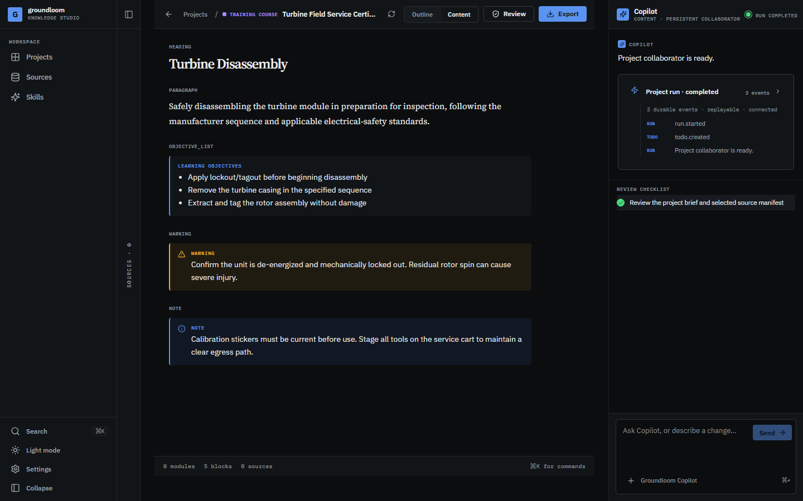

# Groundloom

[](https://github.com/codevertex007/groundloom/actions/workflows/ci.yml)


**A source-grounded knowledge production studio.** One persistent Deep Agent per project investigates sources, plans work, delegates bounded tasks to specialist subagents, drafts structured content, and proposes every change for your review — nothing it writes becomes canonical until you accept it.



## What it is

Groundloom pairs one long-lived agentic collaborator with a deterministic product shell around it. The agent (built on [Deep Agents](https://docs.langchain.com/oss/python/deepagents/overview)/LangGraph) reasons, searches your sources, and drafts — but it never mutates canonical content directly. Every draft is a typed **proposal**: it shows up in the review panel with its citations, and only your explicit accept commits it. Source text is always treated as untrusted evidence, never as instructions.

- **One persistent agent per project** — not a stateless chat, not a rigid `clarify → generate → validate` pipeline. It maintains a todo list, inspects project state, chooses tools, and decides for itself when to delegate.
- **Bounded specialist subagents** — a source researcher, a citation auditor, and a module writer, each scoped to its own tools and prompt, invoked only when isolation or specialization is worth it.
- **Propose, don't mutate** — content changes arrive as reviewable patches with citations; canonical state only changes on explicit accept.
- **Read-only, versioned skills** — the agent gets a pinned, read-only projection of published skill versions; it never sees your filesystem.
- **Runs without any API key** — a deterministic local adapter drives the full product loop (todos, tool calls, delegation, proposals, validation) for development and CI with zero credentials or external services.
- **Typed, authorized tool surface** — every model-facing tool routes through an authorization-checked service adapter; the model never gets raw SQL, shell, or arbitrary object storage access.

## Quick start

Requires Python 3.11+ and Node 18+. This gets you the **local adapter**: no API key, no external services, running on SQLite.

```powershell
python -m pip install -e ".[dev,documents,postgres]"
Copy-Item .env.example .env
$env:PYTHONPATH = "backend"
python backend/scripts/migrate.py
python -m uvicorn app.main:app --reload --port 8000
```

In a second terminal:

```powershell
cd frontend
npm ci
npm run dev
```

Open `http://127.0.0.1:5173`. The default local identity is `local-user` in `local-workspace`.

### Using a real model provider

Set `GROUNDLOOM_MODEL_PROVIDER` to `openai`, `anthropic`, or `google`, plus the matching SDK credential (`OPENAI_API_KEY`, `ANTHROPIC_API_KEY`, or `GOOGLE_API_KEY`) and install the `agent` extra:

```powershell
python -m pip install -e ".[dev,documents,postgres,agent,storage,observability]"
```

**A real provider also requires `GROUNDLOOM_CHECKPOINT_BACKEND=postgres`.** The Deep Agents runtime persists execution state through the Postgres checkpointer and refuses to start against the local checkpoint adapter — this is a fixed, immediate `AGENT_MISCONFIGURED` error, not something a retry can fix. Start Postgres/pgvector/MinIO for deployment-shaped local testing with:

```powershell
docker compose up -d
```

`GET /health` reports a `warnings` field if your provider and checkpoint backend are mismatched, so you don't have to discover it via a failed run. For a production-shaped deployment, set `GROUNDLOOM_DATABASE_URL` to the application role, `GROUNDLOOM_WORKER_DATABASE_URL` to `groundloom_worker`, and `GROUNDLOOM_MIGRATION_DATABASE_URL` to `groundloom_migrator`, and run migrations before starting the API or workers — runtime processes never create tables or apply schema changes in production.

AI contributors can install and test the reusable harness package alone:

```powershell
python -m pip install -e "packages/groundloom-agent-harness[dev]"
```

The root editable install already includes it.

## Repository layout

```
backend/app/            FastAPI application: routes, services, persistence, auth
backend/app/ai/         Deep Agents composition root (agent.py), tools, subagents,
                         middleware, prompts, retrieval, evaluation
backend/app/integrations/ai/   Authorized backend adapter the AI package consumes
backend/scripts/        Migrations, workers, evals, docs validation, backup/restore
backend/tests/          pytest suite (unit, contract, and real-graph integration tests)
packages/groundloom-agent-harness/  Reusable, framework-agnostic Deep Agents
                         primitives: budgets, cancellation, policy, skills backend,
                         stream projection — no dependency on the app
frontend/                React/Vite UI, component + e2e (Playwright) tests
docs/                    Normative product, architecture, contract, ADR, and
                         validation documentation — see docs/README.md
docker/, docker-compose.yml   Postgres/pgvector + MinIO for deployment-shaped
                         local testing
```

## Documentation map

1. [`AGENTS.md`](AGENTS.md) — the operating contract for changes to this repository.
2. [`docs/README.md`](docs/README.md) — the normative document order.
3. [`docs/architecture/system-architecture.md`](docs/architecture/system-architecture.md) — full system architecture.
4. [`docs/architecture/ai-contribution-boundary.md`](docs/architecture/ai-contribution-boundary.md) — where AI implementation lives and how it's bounded.
5. [`docs/deepagents/subagent-architecture.md`](docs/deepagents/subagent-architecture.md) — the specialist subagent roster and delegation model.
6. [`docs/governance/assumptions-risks-open-questions.md`](docs/governance/assumptions-risks-open-questions.md) — open questions and known gaps.
7. [`docs/validation/release-gates.md`](docs/validation/release-gates.md) — release gates that require external infrastructure or release-owner evidence.

## Validation

```powershell
python -m pytest backend/tests -q
python -m ruff check backend/app backend/tests backend/scripts
python -m mypy backend/app backend/scripts --ignore-missing-imports
python backend/scripts/validate_docs.py
cd frontend; npm run build
cd frontend; npm run test:components
cd ..
python backend/scripts/run_evals.py

# Browser E2E (downloads the pinned local Chromium once)
cd frontend; npx playwright install chromium; npm run test:e2e
cd ..

# Optional bounded worker pass
python backend/scripts/ingestion_worker.py --once
python backend/scripts/export_worker.py
python backend/scripts/retention_worker.py
python backend/scripts/index_worker.py
python backend/scripts/delegated_worker.py
python backend/scripts/agent_worker.py --once
# Requires GROUNDLOOM_OUTBOX_DELIVERY_PROVIDER=webhook and a configured sink.
python backend/scripts/outbox_worker.py --once

# Optional disposable local recovery exercise
python backend/scripts/backup_local.py backup --database backend/data/groundloom.db --objects backend/data/objects --destination .local-backup
python backend/scripts/backup_local.py restore --database backend/data/restored.db --objects backend/data/restored-objects --destination .local-backup
```

## Project state

The backend, frontend, migrations, worker seams, agent harness, retrieval, review, validation, export, and local operational scripts are implemented and tested — see [`docs/validation/release-gates.md`](docs/validation/release-gates.md) for the release gates that remain, most of which require external infrastructure (Postgres, S3-compatible storage, a live model provider) or release-owner evidence rather than more code.

## Working name

`Groundloom` is a working product/repository name and has not undergone legal trademark clearance.
