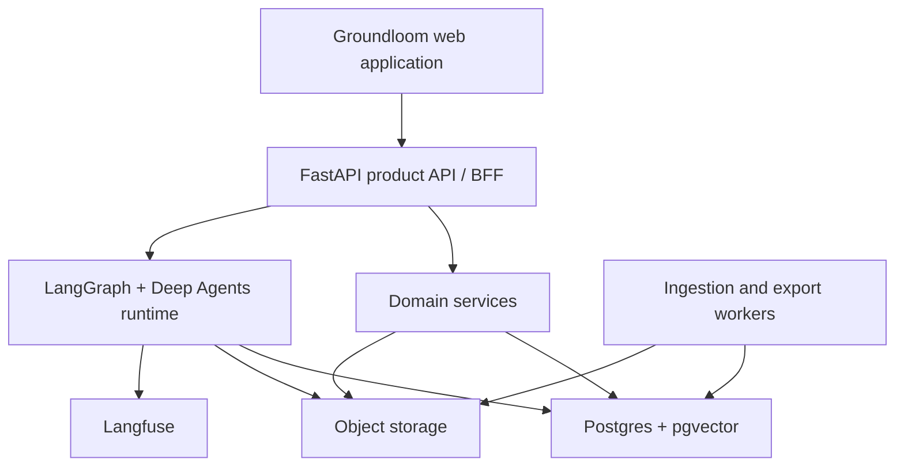
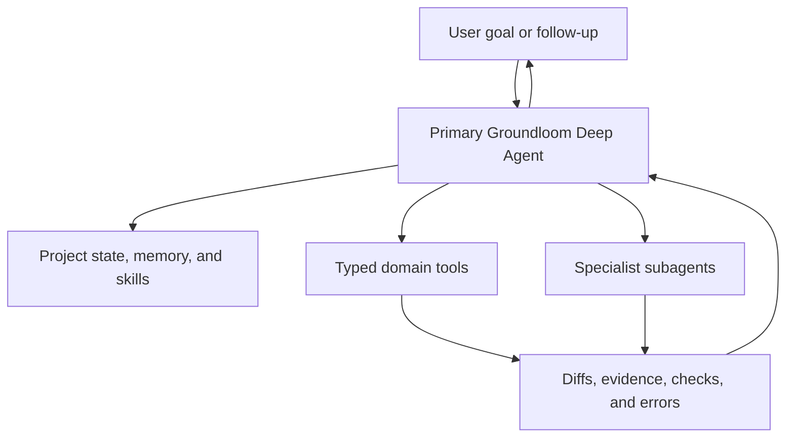
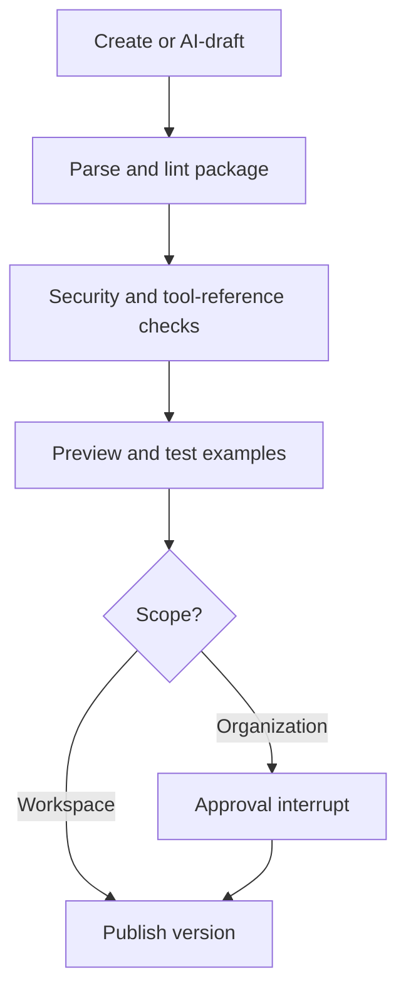
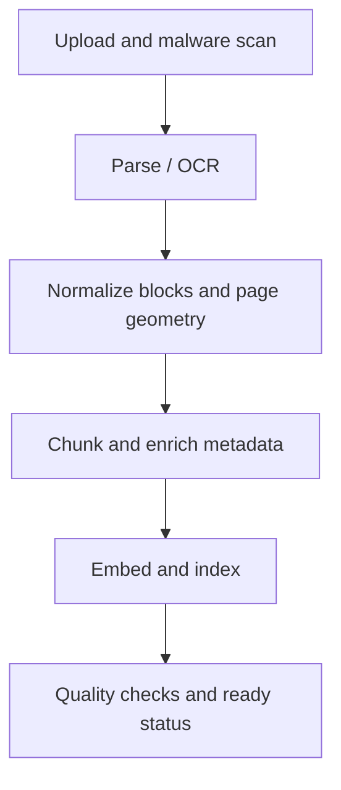

# Groundloom Knowledge Studio — Deep Agents Architecture

**Status:** Architecture proposal v2 — harness-first revision  
**Scope:** The complete UI in `design_ref.zip`: Projects, Sources, Skills, project canvas, source explorer, Copilot, outline/content generation, diff review, settings, command palette, and export.  
**Primary framework:** Deep Agents on LangGraph  
**Recommended implementation shape:** Modular monolith + durable worker processes, with explicit seams for later service extraction.

The current backend ownership map and prioritized refactoring evidence are
recorded in `backend-architecture-assessment.md`. Cross-cutting deterministic
application services live in `backend/app/application/`; external parsing,
derived indexing, and rendering live under `backend/app/integrations/`; the
Deep Agents composition remains isolated in `backend/app/ai/` and the reusable
Groundloom-independent harness package.

---

## 1. Executive decision

Build Groundloom as a **coding-harness-style agent product** centered on one persistent primary Deep Agent per project.

The primary Groundloom agent owns the semantic control loop:

> understand → investigate → clarify → plan → delegate → draft → validate → repair → present → repeat

It decides which sources to inspect, which skills to load, whether clarification or planning is necessary, which tasks to delegate, what to validate, and when the user's goal is satisfied. It is not a worker trapped inside a rigid `clarify → outline → generate → validate` workflow.

The surrounding application provides a deterministic substrate:

1. **The primary Deep Agent** owns requirement clarification, source-grounded research, outline design, module drafting, revision, citation checking, progress planning, delegation, and user interaction.
2. **Skills, typed tools, memory, middleware, and subagents** form the harness around that primary model. They progressively expose the right knowledge and capabilities without stuffing everything into every prompt.
3. **Typed application services and hooks** enforce authorization, scope, schemas, idempotency, versioning, approvals, budgets, and persistence. Agents never receive raw SQL, arbitrary tenant identifiers, unrestricted object-store access, or production shell access.
4. **Explicit standalone workflows** are reserved for deterministic infrastructure such as source ingestion, OCR/indexing, export rendering, cleanup, and scheduled quality processing—not for prescribing the agent's reasoning sequence.
5. **Postgres is the canonical product state.** LangGraph checkpoints are canonical execution state. Object storage is canonical binary/artifact state. The retrieval index is derived. Langfuse is the observability/evaluation data plane.
6. **Generated edits are proposals.** The agent creates a patch/draft version; Accept/Reject in the UI commits or discards it deterministically.

This is the same core pattern used by strong coding harnesses: a capable central model operates an iterative loop over tools, externalized state, validations, skills, and specialist agents, while deterministic controls surround the loop.

---

## 2. What the UI implies

The UI is not merely a chat application. It expresses a durable domain model and several independent workflows.

| UI surface | Implied backend capability | Recommended owner |
|---|---|---|
| Projects grid, filters, status, progress | Project aggregate, lifecycle state, latest run, section count | Postgres + project service |
| New Project: type, sources, brief, active skills | Validated project configuration followed by a persistent project-agent session | FastAPI command + primary Groundloom Deep Agent |
| Sources library | Upload, virus scan, parse/OCR, version, chunk, index, lineage | Deterministic ingestion graph/workers |
| Skills list and scopes | Skill registry, versions, scopes, validation, publication | Skill service + StoreBackend projection |
| “Create with AI” skill flow | Draft SKILL.md, lint, preview, approve/publish | Dedicated skill-author Deep Agent |
| Source explorer and search | Hybrid retrieval, page/section navigation, immutable evidence IDs | Retrieval service/tools |
| Outline tab | Structured outline versions and generation status per module | Primary Groundloom agent + outline tools/subagent |
| Content tab | Versioned content blocks, citations, proposed diffs | Content service + primary Groundloom agent |
| Copilot process card | Live normalized run events, resumable stream, task status | Run/event service |
| Accept all / Reject | Optimistic, auditable commit of a proposed patch | Deterministic application command |
| Review checklist | Machine and model evaluators with evidence | Validation tools/hooks + quality-review subagent |
| Export & Preview | Deterministic render templates and asynchronous export jobs | Export service/workers |
| Settings | User/workspace preferences and render defaults | Preference service; selected values may feed runtime context |
| Command palette | Indexed navigation/commands | Application search; not an LLM requirement |

The “Skills” reference screenshots also imply that skills are real packages—not prompt snippets. Groundloom should store the complete package, validate it, version it, and disclose only metadata until the agent chooses to load the full instructions.

---

## 3. Architecture principles

### 3.1 Agentic where judgment is needed; deterministic where correctness is known

Use an agent for:

- deciding what evidence is relevant;
- asking material clarification questions;
- designing an outline from a brief and sources;
- drafting or revising prose;
- reconciling conflicting source passages;
- choosing and applying relevant skills;
- producing a proposed patch;
- semantic quality review.

Use ordinary code for:

- authorization and tenant scope;
- file upload, parsing, OCR, and embedding;
- project/status transitions;
- versioning and optimistic concurrency;
- accepting/rejecting patches;
- export rendering;
- event persistence and replay;
- billing, quotas, and audit logs;
- exact schema and referential-integrity checks.

### 3.2 One persistent primary project agent, narrow subagents

The same primary agent should begin with project creation and continue into the canvas. The user experiences one collaborator with durable project context, not one generation workflow followed by a different chat agent.

The primary agent maintains a plan/todo list, inspects project state, chooses tools and skills, delegates bounded tasks, observes results, runs checks, repairs failures, and reports progress. Deep Agents exposes synchronous, async, and dynamic subagents; the primary model decides when isolation, specialization, or parallelism is worthwhile.

Routing is not a separate supervisor service and project generation is not a fixed outer graph. Deterministic middleware and services constrain what the agent can do, but they do not prescribe every semantic step it must take.

### 3.3 Domain state is not agent state

- **Domain state:** project, sources, selected skills, outline versions, modules, content blocks, citations, patches, approvals, exports.
- **Execution state:** messages, tool-call bookkeeping, run stage, retry counters, subagent tasks, summaries, interrupt state.
- **Scratch state:** research notes, bounded evidence bundles, temporary draft files, large tool-result offloads.

Each has different consistency and retention needs and must not be collapsed into `messages` or the Deep Agents virtual filesystem.

### 3.4 Evidence first

The writer should never draft factual content directly from a vague project summary. It drafts from an `EvidenceBundle` containing immutable passage IDs and source lineage. Every persisted citation points to a `source_version_id`, page/section, block ID, and offsets.

### 3.5 Version everything that can change output

Pin the following on every generation run:

- source versions;
- skill versions;
- content/render template versions;
- system-prompt version;
- tool-contract version;
- retrieval configuration version;
- model/provider parameters;
- evaluator/rubric versions.

This makes a run reproducible enough to debug and evaluate.

---

## 4. System context



### Recommended initial deployment units

1. **Web UI** — current Groundloom interface.
2. **FastAPI API/BFF** — authentication, authorization, REST commands/queries, SSE endpoint, idempotency, and UI DTOs.
3. **Agent worker** — loads compiled graphs and executes/resumes runs using a Postgres checkpointer.
4. **Document worker** — ingestion/OCR/chunking/embedding.
5. **Export worker** — HTML/PDF/DOCX/PPTX generation and preview assets.
6. **Postgres + pgvector** — domain data, checkpoints, outbox, retrieval for the first scale stage.
7. **S3-compatible object storage** — uploaded files, normalized documents, images, generated exports.
8. **Langfuse** — traces, spans, model/tool usage, costs, feedback, datasets, and experiments.

These can be separate processes from one repository. Do not begin with a fleet of independently deployed microservices.

---

## 5. Harness boundary and deterministic substrate

Implementation ownership is split explicitly: AI runtime, middleware, scoped
tools, subagents, providers, execution state, and prompt assets live under
`backend/app/ai/`; reusable framework mechanics live in
`packages/groundloom-agent-harness/`; focused agent UI lives under
`frontend/src/ai/`; deterministic
product services remain responsible for authorization, persistence, workers,
and canonical commands. See the [AI contribution boundary](ai-contribution-boundary.md)
and ADR-033 for the reusable harness, skill projection, typed service port, and
composition-root contract.

Groundloom should expose one primary project-agent runtime plus a small registry of supporting agents and deterministic jobs.

| Runtime / job | Framework | Purpose | Invocation pattern |
|---|---|---|---|
| `groundloom_project_agent` | `create_deep_agent` | Project creation, clarification, research, planning, outline/content generation, delegation, validation, revision, and ongoing canvas interaction | Persistent, multi-turn, streaming project thread |
| `skill_author_call` | LangChain provider-neutral chat model with structured output | Create one reviewable SKILL.md draft | One bounded call; deterministic validation and approval before publication |
| Specialist subagents | Declarative, compiled, async, or dynamic Deep Agents subagents | Research, outline design, module drafting, citation audit, assessment, and review | Invoked by the primary project agent |
| Validation hooks/tools | Deterministic code plus optional grader model | Enforce exact schemas, citation integrity, safety/style checks, budgets, and bounded review | Called by the primary agent; selected hooks run automatically |
| `source_ingestion_job` | Deterministic workflow | Scan → parse → normalize → chunk → embed → index | Asynchronous infrastructure job |
| `export_job` | Deterministic worker workflow | Render exact output from an immutable content version | Asynchronous infrastructure job; no agent in the render path |
| Quality-control-plane jobs | Deterministic scheduling + specialized agents | Recurring issue discovery, evaluator proposals, regression maintenance | Background, cross-project processing |

### Boundary rule

Use the primary Deep Agent whenever the next step requires interpretation, investigation, judgment, planning, tool selection, or adaptive recovery.

Use deterministic code whenever the application must guarantee authorization, an exact invariant, a transactional write, an external side effect, a resource budget, a parser/rendering algorithm, or a stable public event contract.

This is not “one agent versus workflows.” It is a central agent loop operating over a deterministic substrate.

---

## 6. Primary project-agent loop

### 6.1 Harness topology



The primary agent runs an adaptive loop:

```text
understand the request
→ inspect current project state
→ ask clarification only when material
→ create or update a plan/todo list when the task is complex
→ discover and load relevant skills
→ search/read source evidence
→ act directly or delegate bounded work
→ inspect tool/subagent results
→ run deterministic and semantic checks
→ repair only the failed scope
→ present a proposal, answer, or approval request
→ continue from user feedback
```

This is an operating policy, not a fixed graph path. The agent may skip planning for a small question, return to clarification after discovering a source conflict, revise an outline while drafting, generate one module directly, or launch several module subagents in parallel.

### 6.2 Persistent project thread

Create the primary agent thread as soon as the project record exists and reuse it through project setup, generation, editing, review, and export discussion.

```text
project:{project_id}:primary
```

Separate `run_id` values identify individual user requests or background continuations within the same project thread. This preserves one collaborator and continuous context while retaining auditable run boundaries.

The project agent's execution state may include:

```python
class GroundloomAgentState(DeepAgentState):
    project_phase: str
    active_plan: dict | None
    todos: list[dict]
    active_module_ids: list[str]
    module_tasks: dict[str, dict]
    current_patch_id: str | None
    latest_validation_summary: dict | None
    pending_approval: dict | None
```

Only compact execution references belong here. Full sources, canonical content, skill definitions, and complete validation artifacts remain in their authoritative stores.

### 6.3 Planning and progress

Use opt-in todo/planning middleware for multi-step work. The primary agent creates and updates tasks such as:

- clarify the intended audience;
- inspect safety and maintenance sources;
- propose the outline;
- wait for plan approval;
- draft modules 1–4;
- validate citations;
- repair module 3;
- present the draft.

The frontend renders the todo list and live subagent/tool status. Progress is derived from task state and known worker completion, not free-form model claims. If a percentage is required, the application calculates it from weighted todos and module tasks; the model may update task structure but cannot directly write an arbitrary percentage.

### 6.4 Clarification and approval

Clarification remains model-driven. The agent asks only questions whose answers materially affect the output. When it has enough information, it proceeds rather than waiting for a predefined question count.

Plan approval is implemented through an interrupt or a typed `propose_outline` tool that creates a reviewable proposal. The user can approve, edit, reject, or continue discussing it in the same primary thread.

### 6.5 Dynamic fan-out

The primary agent chooses the cheapest sufficient mechanism:

- draft directly for a small section;
- call one synchronous specialist for a bounded task;
- launch async module writers for long independent modules;
- use dynamic subagents/interpreter code for a variable batch of sections;
- request a second-pass reviewer only where risk or quality signals justify it.

Each delegated task receives a narrow contract, bounded evidence, pinned skill versions, explicit tools, and an output schema. The primary agent monitors, steers, cancels, and synthesizes results.

### 6.6 Validation and repair

Validation is exposed as tools and hooks around the central loop:

1. deterministic checks run automatically before a proposal can become publishable;
2. the primary agent inspects exact failures;
3. semantic reviewers are invoked for judgments that code cannot make;
4. the agent repairs only the affected block/module;
5. retry and grader iterations are capped by middleware/tool budgets;
6. unresolved issues become explicit review items rather than hidden failures.

This mirrors coding harnesses: the central agent runs tests and linters, observes failures, repairs the work, and repeats, while the harness guarantees that required checks actually execute.

---

## 7. Primary Groundloom Deep Agent

### 7.1 Role

The primary Groundloom agent is the user's continuous collaborator from the New Project modal through drafting, review, editing, and export discussion. It asks clarification questions, builds and maintains the plan, selects skills, researches sources, delegates modules, reviews results, proposes outlines and edits, runs quality checks, repairs failures, and explains its work.

It owns the semantic project lifecycle but does not bypass domain invariants or silently overwrite accepted content. Every authoritative mutation still passes through typed, permission-checked application tools.

### 7.2 Per-run context

Define a runtime `context_schema`; do not ask the model to supply these values as tool arguments.

```python
@dataclass
class GroundloomContext:
    user_id: str
    workspace_id: str
    project_id: str
    active_content_version_id: str
    active_module_id: str | None
    selected_block_ids: tuple[str, ...]
    role: str
    locale: str
    request_id: str
```

Runtime context is not automatically visible to the model. A custom `ProjectContextMiddleware` should resolve a small, permission-checked snapshot and append only the necessary fields to the request. Tools read authoritative IDs from `ToolRuntime` rather than accepting model-chosen workspace IDs.

### 7.3 Tool surface

Use small typed tools with product semantics.

#### Planning and lifecycle tools

- `write_project_todos(items)`
- `get_run_status()`
- `propose_outline(plan, evidence_ids, assumptions)`
- `start_module_task(module_contract, evidence_scope, skill_version_ids)`
- `check_module_task(task_id)`
- `update_module_task(task_id, instruction)`
- `cancel_module_task(task_id)`
- `submit_draft_for_validation(content_version_id, scope)`
- `request_user_approval(proposal_id, decision_schema)`

#### Read-only tools

- `get_project_snapshot()`
- `get_active_module()`
- `list_project_sources()`
- `search_source_passages(query, filters, limit)`
- `read_source_passage(passage_id)`
- `get_citation(citation_id)`
- `list_active_skills()`
- `read_content_blocks(block_ids)`
- `get_review_results(content_version_id)`

#### Proposal tools

- `propose_block_patch(base_version_id, operations, rationale, evidence_ids)`
- `propose_module_regeneration(module_id, instruction)`
- `propose_outline_patch(base_outline_version_id, operations)`
- `propose_assessment(module_id, objectives, evidence_ids)`
- `request_quality_check(scope)`

#### Side-effect tools

- `start_export(content_version_id, format, template_version_id)`
- `publish_skill_version(skill_version_id)` — admin/editor role and approval gated
- `share_export(export_id, recipients)` — only if that feature is later added

The agent may create a proposed patch automatically because it is reversible and not yet canonical. Accept/Reject is an explicit UI command and does not need the model in the commit path.

### 7.4 Subagents

| Subagent | When the primary agent delegates | Tool/permission scope | Output contract |
|---|---|---|---|
| `source-researcher` | Multi-document lookup, source conflicts, long manuals | Read-only retrieval; no content mutation | `EvidenceBundle` with claims, passage IDs, conflicts, gaps |
| `outline-architect` | Structural changes or a new plan | Project snapshot + source inventory + schema skills | `OutlinePlan` / `OutlinePatch` |
| `module-writer` | Drafting or substantial rewrite | Evidence bundle + one module + resolved skills | `ModuleDraft` with block-level citations |
| `citation-auditor` | “Check against sources” and quality gates | Read-only content and source passages | `CitationAudit` with supported/unsupported/contradictory claims |
| `assessment-writer` | Training content requires quizzes/checklists | Objectives + evidence; no project writes | `AssessmentDraft` |
| `quality-grader` | Semantic rubric evaluation | Read-only draft, rubric, evidence | Structured verdict and fix instructions |

Use declarative `SubAgent` definitions for specialists that can inherit the approved parent tool set. Use a `CompiledSubAgent` when a specialist requires its own explicit graph topology. Remember that precompiled and remote/async subagents do not automatically inherit every permission or middleware contract; configure them explicitly.

Do not create a subagent per trivial action. Delegation is for context quarantine, specialization, parallelism, or an independently testable output contract.

### 7.5 Illustrative construction

The code below shows the intended assembly seam; product tools and middleware remain ordinary testable Python modules.

```python
from deepagents import create_deep_agent
from deepagents.middleware.filesystem import FilesystemPermission


def build_groundloom_project_agent(
    *,
    model,
    backend,
    checkpointer,
    store,
    tools,
    project_context_middleware,
):
    subagents = [
        {
            "name": "source-researcher",
            "description": (
                "Use for multi-source research, conflicting passages, or when "
                "the answer needs a bounded evidence bundle before drafting."
            ),
            "system_prompt": SOURCE_RESEARCHER_PROMPT,
            "tools": [
                tools.list_project_sources,
                tools.search_source_passages,
                tools.read_source_passage,
            ],
            "skills": ["/skills/org/domain/"],
            "permissions": READ_ONLY_AGENT_PERMISSIONS,
        },
        {
            "name": "module-writer",
            "description": (
                "Use for drafting or materially rewriting one module after "
                "relevant evidence and the module contract are available."
            ),
            "system_prompt": MODULE_WRITER_PROMPT,
            "tools": [
                tools.read_source_passage,
                tools.read_content_blocks,
                tools.propose_block_patch,
            ],
            "skills": [
                "/skills/org/",
                "/skills/workspace/",
                "/skills/project/",
            ],
            "permissions": WRITER_SCRATCH_PERMISSIONS,
        },
        {
            "name": "citation-auditor",
            "description": (
                "Use to verify claims and citations against immutable source "
                "passages. Never rewrite content; return an audit."
            ),
            "system_prompt": CITATION_AUDITOR_PROMPT,
            "tools": [
                tools.read_content_blocks,
                tools.read_source_passage,
            ],
            "permissions": READ_ONLY_AGENT_PERMISSIONS,
        },
    ]

    return create_deep_agent(
        name="groundloom-project-agent",
        model=model,
        system_prompt=GROUNDLOOM_PROJECT_AGENT_PROMPT,
        tools=[
            tools.get_project_snapshot,
            tools.get_active_module,
            tools.write_project_todos,
            tools.search_source_passages,
            tools.read_source_passage,
            tools.read_content_blocks,
            tools.propose_outline,
            tools.propose_block_patch,
            tools.submit_draft_for_validation,
            tools.request_quality_check,
            tools.start_export,
        ],
        subagents=subagents,
        skills=[
            "/skills/org/",
            "/skills/workspace/",
            "/skills/project/",
        ],
        memory=[
            "/memory/org/AGENTS.md",
            "/memory/user/AGENTS.md",
        ],
        backend=backend,
        permissions=MAIN_AGENT_PERMISSIONS,
        interrupt_on={
            "start_export": True,
            "publish_skill_version": True,
        },
        middleware=[project_context_middleware],
        context_schema=GroundloomContext,
        checkpointer=checkpointer,
        store=store,
    )
```

Use provider/harness profiles to tune model-specific tool descriptions, middleware, or prompt suffixes without contaminating Groundloom's domain configuration. A Groundloom “project profile” is a domain concept and should not be conflated with a Deep Agents harness profile.

---

## 8. How Groundloom should use Deep Agents primitives

| Deep Agents primitive | Groundloom usage | Important constraint |
|---|---|---|
| `create_deep_agent` | Build the primary project agent and bounded specialist agents | It returns a compiled graph; keep construction centralized in an agent factory; use a direct structured model call for single-result, tool-free work such as skill drafting |
| Filesystem middleware | Scratch notes, skill packages, summaries, large tool-result offloads | Never make the virtual filesystem the sole canonical content store |
| `StateBackend` | Thread-scoped scratch files and intermediate reasoning artifacts | Persistence depends on checkpointing and remains thread-scoped |
| `StoreBackend` | Versioned skill/memory projections across threads | Namespace by assistant/workspace/user; shared policy should be read-only |
| `CompositeBackend` | Route `/scratch`, `/skills`, `/memory`, and optional read-only project projections | Longest-prefix routing must be tested; avoid overlapping ambiguous routes |
| Skills middleware | Progressive disclosure of brand, schema, domain, audience, and policy packages | Pin skill versions per run; metadata at startup, full SKILL.md on demand |
| Memory middleware | Stable user preferences and workspace policies | Do not put source documents or current project drafts in memory |
| SubAgent middleware | Context-isolated research/writing/audit | Primary agent chooses via prompt/tool description; enforce narrow descriptions and tools |
| Todo/planning middleware | Externalize the primary agent's current plan and progress | Todos guide and expose work; they do not replace domain state |
| Summarization middleware | Long project threads; automatic offload and compaction | Summaries are execution aids, not authoritative project history |
| Patch-tool-calls middleware | Repair interrupted/dangling tool-call histories | Still include checkpoint/resume regression tests |
| Permissions | Deny source/credential writes and gate sensitive filesystem paths | First-match-wins rule order is security relevant |
| `interrupt_on` | Approval before external/irreversible operations | Always use a persistent checkpointer and resume the same thread |
| Structured response | Outline plans, evidence bundles, audits, module drafts, graders | Persist validated schemas, not parsed prose |
| Rubric/grader middleware | Limited self-revision for a bounded draft | Cap iterations; never let it loop indefinitely or self-certify safety alone |
| Async/dynamic subagents | Long research, independent module drafting, variable section batches, and mid-flight steering | Persist task state, cap concurrency, and give each worker explicit tools/skills/permissions |

### 8.1 Composite virtual filesystem

Recommended logical routes:

```text
/scratch/                 thread-scoped StateBackend
/large_tool_results/      offloaded tool results; thread/run scoped
/conversation_history/    summaries/history archives
/skills/starter/          read-only built-in packages
/skills/org/              organization-published skill versions
/skills/workspace/        workspace skill versions
/skills/project/          run projection of selected/pinned skills
/memory/org/              read-only organization policy
/memory/user/             user-scoped durable preferences
```

Do not mount raw object storage, arbitrary database exports, or credentials into this namespace.

The application can project selected immutable skill versions into `/skills/project/` at run start. That makes skill resolution stable even if an administrator publishes a newer version during the run.

### 8.2 Permission policy

Order the narrowest rules first because filesystem permissions are first-match-wins.

Conceptually:

1. Deny all reads/writes to secrets and internal configuration.
2. Deny writes to `/skills/starter/**`, `/skills/org/**`, `/memory/org/**`, and `/sources/**`.
3. Interrupt writes to `/skills/workspace/**` or `/memory/user/**` when an agent is allowed to learn.
4. Allow read/write only in `/scratch/**`, conversation history, and large-result offload routes.
5. Deny everything else.

Do not give the production agent an unrestricted `execute` tool. Document parsing and rendering run in purpose-built workers. If code execution is later needed for a specialized task, use an isolated sandbox with network and resource controls and a separate permission profile.

### 8.3 Skills model

Groundloom's visible skill scopes map naturally onto Deep Agents:

| UI scope | Storage and behavior |
|---|---|
| Groundloom starters | Built-in, immutable, versioned with the application release; fork to customize |
| Organization | Published, shared, read-only to runtime agents; admin/editor approval for new versions |
| Workspace | Editable by workspace members; draft and published states |
| Project active skills | A pinned projection of selected skill versions for one run/project |

Skill categories can remain metadata—brand/style, content schema, domain knowledge, audience profile—but activation should be based on scope, explicit selection, and frontmatter triggers.

#### Skill publication workflow



Validation should check:

- required YAML frontmatter (`name`, `description`);
- unique slug within scope;
- sufficiently specific trigger language;
- maximum file/package sizes;
- valid relative resource references;
- referenced tool names exist and are allowed;
- no hidden secret material;
- no instructions that attempt to override tenant/security policy;
- sample trigger and non-trigger cases;
- optional skill-specific evaluation cases.

The AI skill author uses one bounded LangChain structured-output call and
produces a draft only. It does not receive tools or publication authority.
Validation and publication are separate domain commands.

### 8.4 Memory model

Use memory for stable facts such as:

- user prefers concise edits;
- workspace terminology and editorial policy;
- default audience or locale;
- repeated workflow preference approved by the user.

Do not use memory for:

- source text;
- current module bodies;
- run progress;
- unresolved instructions from untrusted documents;
- facts already represented in the project database.

Namespace durable memory by at least `(assistant_id, workspace_id, user_id)`. Organization memory is populated by application code and read-only to agents. User memory writes should be auditable and preferably approval-gated.

### 8.5 Context strategy

The model should see, at most:

1. stable system and tool instructions;
2. stable organization policy/memory;
3. skill metadata, with full skill content loaded on demand;
4. a compact current project snapshot;
5. the active module/block selection;
6. a small evidence bundle returned by retrieval;
7. recent conversation turns and a summary of older turns.

It should not see the complete workspace, all source documents, every skill body, or the full content of every module on every turn.

Use subagents for context quarantine. A source researcher may inspect many passages, but it returns a bounded evidence bundle to the primary project agent. Large tool outputs can be offloaded by the filesystem/context middleware. Preserve complete AI tool-call/ToolMessage pairs; interrupted runs rely on the patching middleware and checkpoints to repair incomplete histories.

---

## 9. Source ingestion, retrieval, and citation lineage

### 9.1 Ingestion graph



Each node is idempotent and keyed by `source_version_id` plus parser/index configuration versions.

### 9.2 Canonical source representations

- **Original binary:** object storage, immutable per version.
- **Normalized document:** page-aware blocks with tables, headings, lists, images, coordinates, and extracted text.
- **Retrieval chunks:** derived, may be rebuilt without changing the source version.
- **Embeddings/index:** derived and disposable.

### 9.3 Retrieval pipeline

Start with Postgres full-text search + pgvector for a solo-maintained system. Use a two-stage pipeline:

1. metadata/permission filter by workspace, project, selected source versions, language, and document type;
2. hybrid lexical + semantic candidate retrieval;
3. rerank the top candidates;
4. expand around page/section neighbors where needed;
5. deduplicate overlapping chunks;
6. return a bounded `EvidenceBundle`.

The retrieval tool must enforce scope outside the model. A model-supplied filter can narrow an already-authorized set but cannot broaden it.

### 9.4 Evidence contract

```python
class EvidencePassage(BaseModel):
    passage_id: str
    source_version_id: str
    source_name: str
    page_number: int | None
    section_path: list[str]
    block_id: str
    char_start: int
    char_end: int
    text: str
    retrieval_score: float


class EvidenceBundle(BaseModel):
    query: str
    passages: list[EvidencePassage]
    conflicts: list[dict]
    gaps: list[str]
```

Persist citations by passage/block lineage, not by rendered labels such as “Manual §3.2.” The label is a view. This allows citation navigation, source-version comparison, and re-rendering.

### 9.5 Prompt-injection defense

Treat uploaded document content as untrusted data, even inside an internal product.

- Retrieval responses explicitly mark source text as evidence, not instructions.
- Strip active content and unsafe embedded files.
- Detect likely prompt-injection text and surface it as a risk signal.
- Do not allow source content to grant tools or change permissions.
- Keep organization policy and skills in separately trusted, read-only scopes.
- Require citations for factual and safety claims.

---

## 10. Content and diff model

Store generated content as typed blocks rather than one mutable markdown blob.

Example block types:

- heading;
- paragraph;
- ordered/unordered procedure;
- objective list;
- warning/note;
- table;
- figure placeholder/asset;
- quiz/checklist;
- source list.

Each block has a stable ID, order key, typed payload, citation list, provenance, and version metadata.

### Proposed edit flow

1. The primary project agent reads the active `content_version` and selected block IDs.
2. It retrieves evidence and calls `propose_block_patch`.
3. The content service validates operations and creates a `draft_patch` against `base_version_id`.
4. The UI renders adds/deletes/changes.
5. Accept creates a new immutable content version using optimistic concurrency.
6. Reject records the decision and leaves the current version unchanged.
7. If the base version changed, return a conflict and ask the user to regenerate or rebase the proposal.

Patch operations should be typed, for example `insert_after`, `replace_block`, `delete_block`, `move_block`, and `replace_citations`. Do not execute arbitrary model-produced JSON Patch against unrestricted records.

---

## 11. Domain data model

### Core tables

| Aggregate | Important records |
|---|---|
| Identity | `user`, `workspace`, `workspace_membership`, `api_client` |
| Projects | `project`, `project_configuration_version`, `project_source`, `project_skill`, `project_status_event` |
| Sources | `source`, `source_version`, `source_ingestion_job`, `source_block`, `source_chunk`, `source_asset` |
| Skills | `skill`, `skill_version`, `skill_file`, `skill_validation`, `skill_publication` |
| Content | `outline_version`, `module`, `content_version`, `content_block`, `citation`, `draft_patch`, `patch_operation` |
| Runs | `agent_thread`, `agent_run`, `run_step`, `run_event`, `approval`, `run_error` |
| Quality | `evaluation_result`, `rubric_version`, `review_item`, `user_feedback` |
| Export | `render_template`, `render_template_version`, `export_job`, `export_artifact` |
| Governance | `audit_event`, `idempotency_key`, `outbox_event`, `retention_policy` |

### Invariants

- All tenant-owned records carry `workspace_id` and are protected by service authorization and preferably database row-level policy.
- A generation run references immutable configuration/source/skill/template versions.
- At most one active canonical generation run exists per project unless explicit branching is supported.
- Content versions are immutable; “current” is a pointer.
- A patch references exactly one base content version.
- A citation references exactly one source version and evidence location.
- External side effects use idempotency keys.
- Status changes append events; avoid overwriting the only history.
- Agent checkpoints are not queried to build the projects grid.

---

## 12. API and streaming contract

### 12.1 FastAPI boundary

Representative endpoints:

```text
POST   /v1/projects
GET    /v1/projects
GET    /v1/projects/{project_id}
POST   /v1/projects/{project_id}/generation-runs
POST   /v1/runs/{run_id}/cancel
POST   /v1/runs/{run_id}/resume
GET    /v1/runs/{run_id}/events

POST   /v1/projects/{project_id}/threads
POST   /v1/threads/{thread_id}/messages
GET    /v1/threads/{thread_id}/events

POST   /v1/sources/uploads
GET    /v1/sources/{source_id}
GET    /v1/sources/{source_id}/versions/{version_id}/passages/{passage_id}

POST   /v1/skills
POST   /v1/skills/ai-drafts
POST   /v1/skill-versions/{version_id}/validate
POST   /v1/skill-versions/{version_id}/publish

POST   /v1/patches/{patch_id}/accept
POST   /v1/patches/{patch_id}/reject
POST   /v1/exports
GET    /v1/exports/{export_id}
```

Every write accepts an idempotency key. API DTOs are product contracts and should not expose raw LangGraph state.

### 12.2 Event stream

Normalize internal graph/model/tool events into a stable product stream:

```text
run.started
run.stage.changed
question.required
plan.proposed
approval.required
module.started
module.block.delta
citation.added
module.completed
validation.started
validation.failed
patch.proposed
run.completed
run.failed
run.cancelled
```

Each event contains:

- `event_id` — durable deduplication ID;
- `seq` — monotonically increasing within the run;
- `run_id`, `thread_id`, `project_id`;
- timestamp;
- public payload schema version;
- optional correlation to a module/block/tool span.

Persist public events before broadcasting via an outbox. On reconnect, the client supplies the last sequence and receives replay. Never treat an ephemeral websocket buffer as the only copy of progress.

### 12.3 Double-submit/concurrency policy

For the primary project thread, allow one active mutation turn at a time. If another message arrives:

- read-only questions may be queued;
- mutation requests either queue or explicitly cancel/replace the current run;
- the UI displays the policy rather than silently racing two patches.

The application enforces this policy at `start_run`: same-key requests replay
the existing run, while a different request against a queued, running, or
waiting run receives a typed 409 response instructing the user to wait, cancel,
or resume the active turn.

The primary agent can run module subagents concurrently because their ownership boundaries are explicit. The parent remains responsible for reconciling results, updating todos, invoking deterministic validators, and deciding whether another iteration is useful.

---

## 13. Security and authorization

### 13.1 Deterministic scope before reasoning

Authorization runs before every graph and inside every tool/service call. The model never decides whether a user may access a source or publish an organization skill.

### 13.2 Tool design rules

- Do not expose generic SQL.
- Do not expose unrestricted shell in production.
- Do not pass raw Langfuse, database, or object-store credentials to the model.
- Use runtime context for identity and server-side connections.
- Validate all tool inputs with typed schemas.
- Return bounded outputs and opaque IDs.
- Make mutation tools idempotent and auditable.
- Separate proposal tools from commit tools.

### 13.3 Files and sandboxes

If any agent receives code execution, run it in an isolated sandbox with no host filesystem, a network allowlist, CPU/memory/time limits, and short-lived credentials. Path virtualization alone is not a security boundary when shell execution is enabled.

### 13.4 Multi-tenant memory and skills

- Default memory to user/workspace scope.
- Shared organization policy is application-written and read-only.
- Organization skill publication requires a role check and approval.
- Never let one tenant's editable memory become another tenant's prompt.
- Trace and audit memory/skill writes.

### 13.5 Data protection

- Malware scan uploads before parsing.
- Encrypt data in transit and at rest.
- Use signed, short-lived download URLs.
- Store secrets only in the runtime secret manager.
- Support deletion/retention at the source, project, and workspace levels.
- Redact sensitive source text and model/tool payloads according to workspace policy before observability export.

---

## 14. Reliability and recovery

### 14.1 Checkpoints

Use a production Postgres checkpointer. It is required for durable conversations, approval interrupts, cancellation recovery, and long-running generation.

Use stable thread conventions:

```text
project:{project_id}:primary
project:{project_id}:background:{run_id}
skill:{skill_id}:author:{thread_id}
```

The primary thread survives the transition from New Project to canvas and should normally remain stable for the life of the project. Background thread IDs are reserved for detached maintenance or batch work, not for every interactive phase.

### 14.2 Idempotent tools and jobs

Every mutation tool, subagent task, and deterministic job receives `run_id`/`step_id` plus an idempotency key and checks whether its durable effect already exists. Model turns may be retried, but persistence and external effects must not duplicate.

### 14.3 Dual-state boundary

Checkpointing and a domain commit are two systems. Avoid pretending they are one transaction:

1. tool/service mutations write domain state plus an outbox event atomically;
2. return the durable record ID to the agent runtime;
3. checkpoint the primary agent state;
4. on replay, the idempotency key resolves to the existing durable result.

### 14.4 Failure classes

- transient provider/rate limit;
- invalid model structure;
- retrieval empty or contradictory;
- parser/embedding failure;
- optimistic content conflict;
- user cancellation;
- approval timeout;
- policy/authorization denial;
- unrecoverable application bug.

Each class has a distinct retry/resume/user-message policy. Do not retry authorization failures or invalid irreversible operations as if they were provider timeouts.

### 14.5 Cancellation

Cancellation sets a durable flag checked before tool calls, between model turns, and by long-running workers/subagents. Already-created proposed drafts remain non-canonical and can be cleaned up by retention policy.

---

## 15. Observability and evaluation

Keep Langfuse as the telemetry/evaluation system of record; do not write into its database directly. Instrument through a versioned adapter.

### 15.1 Trace hierarchy

```text
groundloom_project_run
  primary_agent_loop
    project_context
    skill_load
    retrieval_tool
    subagent[module_writer]
    content_proposal_tool
    validation_tool
    repair_iteration
    approval_wait
```

Attach metadata such as workspace/project/run/module IDs, content type, source-version set hash, skill-version set hash, prompt version, model, retrieval version, and release SHA. Apply redaction before export.

### 15.2 Product quality metrics

#### Source grounding

- citation precision;
- citation coverage of factual/numeric/safety claims;
- unsupported claim rate;
- source contradiction handling;
- citation navigation success.

#### Content quality

- required structure coverage by content type;
- objective-to-content and objective-to-assessment coverage;
- terminology/style compliance;
- safety-warning preservation;
- user patch acceptance/rejection rate;
- manual edits after generation.

#### Runtime quality

- completion and recovery rate;
- time to first visible event;
- time to approved outline;
- time per module;
- tool and model error rate;
- context-compaction frequency;
- tokens/cost per accepted section;
- cancellation and abandonment rate.

### 15.3 Evaluation layers

1. **Deterministic contract tests:** schemas, source IDs, content structure, permissions, tool inputs.
2. **Retrieval evals:** recall/precision on golden queries and passage lineage.
3. **Component agent evals:** outline, evidence bundle, draft, citation audit.
4. **Trajectory evals:** correct tools/subagents, no unauthorized calls, bounded loops.
5. **End-to-end scenario evals:** UI flows from project creation through accepted draft/export.
6. **Online feedback:** patch decisions, checklist overrides, explicit ratings, export/download completion.

Turn accepted/rejected patches and corrected citations into reviewed regression examples. Do not automatically learn shared skills or memory from every interaction.

The separate quality control plane already planned for recurring issues can consume Langfuse traces from Groundloom without being coupled into the interactive runtime. It should own issue clustering, evidence, evaluator proposals, and recurrence; the Groundloom runtime owns execution.

---

## 16. Repository layout

```text
backend/
  app/
    ai/
      agent.py
      contracts.py
      ports.py
      common/provider_http.py
      runtime/
        factory.py
        local.py
      middleware/
        builder.py
      tools/
        catalog.py
        registry.py
        project.py
        retrieval.py
        content.py
        memory.py
      subagents/
        specs.py
      retrieval/
        contracts.py
        service.py
        providers/{embeddings.py,reranking.py}
      evaluation/providers.py
      prompts/*.txt
      persistence/checkpoints.py
    integrations/ai/
      services.py
      retrieval.py
    deterministic product services, persistence, workers, and API modules
packages/
  groundloom-agent-harness/
    pyproject.toml
    src/groundloom_harness/
      budgets.py
      cancellation.py
      context.py
      events.py
      middleware.py
      policy.py
      skills_backend.py
      streaming.py
    skills/
      parser.py
      validator.py
      resolver.py
      publisher.py
      starters/
    services/
      project_service.py
      ingestion_service.py
      content_service.py
      run_service.py
      export_service.py
    adapters/
      langfuse.py
      object_store.py
      model_provider.py
      parser.py
    persistence/
      models/
      repositories/
      migrations/
      checkpoint.py
      outbox.py
    workers/
      agent_worker.py
      ingestion_worker.py
      export_worker.py
      outbox_worker.py
    settings.py
    main.py
frontend/
  ...
tests/
  unit/
  contracts/
  harness/
  workflows/
  integration/
  evals/
  e2e/
```

Keep agent construction in one factory/registry. Scattered calls to `create_deep_agent` make middleware order, prompts, permissions, and tracing drift across the codebase. Keep explicit workflow code for ingestion, export, and maintenance separate from the semantic project-agent loop.

---

## 17. Testing strategy

### Unit and contract tests

- every typed tool, including tenant scope and idempotency;
- skill parser/linter/resolver and version pinning;
- evidence/citation serialization;
- patch validation and optimistic conflicts;
- progress computation;
- public SSE event schemas;
- permission rule ordering and path normalization;
- middleware prompt assembly and tool visibility.

### Harness and trajectory tests

- primary-agent tool and subagent selection with model/tool fakes;
- clarification only when missing information materially affects the result;
- planning/todo creation, updates, and user-visible progress semantics;
- plan edit/approve/reject interrupts and resume on the same project thread;
- direct execution of small tasks without needless delegation;
- synchronous, asynchronous, and dynamic module delegation;
- partial subagent retry, mid-flight steering, and cancellation;
- deterministic validation hooks on every proposed write;
- bounded semantic-grader and repair iterations;
- checkpoint resume, context compaction, and dangling tool-call recovery;
- no duplicate side effects on replay;
- red-team cases for unauthorized tool, memory, skill, and cross-tenant access.

### Retrieval/evaluation tests

- golden passage recall by document version;
- page/block citation correctness;
- conflict and no-evidence cases;
- prompt-injection documents;
- cross-tenant denial;
- source updates while a run is pinned to an older version.

### End-to-end UI scenarios

1. Create project → answer clarification → change plan → approve → watch modules stream → inspect citation.
2. Ask Copilot to simplify a section → view diff → reject.
3. Ask for torque callout → proposed patch uses the latest selected source version → accept.
4. Upload a revised source → old project remains reproducible; new run can opt into the revision.
5. Create a skill with AI → validation failure → repair → workspace publication.
6. Interrupt export → resume after approval → exactly one artifact.

---

## 18. Implementation sequence

### Phase 0 — contracts and invariants

- Finalize project/source/skill/content/run schemas.
- Define public run events and thread conventions.
- Implement auth/runtime context and typed tool base classes.
- Set up Postgres checkpointer, outbox, and Langfuse adapter.

### Phase 1 — sources and project backbone

- Source upload/versioning and ingestion graph.
- Page/block lineage, hybrid retrieval, and evidence tools.
- Projects grid/new-project commands from real Postgres data.
- No full agent generation yet; validate data contracts first.

### Phase 2 — skills and primary project-agent foundation

- Skill registry, scopes, versions, validator, and StoreBackend projection.
- One persistent primary project agent spanning New Project and canvas.
- Project-context middleware, planning/todos, and read-only source/content tools.
- Add typed proposal tools and diff persistence.
- Implement Accept/Reject as deterministic commands.

### Phase 3 — full harness execution and delegation

- Model-driven clarification and outline proposals within the primary loop.
- Plan approval interrupt/resume on the same project thread.
- Async/dynamic module subagents with pinned evidence and skills.
- Deterministic validation hooks plus bounded repair/grader iterations.
- Resumable normalized SSE events.

### Phase 4 — quality and export

- Citation/structure/safety validators.
- Bounded semantic grader and targeted revision.
- Render templates, previews, PDF/DOCX/PPTX workers.
- Export approval and idempotency.

### Phase 5 — hardening and improvement loop

- Golden datasets and CI gates.
- Load/cost tests and model routing.
- Recovery/chaos scenarios.
- Feed reviewed failures into the separate quality control plane.

---

## 19. Decisions to lock before implementation

These are the few choices that materially affect the architecture:

1. **Canonical authoring format:** typed blocks are recommended; confirm which block types are required for the first content types.
2. **First export formats:** PDF + DOCX are a sensible first pair; PPTX adds a distinct layout model.
3. **Source types for v1:** PDF/DOCX/TXT/URL are visible or implied, but URL crawling introduces permissions, freshness, and SSRF controls.
4. **Collaboration model:** single active editor is simpler; multi-user live editing requires branch/merge or CRDT decisions.
5. **Approval policy:** plan approval and organization-skill publication should be mandatory; export approval can be workspace-configurable.
6. **Deployment runtime:** run the compiled primary Deep Agent behind FastAPI and Postgres-backed workers, or place it behind LangGraph Agent Server while keeping FastAPI as the public BFF. Explicit workflow workers remain available for ingestion, export, and maintenance. The frontend contract remains the same either way.

None of these changes the core Deep Agents design.

---

## 20. Anti-patterns to avoid

- A central model with raw infrastructure access that also implements ingestion, rendering, canonical persistence, and authorization internally. Central semantic control is desired; unbounded infrastructure ownership is not.
- A rigid outer graph that forces every project through the same clarification, outline, generation, and review sequence even when the primary agent has enough context to skip, revisit, or reorder steps.
- Passing all source text and all skills into every model call.
- Treating a vector database as the source of truth.
- Storing canonical drafts only in LangGraph checkpoints or Deep Agents files.
- Letting the model provide `workspace_id` or authorize its own retrieval scope.
- Generic “database”, “filesystem”, or “shell” tools in the production primary agent.
- Directly applying model output to accepted content without a typed proposal/version boundary.
- Mutable skills referenced only by name instead of pinned version.
- Using long-term memory as a dumping ground for project state.
- Sending unredacted sensitive source/tool content to observability.
- Reporting model-estimated progress percentages.
- Automatic grader loops without an iteration cap.
- Rebuilding the entire project for one failed module or one rejected patch.
- Coupling the frontend to internal LangGraph state/checkpoint schemas.

---

## 21. Architecture acceptance criteria

The architecture is implemented correctly when:

- a user can reload during generation and resume the exact run with replayed progress;
- one persistent primary-agent thread carries project context from setup through canvas editing;
- the primary agent can skip unnecessary stages, revisit earlier assumptions, and delegate modules dynamically;
- todos and subagent status provide user-visible progress without pretending model-estimated percentages are exact;
- deterministic authorization, schema, version, citation, budget, and approval hooks run regardless of the model's chosen trajectory;
- every generated factual block can navigate to an immutable source passage;
- a rejected Copilot edit leaves canonical content unchanged;
- replaying a graph after failure does not duplicate patches, exports, or publications;
- changing a skill/source after a run does not alter the historical run;
- a source or memory from another workspace is unreachable even if the model invents its ID/path;
- large source research does not bloat the primary project-agent context;
- the system can explain which prompt, model, tools, skills, sources, retrieval config, and evaluators produced a version;
- quality failures target the affected block/module and can become regression examples;
- deterministic product operations remain testable without an LLM.

---

## 22. Sources used

This proposal is grounded in the complete UI attachment and the selected `/deepagents` material, especially the local analyses of graph construction, state, backends, context management, permissions, subagents, memory, profiles, evaluation, and architecture trade-offs.

Current framework behavior was cross-checked against official documentation:

- [Deep Agents overview](https://docs.langchain.com/oss/python/deepagents/overview)
- [Deep Agents customization and backends](https://docs.langchain.com/oss/python/deepagents/customization)
- [Deep Agents frontend and streaming](https://docs.langchain.com/oss/python/deepagents/frontend/overview)
- [Context engineering in Deep Agents](https://docs.langchain.com/oss/python/deepagents/context-engineering)
- [Deep Agents subagents](https://docs.langchain.com/oss/python/deepagents/subagents)
- [Deep Agents skills](https://docs.langchain.com/oss/python/deepagents/skills)
- [Deep Agents memory](https://docs.langchain.com/oss/python/deepagents/memory)
- [Deep Agents human-in-the-loop](https://docs.langchain.com/oss/python/deepagents/human-in-the-loop)
- [Deep Agents backends and sandbox guidance](https://docs.langchain.com/oss/python/deepagents/backends)
- [Going to production](https://docs.langchain.com/oss/python/deepagents/going-to-production)
- [LangSmith event streaming semantics](https://docs.langchain.com/langsmith/event-streaming)

The harness-first revision was also checked against official documentation from leading coding-agent systems. These references consistently separate a central adaptive agent loop from skills/instructions, tools, hooks, isolated subagents, persistent state, and deterministic external controls:

- [OpenAI: running long-horizon tasks with Codex](https://developers.openai.com/blog/run-long-horizon-tasks-with-codex)
- [OpenAI: build skills](https://learn.chatgpt.com/docs/build-skills)
- [Anthropic: Claude Code features](https://code.claude.com/docs/en/features-overview)
- [Anthropic: Claude Code hooks](https://code.claude.com/docs/en/hooks-guide)
- [Cursor: agent best practices](https://cursor.com/blog/agent-best-practices)
- [GitHub: Copilot coding agent](https://docs.github.com/en/copilot/concepts/agents/cloud-agent/about-cloud-agent)
- [GitHub: custom agents and subagents](https://docs.github.com/en/copilot/how-tos/copilot-sdk/features/custom-agents)
