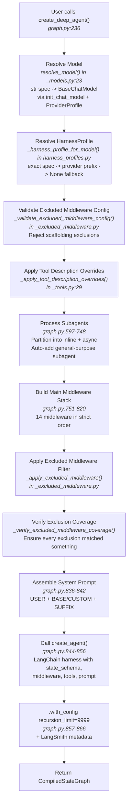
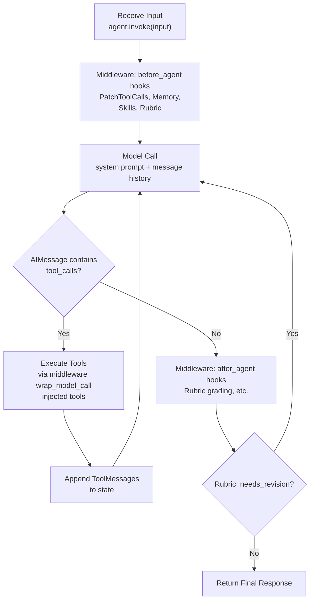
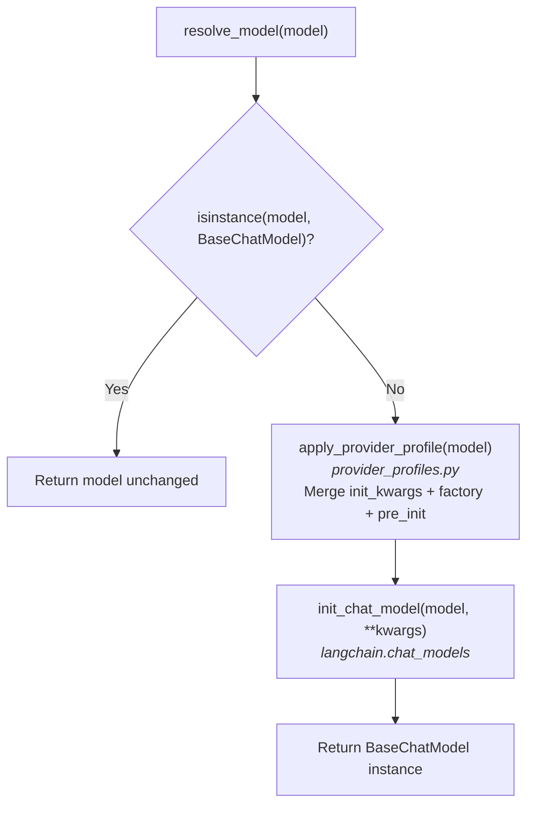
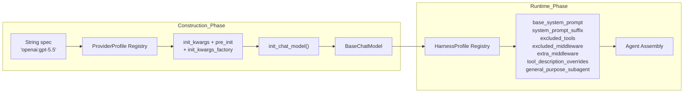
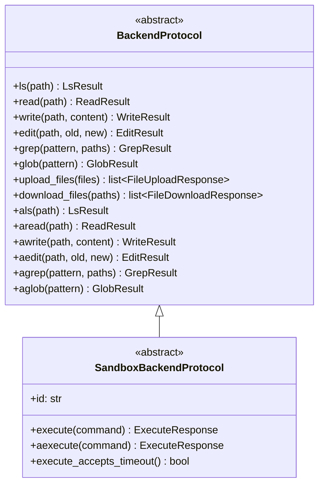
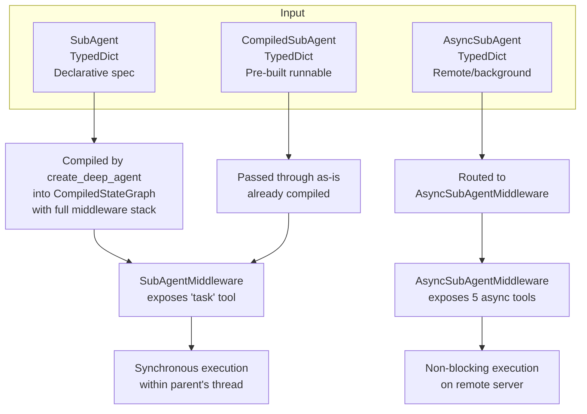
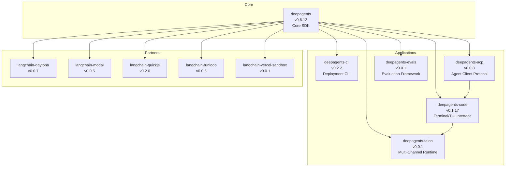
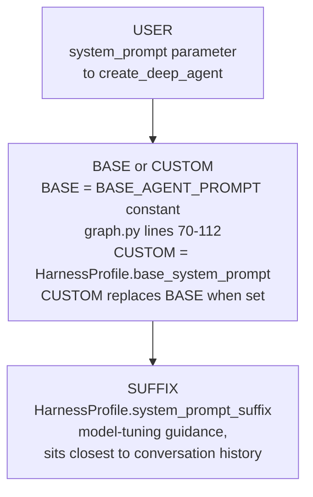
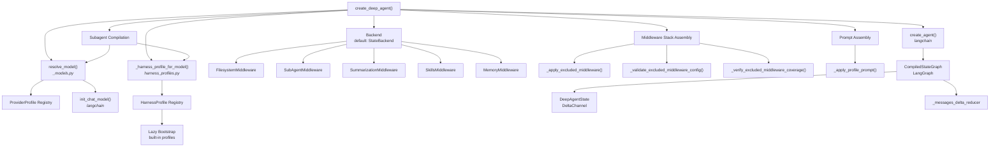

# Document 01 -- Big Picture Architecture

## Purpose

This document provides an exhaustive, implementation-level architectural overview of the
Deep Agents framework. It is written for someone who wants to reimplement a similar
framework from scratch. Every claim is grounded in specific source files, line numbers,
class names, and function signatures from the `deepagents` v0.6.12 codebase.

For package-level descriptions and ecosystem positioning, see Document 00.

---

## 1. What Deep Agents IS

Deep Agents is a **general-purpose agent harness** built on top of LangGraph. It wraps
LangChain's `create_agent` (formerly `create_react_agent`) with a middleware pipeline,
profile system, backend abstraction, and subagent spawning mechanism.

| Attribute              | Value                                                                                      |
|------------------------|--------------------------------------------------------------------------------------------|
| **Package name**       | `deepagents`                                                                               |
| **Version**            | `0.6.12`                                                                                   |
| **License**            | MIT                                                                                        |
| **Python requirement** | `>=3.11, <4.0`                                                                             |
| **Repository**         | `https://github.com/langchain-ai/deepagents`                                              |
| **PyPI classifiers**   | Beta status, supports Python 3.11 / 3.12 / 3.13 / 3.14                                    |
| **Build system**       | setuptools >= 82.0.1                                                                       |
| **Entry point**        | `create_deep_agent()` in `libs/deepagents/deepagents/graph.py` (line 236)                  |
| **Return type**        | LangGraph `CompiledStateGraph` with `recursion_limit=9_999`                                |
| **Default model**      | `ChatAnthropic(model_name="claude-sonnet-4-6")` (deprecated; explicit model recommended)   |

**In one sentence:** Deep Agents takes a model spec, optional tools, middleware, subagent
definitions, a backend, and profile configuration, then assembles a LangGraph compiled
state graph that runs a ReAct loop with filesystem tools, subagent delegation, context
summarization, and human-in-the-loop capabilities.

### Public API Surface

The public API is defined in `libs/deepagents/deepagents/__init__.py` (45 lines).
Everything in `__all__` is a stable export:

```python
__all__ = [
    "AsyncSubAgent",              # TypedDict spec for remote/background subagents
    "AsyncSubAgentMiddleware",    # Middleware exposing async task tools
    "CompiledSubAgent",           # TypedDict wrapping a pre-built Runnable
    "DeepAgentState",             # AgentState with DeltaChannel on messages
    "FilesystemMiddleware",       # File tools + permission enforcement
    "FilesystemPermission",       # TypedDict for allow/deny/interrupt rules
    "GeneralPurposeSubagentProfile",  # Config for auto-added subagent
    "HarnessProfile",            # Runtime behavior tuning (prompts, tools, middleware)
    "HarnessProfileConfig",      # Declarative (YAML/JSON) form of HarnessProfile
    "MemoryMiddleware",          # AGENTS.md injection into system prompt
    "ProviderProfile",           # Model-construction configuration
    "RubricMiddleware",          # Self-evaluation loop with grader
    "SubAgent",                  # TypedDict spec for declarative subagents
    "SubAgentMiddleware",        # Middleware exposing the "task" tool
    "__version__",               # Package version string
    "create_deep_agent",         # THE factory function
    "register_harness_profile",  # Register runtime behavior profile
    "register_provider_profile", # Register model-construction profile
]
```

The factory function signature captures the full surface area of agent configuration:

```python
def create_deep_agent(
    model: str | BaseChatModel | None = None,
    tools: Sequence[BaseTool | Callable | dict] | None = None,
    *,
    system_prompt: str | SystemMessage | None = None,
    middleware: Sequence[AgentMiddleware] = (),
    subagents: Sequence[SubAgent | CompiledSubAgent | AsyncSubAgent] | None = None,
    skills: list[str] | None = None,
    memory: list[str] | None = None,
    permissions: list[FilesystemPermission] | None = None,
    backend: BackendProtocol | None = None,
    interrupt_on: dict[str, bool | InterruptOnConfig] | None = None,
    response_format: ResponseFormat | type | dict | None = None,
    state_schema: type[DeepAgentState] | None = None,
    context_schema: type[ContextT] | None = None,
    checkpointer: Checkpointer | None = None,
    store: BaseStore | None = None,
    debug: bool = False,
    name: str | None = None,
    cache: BaseCache | None = None,
) -> CompiledStateGraph
```

---

## 2. The Core Pipeline

### 2.1 End-to-End Construction Flow

When a user calls `create_deep_agent()`, the following sequence executes. Each step
references the exact source location.



### 2.2 Runtime Execution Loop

Once constructed, the compiled graph executes a standard ReAct loop. Each iteration:



### 2.3 Middleware Lifecycle Hooks

Each middleware in the stack can implement three hooks (defined in
`langchain.agents.middleware.types.AgentMiddleware`):

| Hook                | When It Runs                          | What It Can Do                                    |
|---------------------|---------------------------------------|---------------------------------------------------|
| `before_agent`      | Once, before the ReAct loop starts    | Patch state, load data, inject initial messages    |
| `wrap_model_call`   | Every model invocation in the loop    | Inject tools, modify prompts, intercept responses  |
| `after_agent`       | Once, after the loop finishes         | Grade output, cleanup, emit final state            |

Each hook has an async counterpart (`abefore_agent`, `awrap_model_call`, `aafter_agent`).

---

## 3. The 7 Architectural Layers

### Layer 1: State (`DeepAgentState` with `DeltaChannel`)

**Source:** `libs/deepagents/deepagents/graph.py`, lines 64-68

```python
class DeepAgentState(AgentState):
    messages: Required[Annotated[
        list[AnyMessage],
        DeltaChannel(_messages_delta_reducer, snapshot_frequency=50)
    ]]
```

**Why this matters:** Standard LangGraph checkpoints store the full message list at every
step, yielding O(N^2) storage for N messages. `DeltaChannel` stores only deltas (new
messages since the last snapshot), with a full snapshot every 50 steps. This reduces
checkpoint growth to O(N) -- critical for long-running agents that accumulate hundreds or
thousands of messages.

#### The Messages Reducer

**Source:** `libs/deepagents/deepagents/_messages_reducer.py`, lines 31-90

`_messages_delta_reducer(state, writes)` is a batch reducer for `DeltaChannel`. It
handles three operations:

1. **Deduplication by ID** -- If a new message has the same `id` as an existing message,
   the existing one is replaced in-place at its original index.
2. **Tombstoning** -- `RemoveMessage` objects delete the message with the matching `id`
   by setting the slot to `None` (filtered out at the end).
3. **Full reset** -- The sentinel `REMOVE_ALL_MESSAGES` clears all state and discards
   all writes preceding it in the batch.

**Key design decision:** ID assignment is intentionally absent from the reducer.
LangGraph's `ensure_message_ids` hook stamps stable UUIDs onto all `BaseMessage` writes
before serialization, so by the time the reducer sees a message it already has a stable
ID. Assigning IDs in the reducer would be both redundant and fragile (a reducer runs on
replay too, where a randomly-assigned ID would differ from the one stored in the
checkpoint).

**Coercion fast path (line 58):** The reducer's own output is already typed
`BaseMessage`, so the `convert_to_messages` call is skipped on the steady-state path.
Only raw inputs (initial dicts, deserialized HTTP blobs) hit the slow conversion path.

#### Middleware State Schemas

Individual middleware contribute additional state fields via `state_schema` attributes
on the middleware class. These are merged with `DeepAgentState` at graph compilation time.
Examples:

| Middleware                | State Schema           | Key Fields                                                |
|---------------------------|------------------------|-----------------------------------------------------------|
| `FilesystemMiddleware`    | `FilesystemState`      | `files: DeltaChannel(dict[str, FileData])`                |
| `MemoryMiddleware`        | `MemoryState`          | `memory_contents: dict[str, str]` (private)               |
| `SkillsMiddleware`        | `SkillsState`          | `skills_metadata: list[SkillMetadata]`                    |
| `AsyncSubAgentMiddleware` | `AsyncSubAgentState`   | `async_tasks: dict[str, AsyncTask]`                       |
| `SummarizationMiddleware` | `SummarizationState`   | `_summarization_event: SummarizationEvent` (private)      |
| `RubricMiddleware`        | `RubricState`          | `rubric: str`, `_rubric_iterations: int` (private)        |

Private fields (marked with `PrivateStateAttr`) are excluded from subagent state
inheritance via `private_state_field_names()` in `middleware/_state.py`.

---

### Layer 2: Model Resolution

**Source:** `libs/deepagents/deepagents/_models.py`

#### `resolve_model(model: str | BaseChatModel) -> BaseChatModel` (line 23)

This is the single entry point for turning a model specification into a usable chat
model instance.



**String spec format:** `"provider:model_name"` (e.g., `"openai:gpt-5.5"`,
`"anthropic:claude-sonnet-4-6"`). The colon-separated format is passed directly to
LangChain's `init_chat_model`, which resolves the appropriate provider package.

#### Supporting Functions

| Function                  | Line | Purpose                                                                |
|---------------------------|------|------------------------------------------------------------------------|
| `get_model_identifier()`  | 47   | Extracts model name (tries `model_name` then `model` attribute)        |
| `get_model_provider()`    | 62   | Extracts provider via `model._get_ls_params()["ls_provider"]`          |
| `model_matches_spec()`    | 109  | Checks if a pre-built model matches a string spec                      |
| `_normalize_provider()`   | 155  | Canonicalizes provider names (lowercase, `_` for `-`, alias map)       |

#### Provider Aliases

```python
_PROVIDER_ALIASES = {
    "azure_openai": "azure",
    "mistralai": "mistral",
}
```

These ensure that `mistralai:mixtral` and `mistral:mixtral` resolve to the same provider.

---

### Layer 3: Profile System

Deep Agents uses a **two-tier profile system** where `ProviderProfile` controls model
construction and `HarnessProfile` controls runtime behavior. Both use additive merge
semantics when re-registered.



#### 3.1 ProviderProfile

**Source:** `libs/deepagents/deepagents/profiles/provider/provider_profiles.py`

```python
@dataclass(frozen=True)
class ProviderProfile:
    init_kwargs: Mapping[str, Any]           # Static kwargs to init_chat_model
    pre_init: Callable[[str], None] | None   # Side effect before construction
    init_kwargs_factory: Callable[[], dict] | None  # Dynamic kwargs from runtime
```

**Registration:** `register_provider_profile(key, profile)` where `key` is `"provider"`
or `"provider:model"`.

**Lookup chain (`get_provider_profile`):**
1. Exact spec match (e.g., `"openai:gpt-5.5"`)
2. Provider prefix match (e.g., `"openai"`)
3. `None` fallback (no profile modifications)

**Application (`apply_provider_profile` at line 317):**
1. Run `pre_init` hook if enabled (e.g., minimum-version enforcement for `openrouter`)
2. Merge: `profile.init_kwargs` + `factory()` output + caller kwargs
3. Caller kwargs win on conflicts

**Built-in profiles:**
- `openai` -- Enables Responses API by default (`use_responses_api=True`)
- `openrouter` -- Enforces minimum `langchain-openrouter` version, injects
  app-attribution headers

**Merge semantics (`_merge_provider_profiles` at line 382):**
- `init_kwargs`: Dict merge, override wins per key
- `pre_init`: Chain both (base first, then override); exceptions propagate
- `init_kwargs_factory`: Chain both at resolution time; outputs merge with override
  winning

**Defensive copying:** `MappingProxyType` wraps `init_kwargs` in `__post_init__`
(line 131) to prevent post-construction mutation.

#### 3.2 HarnessProfile

**Source:** `libs/deepagents/deepagents/profiles/harness/harness_profiles.py`

```python
@dataclass(frozen=True)
class HarnessProfile:
    base_system_prompt: str | None                      # Replaces BASE_AGENT_PROMPT
    system_prompt_suffix: str | None                    # Appended after base prompt
    tool_description_overrides: Mapping[str, str]       # Per-tool description rewrites
    excluded_tools: frozenset[str]                      # Tools hidden from model
    excluded_middleware: frozenset[type | str]           # Middleware to strip
    extra_middleware: Sequence | Callable                # Additional middleware
    general_purpose_subagent: GeneralPurposeSubagentProfile | None
```

**Registration:** `register_harness_profile(key, profile)` (line 975) -- additive merge
on re-registration. Runs lazy bootstrap of built-in profiles on first call.

**Lookup chain (`_harness_profile_for_model` at line 1250):**
1. `"provider:identifier"` exact match
2. Bare identifier (if spec was colon-format)
3. Provider-only match
4. Empty default (no modifications)

When both an exact and a provider-level match exist, they are merged with the exact
match taking priority.

**Merge semantics (`_merge_profiles` at line 1192):**

| Field                       | Merge Strategy                                            |
|-----------------------------|-----------------------------------------------------------|
| Scalar fields               | Override wins when set, else base                         |
| `tool_description_overrides`| Dict merge, override wins per key                         |
| `excluded_tools`            | Union of both sets                                        |
| `excluded_middleware`       | Union of both sets (class + string forms)                 |
| `extra_middleware`          | Type-identity merge: override replaces base at same slot  |
| `general_purpose_subagent`  | Field-wise merge via `_merge_general_purpose_subagent_profiles()` |

**Middleware merging detail:**
- Identity = concrete class (exact `type()` match, not `isinstance`)
- Override instances replace base instances at the same position
- Novel classes are appended at the end
- Returns a factory when both inputs have factories

#### 3.3 GeneralPurposeSubagentProfile

```python
@dataclass(frozen=True)
class GeneralPurposeSubagentProfile:
    enabled: bool | None = None    # None=inherit, True=force, False=disable
    description: str | None = None # Override subagent description
    system_prompt: str | None = None  # Override subagent system prompt
```

This controls whether `create_deep_agent` auto-inserts the default general-purpose
subagent. Three-state logic: `None` inherits the default (enabled), `True` forces
inclusion, `False` disables.

#### 3.4 Profile Key Validation

**Source:** `libs/deepagents/deepagents/profiles/_keys.py`

`validate_profile_key(key)` enforces the `"provider"` or `"provider:model"` shape.
Rejects: empty strings, whitespace-padded keys, multiple colons, empty halves. Raises
`ValueError` with specific guidance.

#### 3.5 Lazy Loading and Thread-Safe Bootstrap

Profile registries are populated lazily on first access, not at import time. This keeps
`import deepagents` fast and avoids import-order issues with third-party providers.

The bootstrap mechanism in `_builtin_profiles.py` uses:

- **`_loaded` flag** -- guards against re-running. Registration callables are not
  idempotent; repeat invocations would chain `pre_init` hooks with themselves.
- **`_BOOTSTRAP_CONDITION`** (`threading.Condition`) -- coordinates first-time bootstrap
  across threads. One thread performs the bootstrap while concurrent threads wait.
- **`_loading_thread_id`** -- distinguishes same-thread re-entry (short-circuit) from
  cross-thread first access (wait). This matters because plugin registration callables
  invoked during bootstrap call the public `register_*_profile` helpers, which must
  not deadlock.

Bootstrap runs two phases:

1. **Built-in profiles** are registered via direct module imports (not entry points).
   Any exception propagates -- a broken built-in is a framework bug that must surface
   loudly.
2. **Third-party plugins** are discovered via `importlib.metadata` entry points under
   `deepagents.provider_profiles` and `deepagents.harness_profiles`. Each entry point
   resolves to a zero-arg callable that performs registrations. Failures are logged at
   WARNING and skipped -- one misbehaving plugin cannot prevent the framework from
   loading.

If the bootstrap itself fails (exception during built-in registration), the registry is
rolled back to its pre-bootstrap state to prevent a partially populated registry from
causing downstream failures.

---

### Layer 4: Middleware Pipeline

The middleware pipeline is the primary extension mechanism. Each middleware wraps the
model call, injecting tools, modifying prompts, processing responses, and managing state.

#### 4.1 Assembly Order

The full middleware stack for the main agent is built in `create_deep_agent` (the block
starting at the `# Build main agent middleware stack` comment). The ordering is
deterministic and intentional:

```
 POSITION    MIDDLEWARE                          CONDITION           SOURCE FILE
 --------    ----------                          ---------           -----------
 [Core 1]    SkillsMiddleware                    If skills!=None     middleware/skills.py
 [Core 2]    FilesystemMiddleware                Always (REQUIRED)   middleware/filesystem.py
 [Core 3]    SubAgentMiddleware                  If inline subagents middleware/subagents.py
 [Core 4]    SummarizationMiddleware             Always              middleware/summarization.py
 [Core 5]    PatchToolCallsMiddleware            Always              middleware/patch_tool_calls.py
 [Core 6]    AsyncSubAgentMiddleware             If async subagents  middleware/async_subagents.py

 [User]      <new user-supplied middleware>      From middleware=...  (caller)

 [Tail 1]    <profile extra_middleware>          From HarnessProfile profiles/harness/
 [Tail 2]    AnthropicPromptCachingMiddleware    Always (no-ops)     langchain_anthropic.middleware
 [Tail 3]    MemoryMiddleware                    If memory!=None     middleware/memory.py
 [Tail 4]    HumanInTheLoopMiddleware            If interrupt_on     langchain.agents.middleware

 [Last]      _ToolExclusionMiddleware            If excluded_tools   middleware/_tool_exclusion.py
```

`TodoListMiddleware` is **not** part of the base stack. It is opt-in: harness profiles
that want the `write_todos` tool contribute it via `extra_middleware` (the OpenAI Codex
profile does this in `profiles/harness/_openai_codex.py`), or the caller passes it
explicitly through `middleware=`.

Assembly is not a single linear append. After the tail is built, `create_deep_agent`
runs, in order:

1. `_apply_excluded_middleware()` -- drops entries matching the profile's
   `excluded_middleware` set.
2. `_apply_custom_middleware()` -- merges `middleware=` entries by `.name`. A custom
   middleware whose name matches an existing entry **replaces it in place**, preserving
   stack position; a brand-new entry is spliced in after the last *core* member, ahead of
   the profile/prompt-caching/memory tail.
3. `_apply_excluded_middleware()` again -- so a profile exclusion also applies to
   middleware the caller just spliced in.
4. `_ToolExclusionMiddleware` is appended last, so excluded tool names are stripped after
   everything else and cannot be restored by a custom `wrap_model_call`.

**Why this ordering matters:**

- **Skills before Filesystem:** Skill metadata is loaded before filesystem tools so that
  skill-related files are accessible.
- **Filesystem before SubAgent:** Subagent middleware needs the backend already
  configured with filesystem tools.
- **Summarization before user middleware:** Context overflow handling must wrap the core
  tools; user middleware should not interfere with summarization decisions.
- **PatchToolCalls early:** Dangling tool calls from interrupted sessions must be
  patched before the model sees them.
- **PromptCaching late:** Anthropic prompt caching must happen after all prompt-modifying
  middleware has run, so the cache prefix is stable.
- **Memory after PromptCaching:** Memory updates change the system prompt; placing Memory
  after PromptCaching ensures memory changes do not invalidate the Anthropic prompt cache
  prefix. (This is called out in an explicit design comment in `graph.py`.)
- **HITL last:** Human-in-the-loop must be the outermost wrapper (aside from tool
  exclusion) so it can intercept any tool call from any middleware.

#### 4.2 Required Middleware (Cannot Be Excluded)

**Source:** `graph.py`, lines 206-233

```python
_REQUIRED_MIDDLEWARE: tuple[tuple[type[AgentMiddleware], tuple[str, ...]], ...] = (
    (FilesystemMiddleware, ()),
    (SubAgentMiddleware, ()),
)
```

Attempting to exclude either via `HarnessProfile.excluded_middleware` raises `ValueError`
at assembly time. The error message directs users to use `excluded_tools` for per-tool
visibility or adjust profile settings instead of stripping scaffolding.

#### 4.3 The 14 Middleware Classes

##### 4.3.1 TodoListMiddleware (opt-in)
- **Source:** `langchain.agents.middleware.TodoListMiddleware` (external)
- **Hook:** `wrap_model_call` -- injects `write_todos` tool
- **State:** Manages todo list items in agent state
- **Tools provided:** `write_todos`
- **Not in the default stack.** Added only by harness profiles that request it (e.g. the
  OpenAI Codex profile) or by the caller via `middleware=`.

##### 4.3.2 SkillsMiddleware
- **Source:** `libs/deepagents/deepagents/middleware/skills.py`
- **State schema:** `SkillsState` (`skills_metadata: list[SkillMetadata]`,
  `skills_load_errors: list[str]`)
- **Hooks:**
  - `before_agent` -- Loads skill metadata from backend sources (parses YAML frontmatter
    from `SKILL.md` files)
  - `wrap_model_call` -- Injects skill list into system prompt
- **Tools provided:** None (progressive disclosure -- metadata visible, full docs
  loaded on-demand via `read_file`)

##### 4.3.3 FilesystemMiddleware
- **Source:** `libs/deepagents/deepagents/middleware/filesystem.py`
- **State schema:** `FilesystemState` (`files: DeltaChannel(dict[str, FileData])`)
- **Hooks:**
  - `wrap_model_call` -- Injects filesystem tools and dynamic system prompt
- **Tools provided (7):** `ls`, `read_file`, `write_file`, `edit_file`, `glob`, `grep`,
  `execute`
- **Key behaviors:**
  - Enforces `FilesystemPermission` rules (allow/deny/interrupt modes)
  - Token-aware tool result eviction: when tool output exceeds a token threshold, the
    result is offloaded to `/large_tool_results/{tool_call_id}` and a truncated preview
    is returned instead
  - The `execute` tool is only available when the backend implements
    `SandboxBackendProtocol`

##### 4.3.4 SubAgentMiddleware
- **Source:** `libs/deepagents/deepagents/middleware/subagents.py`
- **Hooks:**
  - `wrap_model_call` -- Injects `task` tool and subagent listing into system prompt
- **Tools provided:** `task(description, subagent_type)`
- **Key behaviors:**
  - Raw `SubAgent` specs are auto-compiled with a full middleware stack and model
  - Subagents inherit parent state (filtered to exclude private fields via
    `private_state_keys`)
  - Tracing context tagged with `ls_agent_type="subagent"` for LangSmith
  - Returns `ToolMessage` with serialized result

##### 4.3.5 SummarizationMiddleware
- **Source:** `libs/deepagents/deepagents/middleware/summarization.py`
- **State schema:** `SummarizationState`
  (`_summarization_event: SummarizationEvent | None` -- private)
- **Hooks:**
  - `wrap_model_call` -- Counts tokens; triggers summarization on overflow
- **Tools provided:** None directly. Composes with `SummarizationToolMiddleware` which
  provides `compact_conversation`
- **Key behaviors:**
  - Two-phase optimization:
    1. Argument truncation (lightweight, fires at lower token threshold)
    2. Full summarization (expensive LLM call, fires when tokens exceed context limit)
  - Offloads conversation history to `/conversation_history/{thread_id}.md`
  - Handles `ContextOverflowError` fallback with tail-clipping
    (`_clip_overflow_tail` in `middleware/_overflow_clip.py`)
  - Model-aware defaults via `create_summarization_middleware()` factory

##### 4.3.6 PatchToolCallsMiddleware
- **Source:** `libs/deepagents/deepagents/middleware/patch_tool_calls.py`
- **Hooks:**
  - `before_agent` -- Patches dangling tool calls in message history
- **Tools provided:** None
- **Key behaviors:**
  - Handles orphaned tool calls (AIMessage with tool_calls but no corresponding
    ToolMessage)
  - Classifies as "cancelled" (message interrupted) or "invalid" (arguments
    malformed/truncated)
  - Injects synthetic `ToolMessage` responses to complete the turn

##### 4.3.7 AsyncSubAgentMiddleware
- **Source:** `libs/deepagents/deepagents/middleware/async_subagents.py`
- **State schema:** `AsyncSubAgentState`
  (`async_tasks: dict[str, AsyncTask]` with custom reducer)
- **Hooks:**
  - `wrap_model_call` -- Injects async task tools and system prompt
- **Tools provided (5):** `start_async_task`, `check_async_task`,
  `update_async_task`, `cancel_async_task`, `list_async_tasks`
- **Key behaviors:**
  - Connects to remote Agent Protocol-compliant servers
  - Client-caching by URL and headers for connection pooling
  - Task state persisted in agent state with timestamps
  - Status tracking: `running`, `success`, `error`, `cancelled`
  - Non-blocking: returns control immediately after launch

##### 4.3.8 _ToolExclusionMiddleware (Internal)
- **Source:** `libs/deepagents/deepagents/middleware/_tool_exclusion.py`
- **Hooks:**
  - `wrap_model_call` -- Filters excluded tools from model request
- **Key behaviors:**
  - Removes tools named in `HarnessProfile.excluded_tools`
  - Applies to all tools (user-supplied and middleware-injected)
  - Placed late in the stack (after all tool-injecting middleware)

##### 4.3.9 AnthropicPromptCachingMiddleware (External)
- **Source:** `langchain_anthropic.middleware`
- **Hooks:**
  - `wrap_model_call` -- Adds `cache_control` breakpoints to system prompt
- **Key behaviors:**
  - Constructed with `unsupported_model_behavior="ignore"` so it no-ops for
    non-Anthropic models
  - Placed after all prompt-modifying middleware to ensure stable cache prefix

##### 4.3.10 MemoryMiddleware
- **Source:** `libs/deepagents/deepagents/middleware/memory.py`
- **State schema:** `MemoryState`
  (`memory_contents: dict[str, str]` -- private)
- **Hooks:**
  - `before_agent` -- Loads AGENTS.md files from configured sources
  - `wrap_model_call` -- Injects loaded memory into system prompt
- **Tools provided:** None (read-only memory injection)
- **Key behaviors:**
  - Loads from multiple memory sources (combined in order)
  - Strips HTML comments from loaded content
  - Memory contents are marked private (not included in serialized state)

##### 4.3.11 HumanInTheLoopMiddleware (External)
- **Source:** `langchain.agents.middleware.HumanInTheLoopMiddleware`
- **Hooks:**
  - `wrap_model_call` -- Interrupts execution at specified tool calls
- **Key behaviors:**
  - Configured via `interrupt_on` dict mapping tool names to `bool | InterruptOnConfig`
  - Auto-installed when any `FilesystemPermission` rule has mode `"interrupt"`
  - Generated interrupt configs merged with user-supplied `interrupt_on`

##### 4.3.12 RubricMiddleware
- **Source:** `libs/deepagents/deepagents/middleware/rubric.py`
- **State schema:** `RubricState` (6 fields including `rubric`, `_rubric_iterations`,
  `_rubric_status`, `_current_grading_run_id`, `_rubric_evaluations`, `_active_rubric`)
- **Hooks:**
  - `before_agent` -- Detects new rubric, resets iteration counter
  - `after_agent` -- Runs grader sub-agent, injects feedback if `needs_revision`
    (decorated with `@hook_config(can_jump_to=["model"])`)
- **Key behaviors:**
  - Self-evaluation loop: grader runs when agent finishes each iteration
  - Grader verdicts: `satisfied`, `needs_revision`, `failed`
  - Max iterations hard-capped at 20
  - Uses `jump_to="model"` to loop back if needs_revision
  - Structured output via `GraderResponse` schema

##### 4.3.13 SummarizationToolMiddleware (Composed)
- **Source:** `libs/deepagents/deepagents/middleware/summarization.py`
- **Hooks:**
  - `wrap_model_call` -- Injects `compact_conversation` tool
- **Tools provided:** `compact_conversation`
- **Composed with:** a `SummarizationMiddleware` instance (shared engine)

##### 4.3.14 ProfileMiddleware (via HarnessProfile.extra_middleware)
- Profile-specific middleware injected into the stack. These are model-specific
  tuning middleware that providers register to optimize behavior for their models.

#### 4.4 Excluded Middleware System

**Source:** `libs/deepagents/deepagents/_excluded_middleware.py`

Three functions work together to provide safe middleware filtering:

1. **`_validate_excluded_middleware_config(profile, required_classes, required_names)`**
   -- Pre-assembly validation. Rejects entries that name required scaffolding
   (`FilesystemMiddleware`, `SubAgentMiddleware`). Rejects private (underscore-prefixed)
   names.

2. **`_apply_excluded_middleware(stack, profile, matched_classes, matched_names)`**
   -- Filters the assembled stack. Class-form entries use exact `type()` match.
   String-form entries match `AgentMiddleware.name`. Records which entries matched for
   later coverage audit. Detects name collisions (string matching multiple distinct
   classes).

3. **`_verify_excluded_middleware_coverage(profile, matched_classes, matched_names, ...)`**
   -- Post-assembly audit. Raises `ValueError` if any exclusion entry matched
   nothing across all stacks the profile applies to (main agent + general-purpose
   subagent). Catches typos and stale profile entries.

---

### Layer 5: Backend Abstraction

**Source:** `libs/deepagents/deepagents/backends/protocol.py`

#### 5.1 Protocol Hierarchy



Every sync method has an async counterpart (prefixed with `a`). The protocol uses
`abc.ABC` for enforcement.

#### 5.2 Data Types

| Type                   | Format    | Key Fields                                              |
|------------------------|-----------|---------------------------------------------------------|
| `FileData`             | TypedDict | `content: str`, `encoding: str`, timestamps             |
| `FileInfo`             | TypedDict | `path: str`, `is_dir: bool`, `size: int`, `modified_at` |
| `GrepMatch`            | TypedDict | `path: str`, `line_number: int`, `text: str`            |
| `ExecuteResponse`      | TypedDict | `output: str`, `exit_code: int`, `truncated: bool`      |
| `FileUploadResponse`   | TypedDict | `path: str`, `error: FileOperationError | None`         |
| `FileDownloadResponse` | TypedDict | `path: str`, `content: str`, `error: ... | None`        |

**File format versions:**
- `"v1"` (legacy): Content stored as `list[str]` (lines split on `\n`), no `encoding`
  field. Deprecated.
- `"v2"` (current): Content stored as plain `str` (UTF-8 text or base64-encoded binary),
  with `encoding` field (`"utf-8"` or `"base64"`).

#### 5.3 `BackendFactory` (removed)

> **Changed:** there is no `BackendFactory` type in the current SDK. The
> `backend` parameter of `create_deep_agent` is typed `BackendProtocol | None`
> — a backend instance (or `None`). The only factory-style callable in
> `backends/` today is `NamespaceFactory`
> (`Callable[[Runtime], tuple[str, ...]]`) used by `StoreBackend` to compute a
> store namespace — it is unrelated to backend construction.

#### 5.4 Concrete Implementations

| Backend            | Source File              | Storage Medium               | Persistence        | Execution |
|--------------------|--------------------------|------------------------------|--------------------|-----------|
| `StateBackend`     | `backends/state.py`      | LangGraph state channels     | Within thread only | No        |
| `FilesystemBackend`| `backends/filesystem.py` | Local disk                   | Permanent          | No        |
| `StoreBackend`     | `backends/store.py`      | LangGraph `BaseStore`        | Across threads     | No        |
| `CompositeBackend` | `backends/composite.py`  | Routes by path prefix        | Varies             | Varies    |
| `ContextHubBackend`| `backends/context_hub.py`| LangGraph context            | Read-only          | No        |
| `LocalShellBackend`| `backends/local_shell.py`| Local shell execution        | N/A                | Yes       |
| `LangSmithSandbox` | `backends/langsmith.py`  | LangSmith sandbox runtime    | Session            | Yes       |

`StateBackend` is the default when no backend is specified. It stores files in LangGraph
state using `CONFIG_KEY_READ` and `CONFIG_KEY_SEND` so that state updates are queued as
proper channel writes rather than returned as dict updates.

`BaseSandbox` (in `backends/sandbox.py`) is an abstract base class that implements all
`BackendProtocol` file operations by delegating to `execute()` -- it runs shell commands
(e.g., `cat`, `python3 -c "..."`) inside the sandbox to perform reads, writes, and
searches. Partner sandbox packages (Daytona, Modal, RunLoop, Vercel) extend `BaseSandbox`
and only need to implement `execute()` and `upload_files()`.

---

### Layer 6: Tool System

#### 6.1 Built-In Tools

Every deep agent has access to these tools by default:

| Tool            | Provided By              | Operation Type | Description                          |
|-----------------|--------------------------|----------------|--------------------------------------|
| `ls`            | `FilesystemMiddleware`   | Read           | List directory contents              |
| `read_file`     | `FilesystemMiddleware`   | Read           | Read file contents (paginated)       |
| `write_file`    | `FilesystemMiddleware`   | Write          | Create new files                     |
| `edit_file`     | `FilesystemMiddleware`   | Write          | String replacement edits             |
| `glob`          | `FilesystemMiddleware`   | Read           | Pattern-match file paths (globstar)  |
| `grep`          | `FilesystemMiddleware`   | Read           | Search file contents (literal)       |
| `execute`       | `FilesystemMiddleware`   | Execute        | Shell commands (sandbox only)        |
| `task`          | `SubAgentMiddleware`     | Delegation     | Spawn subagent for subtask           |

`write_todos` is **not** in this set -- it arrives only with the opt-in
`TodoListMiddleware`.

Async subagent tools (when async subagents are configured):

| Tool                | Provided By               | Description                              |
|---------------------|---------------------------|------------------------------------------|
| `start_async_task`  | `AsyncSubAgentMiddleware` | Launch remote background task            |
| `check_async_task`  | `AsyncSubAgentMiddleware` | Poll task status and retrieve result     |
| `update_async_task` | `AsyncSubAgentMiddleware` | Send new instructions to running task    |
| `cancel_async_task` | `AsyncSubAgentMiddleware` | Stop a running task                      |
| `list_async_tasks`  | `AsyncSubAgentMiddleware` | List all tracked tasks with statuses     |

Optional tools:

| Tool                    | Provided By                    | Description                        |
|-------------------------|--------------------------------|------------------------------------|
| `compact_conversation`  | `SummarizationToolMiddleware`  | Manually trigger compaction        |

#### 6.2 Tool Description Overrides

**Source:** `libs/deepagents/deepagents/_tools.py`

`_apply_tool_description_overrides(tools, overrides)` (line 29) applies
`HarnessProfile.tool_description_overrides` to tools without mutating the originals.
It copies dict tools and `BaseTool` instances, rewriting their `description` field.
`Callable` tools are returned unchanged (unsafe to wrap).

#### 6.3 Tool Exclusion

Profile-driven tool hiding is handled by `_ToolExclusionMiddleware`, which filters
tools by name from the model request. This runs late in the middleware stack so it
catches tools from all sources (user-supplied and middleware-injected).

#### 6.4 Permission-Based Tool Interruption

**Source:** `libs/deepagents/deepagents/middleware/_fs_interrupt.py`

`_build_interrupt_on_from_permissions(rules)` converts `FilesystemPermission` rules
with `mode="interrupt"` into `HumanInTheLoopMiddleware` `InterruptOnConfig` entries.
These are scope-aware (exact vs. bulk path matching) and are merged with user-supplied
`interrupt_on` configs in `_merge_fs_interrupt_on()` (graph.py line 188).

---

### Layer 7: Subagent Spawning

#### 7.1 Three Subagent Forms



#### 7.2 SubAgent (Declarative)

A `TypedDict` with required fields `name`, `description`, `system_prompt` and optional
fields `tools`, `model`, `middleware`, `interrupt_on`, `skills`, `permissions`.

During `create_deep_agent`, each `SubAgent` is processed (graph.py lines 607-686):

1. Model resolved via `resolve_model()`
2. HarnessProfile looked up for the subagent's model
3. Permissions inherited from parent unless subagent declares its own
4. Middleware stack built: `[TodoList, Filesystem, Summarization, PatchToolCalls]`
   + skills (if specified) + user middleware + profile extra_middleware +
   ToolExclusion (if profile has excluded_tools) + PromptCaching
5. Excluded middleware applied and coverage verified
6. Tools inherited from parent unless subagent declares its own
7. System prompt assembled via `_apply_profile_prompt()`
8. `interrupt_on` inherited unless subagent declares its own

#### 7.3 CompiledSubAgent (Pre-Built)

A `TypedDict` with a `runnable` field containing a pre-compiled `Runnable`. Passed
through without modification. Does not inherit parent's `interrupt_on`,
`state_schema`, or middleware. Useful when you need a custom graph topology.

#### 7.4 AsyncSubAgent (Remote)

A `TypedDict` identified by `graph_id` field (plus optional `url`/`headers`). Routed
to `AsyncSubAgentMiddleware`. Runs as a background task on a remote Agent
Protocol-compliant server (LangGraph Platform or self-hosted).

#### 7.5 Auto-Added General-Purpose Subagent

**Source:** `graph.py` lines 693-748

Unless `HarnessProfile.general_purpose_subagent.enabled` is `False`, and unless the
caller already supplied a subagent named `"general-purpose"`, `create_deep_agent`
inserts a default general-purpose subagent at position 0 in the inline subagent list.

This subagent mirrors the main agent: same model, same tools, same middleware stack
(base + profile extra + ToolExclusion + PromptCaching), same permissions, same
`interrupt_on`. Its system prompt comes from either the
`GeneralPurposeSubagentProfile.system_prompt` override or the GENERAL_PURPOSE_SUBAGENT
constant processed through `_apply_profile_prompt()`.

If no synchronous subagents exist after this step, the `task` tool is not exposed.
Async subagents are independent and always expose their own tool surface.

#### 7.6 State Inheritance

Subagents inherit parent state but with private fields filtered out. The set of private
field names is computed by `private_state_field_names()` in `middleware/_state.py`, which
scans all middleware `state_schema` attributes for fields annotated with
`PrivateStateAttr`. These field names are stored on `SubAgentMiddleware.private_state_keys`
(graph.py lines 821-823).

---

## 4. The Monorepo Packages

The Deep Agents project is organized as a monorepo under `libs/`. The core SDK is the
foundation; all other packages depend on it.



### 4.1 deepagents (Core SDK)

- **Package:** `deepagents`
- **Version:** `0.6.12`
- **Directory:** `libs/deepagents/`
- **Build system:** setuptools
- **Python:** `>=3.11, <4.0`

This is the framework documented throughout this document. It provides:
- `create_deep_agent()` factory function
- `DeepAgentState` with `DeltaChannel`
- 14 middleware classes
- Backend protocol hierarchy with 7 implementations
- Two-tier profile system
- Subagent spawning (declarative, compiled, async)

### 4.2 deepagents-code (Terminal Interface)

- **Package:** `deepagents-code`
- **Version:** `0.1.17`
- **Directory:** `libs/code/`
- **Build system:** hatchling
- **Python:** `>=3.11, <4.0`
- **Core dependency:** `deepagents==0.7.0b2` (strict pin)
- **CLI entry points:** `deepagents-code`, `dcode`

Key dependencies: `textual>=8.2.7` (TUI framework), `langgraph-sdk`, `langgraph-cli`,
`langsmith[sandbox]`, `langchain-mcp-adapters`. Supports 20+ optional model providers
and 5+ sandbox providers.

### 4.3 deepagents-acp (Agent Client Protocol)

- **Package:** `deepagents-acp`
- **Version:** `0.0.8`
- **Directory:** `libs/acp/`
- **Build system:** hatchling
- **Status:** Alpha
- **Core dependency:** `deepagents` (unpinned), `agent-client-protocol>=0.10.1`

Provides a Starlette ASGI server with SSE streaming for standardized agent
communication via the Agent Client Protocol.

### 4.4 deepagents-cli (Deployment CLI)

- **Package:** `deepagents-cli`
- **Version:** `0.2.2`
- **Directory:** `libs/cli/`
- **Build system:** hatchling
- **Core dependency:** `deepagents>=0.6.8`
- **CLI entry points:** `deepagents` (primary), `deepagents-cli`

Commands: `deploy`, `env`, `dev`, `push`, `status`, `logs`, `delete`, `model`.

### 4.5 deepagents-talon (Multi-Channel Runtime)

- **Package:** `deepagents-talon`
- **Version:** `0.0.1`
- **Directory:** `libs/talon/`
- **Build system:** hatchling
- **Status:** Alpha (experimental)
- **Core dependency:** `deepagents>=0.6.8,<0.7.0`, `deepagents-code>=0.1.11`
- **CLI entry point:** `deepagents-talon`

Provides channel-based and scheduled agent execution for long-running processes.

### 4.6 deepagents-evals (Evaluation Framework)

- **Package:** `deepagents-evals`
- **Version:** `0.0.1`
- **Directory:** `libs/evals/`
- **Build system:** setuptools
- **Status:** Alpha
- **Python:** `>=3.12, <3.14` (stricter than core)
- **Core dependency:** `deepagents>=0.6.8`, `deepagents-code>=0.1.11`
- **CLI entry point:** `deepagents-evals`

Comprehensive evaluation framework with Harbor integration.

### 4.7 Partner Packages

All in `libs/partners/`. Each provides a `SandboxBackendProtocol` implementation.

| Package                      | Version | Directory          | Sandbox Platform   |
|------------------------------|---------|--------------------|--------------------|
| `langchain-daytona`          | 0.0.7   | `partners/daytona` | Daytona            |
| `langchain-modal`            | 0.0.5   | `partners/modal`   | Modal              |
| `langchain-quickjs`          | 0.2.0   | `partners/quickjs` | QuickJS (JS REPL)  |
| `langchain-runloop`          | 0.0.6   | `partners/runloop` | Runloop            |
| `langchain-vercel-sandbox`   | 0.0.1   | `partners/vercel`  | Vercel             |

All depend on `deepagents>=0.6.8,<0.7.0`.

---

## 5. Key Dependencies

**Source:** `libs/deepagents/pyproject.toml` lines 22-29

| Dependency                  | Version Constraint         | Role                                                     |
|-----------------------------|----------------------------|----------------------------------------------------------|
| `langchain-core`            | `>=1.4.7, <2.0.0`         | Base abstractions: `BaseChatModel`, `BaseTool`, messages  |
| `langsmith`                 | `>=0.8.11`                 | Observability, tracing, run metadata                     |
| `langchain-anthropic`       | `>=1.4.6, <2.0.0`         | Anthropic model integration, prompt caching middleware    |
| `langchain-google-genai`    | `>=4.2.5, <5.0.0`         | Google model integration                                 |
| `langchain`                 | `>=1.3.9, <2.0.0`         | `create_agent`, `init_chat_model`, middleware types       |
| `wcmatch`                   | `>=10.1`                   | Advanced glob matching (globstar, extended patterns)      |

**Optional dependency:**

| Dependency                  | Extra Name | Role                                                |
|-----------------------------|------------|-----------------------------------------------------|
| `langchain-quickjs`         | `quickjs`  | JavaScript REPL middleware                          |

**Implicit transitive dependencies (via langchain):**
- `langgraph` -- Graph compilation, state channels, `DeltaChannel`, checkpointing
- `langgraph.channels.delta` -- `DeltaChannel` for efficient checkpoint storage
- `langgraph.graph.state` -- `CompiledStateGraph`
- `langgraph.store.base` -- `BaseStore` for persistent storage
- `langgraph.cache.base` -- `BaseCache` for caching

### Why These Specific Versions

- **`langchain-core>=1.4.7`**: Required for `AnyMessage` type, `convert_to_messages`,
  `RemoveMessage`
- **`langchain>=1.3.9`**: Required for `create_agent` (the wrapper around
  `create_react_agent`), `init_chat_model`, and the `AgentMiddleware` protocol
- **`langchain-anthropic>=1.4.6`**: Required for `AnthropicPromptCachingMiddleware`
  with `unsupported_model_behavior` parameter
- **`langsmith>=0.8.11`**: Required for sandbox support and tracing metadata
- **`wcmatch>=10.1`**: Required for `GLOBSTAR` flag in glob matching

---

## 6. Design Principles

### 6.1 Convention Over Configuration

Deep Agents provides sensible defaults at every level:

- **Default model:** `claude-sonnet-4-6` (deprecated; explicit model recommended)
- **Default backend:** `StateBackend()` (ephemeral in-state storage)
- **Default subagent:** Auto-added general-purpose subagent
- **Default middleware stack:** Full 14-middleware pipeline assembled automatically
- **Default system prompt:** `BASE_AGENT_PROMPT` with concise, direct behavior guidance
  (graph.py lines 70-112)
- **Default recursion limit:** `9_999` (high enough for long-running tasks)
- **Default checkpoint frequency:** Every 50 steps (DeltaChannel snapshot)

Everything is overridable: the model, backend, system prompt, middleware stack, tools,
subagents, permissions, and even individual middleware can be excluded or replaced.

### 6.2 Security by Default

Two middleware classes are **required scaffolding** and cannot be excluded
(`graph.py` lines 206-233):

- **`FilesystemMiddleware`** -- Cannot be excluded because it backs every built-in file
  tool AND enforces `FilesystemPermission` rules. Removing it would silently break
  file operations and remove the security guarantee of permission enforcement.
- **`SubAgentMiddleware`** -- Cannot be excluded because it backs the `task` tool
  handler. Removing it would silently break subagent delegation.

Attempting to exclude either via `HarnessProfile.excluded_middleware` raises `ValueError`
with guidance to use `excluded_tools` for per-tool visibility instead.

The `_validate_excluded_middleware_config` function also rejects private
(underscore-prefixed) names, preventing accidental exclusion of internal middleware.

### 6.3 Protocol-Based Abstraction

The backend system uses `abc.ABC` protocols (`BackendProtocol`,
`SandboxBackendProtocol`), not concrete base classes. This allows any implementation
that satisfies the protocol to be used, including:

- In-memory state backends for testing
- Disk-backed backends for local development
- Remote sandbox backends for production
- Composite backends that route by path prefix
- Custom backends for domain-specific storage

(The former `BackendFactory` type alias has been removed; pass a constructed
`BackendProtocol` instance to `backend=`.)

### 6.4 Additive Profile Merging

Both profile registries use **additive merge semantics**: calling
`register_harness_profile` or `register_provider_profile` a second time for the same key
**merges** the new profile on top of the existing one rather than replacing it.

This enables layered customization:

```python
# Base provider profile (built-in)
register_provider_profile("openai", ProviderProfile(
    init_kwargs={"use_responses_api": True}
))

# User adds temperature override without losing Responses API default
register_provider_profile("openai", ProviderProfile(
    init_kwargs={"temperature": 0.7}
))

# Result: {"use_responses_api": True, "temperature": 0.7}
```

Merge strategies vary by field type:
- Scalars: override wins when set
- Dicts: per-key merge, override wins on conflict
- Sets: union
- Middleware lists: type-identity merge (override replaces base at same position)

### 6.5 Explicit Over Implicit

Several design decisions favor explicitness:

- **Model deprecation:** Passing `model=None` emits a deprecation warning since v0.5.3
  (graph.py line 154). The intent is to force explicit model selection before v1.0.0.
- **Coverage verification:** Every `excluded_middleware` entry that matches nothing
  raises `ValueError`. This catches typos and stale profile entries rather than silently
  ignoring them.
- **Scaffolding rejection:** Rather than silently degrading when required middleware is
  excluded, the system raises immediately with guidance.
- **ID assignment:** Message IDs are NOT assigned in the reducer -- they are expected to
  be pre-assigned by LangGraph's `ensure_message_ids` hook. This makes the reducer
  replay-safe.

### 6.6 Composition Over Inheritance

The middleware system favors composition:

- Each middleware is a standalone unit with defined lifecycle hooks
- Middleware can compose with other middleware (e.g., `SummarizationToolMiddleware`
  wraps `SummarizationMiddleware`)
- State schemas are contributed additively by individual middleware, not inherited
  through a class hierarchy
- Backends are composed via `CompositeBackend` rather than through inheritance
- Profile middleware is injected positionally rather than subclassed

---

## 7. Prompt Assembly

The system prompt sent to the model is composed from up to three named parts, always in
this order:



**Implementation** (`graph.py` lines 836-842):

When `system_prompt` is a plain string, it is concatenated with the base prompt using
`"\n\n"` as separator. When `system_prompt` is a `SystemMessage`, the assembled
right-hand content is appended as an additional text content block
(`{"type": "text", "text": f"\n\n{base_prompt}"}`) onto the message's existing
`content_blocks` list. This preserves any `cache_control` markers the caller set on the
original message's content blocks, which is important for Anthropic prompt caching.

**Invariants:**

1. `USER` is always at the front, so caller instructions take precedence over SDK and
   profile content regardless of which model is selected.
2. `SUFFIX` is always at the end, so model-tuning guidance sits closest to the
   conversation history (where the model attends most).
3. `CUSTOM` replaces `BASE` entirely (never augments it), giving profile authors full
   control over core behavioral instructions.

### BASE_AGENT_PROMPT

The default base prompt (`graph.py` lines 70-112) establishes core agent behavior:

- **Concise and direct** -- No unnecessary preamble ("Sure!", "Great question!")
- **Professional objectivity** -- Accuracy over validating user beliefs
- **Three-step task execution:** Understand first, act, verify
- **Persistence** -- Keep working until the task is fully complete
- **Error handling** -- Stop and analyze on repeated failures
- **Progress updates** -- Brief updates at reasonable intervals for longer tasks

---

## 8. Component Dependency Graph

This diagram shows how the major subsystems within the core SDK depend on each other at
construction time:



---

## 9. Key Source Files

| File | Purpose |
|------|---------|
| `libs/deepagents/deepagents/__init__.py` | Public API surface (`__all__` with 18 exports) |
| `libs/deepagents/deepagents/graph.py` | Central factory (`create_deep_agent`), `DeepAgentState`, `BASE_AGENT_PROMPT`, required middleware constants |
| `libs/deepagents/deepagents/_messages_reducer.py` | Custom `DeltaChannel` reducer for message dedup, tombstoning, and reset |
| `libs/deepagents/deepagents/_models.py` | Model resolution (`resolve_model`), provider inspection, spec matching |
| `libs/deepagents/deepagents/_tools.py` | Tool description override application |
| `libs/deepagents/deepagents/_excluded_middleware.py` | Middleware filtering, validation, and coverage verification |
| `libs/deepagents/deepagents/backends/protocol.py` | `BackendProtocol`, `SandboxBackendProtocol` ABCs, data types |
| `libs/deepagents/deepagents/backends/state.py` | `StateBackend` -- ephemeral in-state file storage |
| `libs/deepagents/deepagents/backends/filesystem.py` | `FilesystemBackend` -- disk-backed storage |
| `libs/deepagents/deepagents/backends/composite.py` | `CompositeBackend` -- path-prefix routing |
| `libs/deepagents/deepagents/backends/sandbox.py` | `BaseSandbox` -- abstract base for execute-backed file operations |
| `libs/deepagents/deepagents/backends/store.py` | `StoreBackend` -- cross-thread persistent storage |
| `libs/deepagents/deepagents/backends/local_shell.py` | `LocalShellBackend` -- filesystem + unrestricted local shell |
| `libs/deepagents/deepagents/backends/context_hub.py` | `ContextHubBackend` -- persistent via LangSmith Hub |
| `libs/deepagents/deepagents/middleware/filesystem.py` | `FilesystemMiddleware` -- 7 file tools + permission enforcement |
| `libs/deepagents/deepagents/middleware/subagents.py` | `SubAgentMiddleware`, `SubAgent`, `CompiledSubAgent` types |
| `libs/deepagents/deepagents/middleware/async_subagents.py` | `AsyncSubAgentMiddleware`, `AsyncSubAgent` type |
| `libs/deepagents/deepagents/middleware/skills.py` | `SkillsMiddleware` -- skill loading and injection |
| `libs/deepagents/deepagents/middleware/memory.py` | `MemoryMiddleware` -- AGENTS.md loading and injection |
| `libs/deepagents/deepagents/middleware/summarization.py` | `SummarizationMiddleware` + `SummarizationToolMiddleware` |
| `libs/deepagents/deepagents/middleware/patch_tool_calls.py` | `PatchToolCallsMiddleware` -- orphaned tool call repair |
| `libs/deepagents/deepagents/middleware/rubric.py` | `RubricMiddleware` -- self-evaluation loop |
| `libs/deepagents/deepagents/middleware/_tool_exclusion.py` | `_ToolExclusionMiddleware` -- profile-driven tool hiding |
| `libs/deepagents/deepagents/middleware/_state.py` | `private_state_field_names()` -- private field detection |
| `libs/deepagents/deepagents/middleware/_fs_interrupt.py` | Permission-to-interrupt config conversion |
| `libs/deepagents/deepagents/middleware/_overflow_clip.py` | Context overflow tail-clipping fallback |
| `libs/deepagents/deepagents/profiles/harness/harness_profiles.py` | `HarnessProfile`, `HarnessProfileConfig`, `GeneralPurposeSubagentProfile`, registry |
| `libs/deepagents/deepagents/profiles/provider/provider_profiles.py` | `ProviderProfile`, registry, `apply_provider_profile` |
| `libs/deepagents/deepagents/profiles/_keys.py` | Profile key validation |
| `libs/deepagents/deepagents/profiles/_builtin_profiles.py` | Lazy bootstrap, thread-safe loading, plugin discovery |
| `libs/deepagents/pyproject.toml` | Package metadata, dependencies, build config |

---

## 10. Knowledge Verification Questions

These questions test deep understanding of the Deep Agents architecture. A correct answer
requires reading the source code, not just this document.

### Q1: Why is `MemoryMiddleware` placed AFTER `AnthropicPromptCachingMiddleware` in the stack?

**Expected answer:** Memory updates change the system prompt. If Memory ran before
PromptCaching, each memory change would invalidate the Anthropic prompt cache prefix,
destroying cache efficiency. By placing Memory after PromptCaching, the cache breakpoints
are set on the stable portion of the prompt, and memory content (which changes between
runs) sits outside the cached prefix. This is an explicit design decision documented in
a code comment at `graph.py` lines 792-793.

### Q2: What happens if you register an `excluded_middleware` entry that matches nothing in any middleware stack?

**Expected answer:** `_verify_excluded_middleware_coverage()` raises `ValueError`. The
coverage check runs after both the main agent stack and the general-purpose subagent
stack have been filtered. An entry only needs to match in one of those stacks. If it
matches in neither, it is considered a typo or stale profile entry. Private
(underscore-prefixed) names and required scaffolding names are exempt from this check
(they are rejected earlier by `_validate_excluded_middleware_config`).

### Q3: How does the `DeltaChannel` on messages reduce checkpoint size from O(N^2) to O(N)?

**Expected answer:** Without `DeltaChannel`, each checkpoint stores the complete message
list. After N steps, the total storage is 1+2+3+...+N = O(N^2). With `DeltaChannel`, each
checkpoint stores only the delta (new messages since the last checkpoint), with a full
snapshot every `snapshot_frequency` steps (default 50). Total storage becomes O(N) because
each message is stored once in its delta plus once in the next snapshot.

### Q4: Why does the messages reducer NOT assign IDs to messages?

**Expected answer:** LangGraph's `ensure_message_ids` hook stamps stable UUIDs onto all
`BaseMessage` writes before they are serialized to the checkpoint. By the time the
reducer runs, every message already has a stable ID. Assigning IDs in the reducer would
be both redundant and fragile -- a reducer runs on replay too, where a
randomly-assigned ID would differ from the one stored in the checkpoint, breaking
deduplication.

### Q5: What is the difference between `ProviderProfile` and `HarnessProfile`?

**Expected answer:** `ProviderProfile` controls **model construction** -- it provides
kwargs to `init_chat_model`, runs pre-initialization side effects, and generates
runtime-derived kwargs. It is consumed by `resolve_model()` when turning a string spec
into a `BaseChatModel`. `HarnessProfile` controls **runtime behavior** after the model
is constructed -- it tunes prompt assembly, tool visibility, middleware composition, and
default subagent behavior. They are orthogonal: a single model can have both profiles
registered, and they are consumed at different phases of `create_deep_agent`.

### Q6: How do subagent permissions interact with parent permissions?

**Expected answer:** Subagents inherit the parent's `permissions` rules by default
(`spec.get("permissions", permissions)` at graph.py line 616). If a subagent declares
its own `permissions` field, that **replaces** the parent's rules entirely (no merging).
`CompiledSubAgent` runnables do not inherit permissions at all -- they must configure
their own. `AsyncSubAgent` specs manage permissions on the remote server.

### Q7: Why can `FilesystemMiddleware` and `SubAgentMiddleware` not be excluded?

**Expected answer:** They are listed in `_REQUIRED_MIDDLEWARE` (graph.py lines 206-209).
`FilesystemMiddleware` backs every built-in file tool (ls, read_file, write_file,
edit_file, glob, grep, execute) and enforces `FilesystemPermission` rules -- a security
guarantee. `SubAgentMiddleware` backs the `task` tool handler. Removing either would
silently break core features. The system directs users to use `excluded_tools` for
per-tool visibility or to disable the general-purpose subagent via
`GeneralPurposeSubagentProfile(enabled=False)` instead.

### Q8: What are the three forms of subagent, and how does each get compiled?

**Expected answer:** (1) `SubAgent` (declarative TypedDict): compiled by
`create_deep_agent` into a full `CompiledStateGraph` with its own middleware stack,
model resolution, and profile lookup. (2) `CompiledSubAgent` (pre-built): passed through
as-is; the `runnable` field contains an already-compiled `Runnable`. (3) `AsyncSubAgent`
(remote): routed to `AsyncSubAgentMiddleware`; not compiled locally but invoked on a
remote Agent Protocol-compliant server via `graph_id`. Only `SubAgent` specs go through
the full assembly pipeline.

### Q9: How is the `backend` argument typed, and what happened to `BackendFactory`?

**Expected answer:** `backend` is typed `BackendProtocol | None`. A now-removed
`BackendFactory` type alias (`Callable[[ToolRuntime], BackendProtocol]`) used to
allow lazy, runtime-dependent construction, but it no longer exists — pass a
constructed backend instance (or `None` to default to `StateBackend`).
Runtime-dependent behavior lives inside individual backends instead (e.g.
`StoreBackend`'s `NamespaceFactory`).

### Q10: How does the prompt assembly system handle `SystemMessage` vs plain string `system_prompt`?

**Expected answer:** When `system_prompt` is a plain string, it is concatenated with the
base prompt using `"\n\n"` as separator. When `system_prompt` is a `SystemMessage`, the
base prompt is appended as an additional text content block
(`{"type": "text", "text": f"\n\n{base_prompt}"}`) onto the message's existing
`content_blocks` list. This preserves any `cache_control` markers the caller set on the
original message's content blocks, which is important for Anthropic prompt caching.

---

*This document covers the Deep Agents v0.6.12 architecture as of the codebase snapshot
used for analysis. Line numbers may shift as the codebase evolves.*
