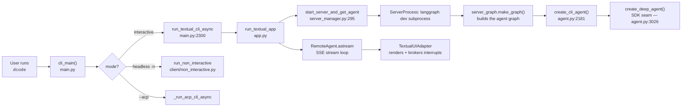
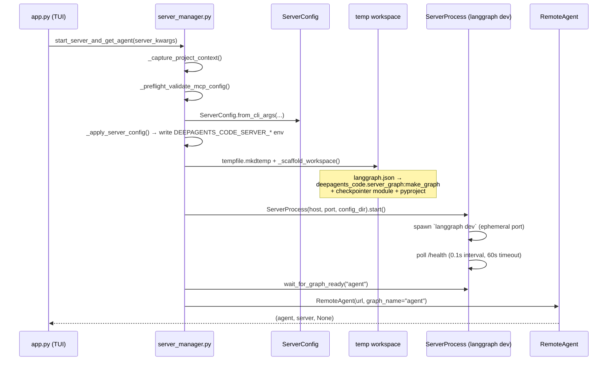
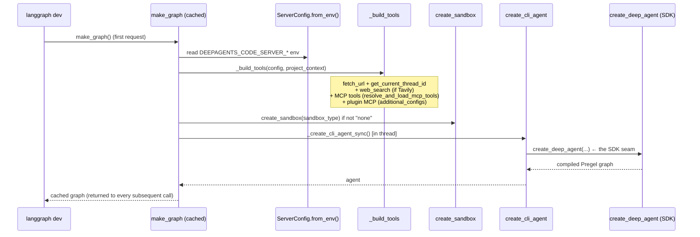
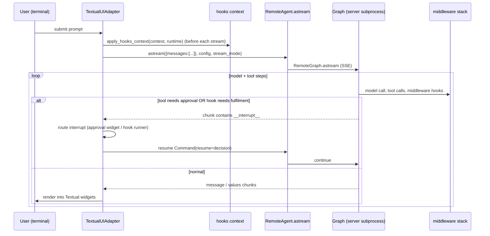

# 01 — Execution Flow: from keystroke to response

This document traces the **complete runtime path** of an interactive `dcode`
session, from the console-script entry point to a rendered assistant message,
then covers the headless (`-n`) variant. Every step cites the real source.

---

## 1. High-level lifecycle

The defining structural fact: **the agent graph runs in a separate process**
(`langgraph dev`), and the TUI is a **remote client** of it. This is why
approvals, hooks, and goal reviews are all mediated through LangGraph
**interrupts** rather than direct function calls.

---

## 2. CLI entry — `cli_main()`

Entry point registered as both `dcode` and `deepagents-code` console scripts,
defined at [`main.py:3566`](../../libs/code/deepagents_code/main.py). Startup, in
order:

1. **gRPC fork fix** on macOS — sets `GRPC_ENABLE_FORK_SUPPORT=0` before any
   heavy imports (`main.py:3570`).
2. **Fast-path `--version`** — prints `build_version_text()` and exits without
   importing the middleware stack (`main.py:3581`). Lazy imports throughout keep
   this path cheap (an explicit startup-performance rule in
   [`AGENTS.md`](../../libs/code/AGENTS.md)).
3. **Dependency check** — `check_cli_dependencies()` unless `--acp` is present.
4. **Signal handlers** — `_install_termination_signal_handlers()` converts
   `SIGHUP`/`SIGTERM`/`SIGQUIT` into `SystemExit` so the app/server cleanup
   `finally` blocks run even when the process group is stopped (`main.py:3593`).
5. **`parse_args()`** — the large argparse tree.
6. **Fast-path subcommands** that need no global settings, dispatched before
   settings bootstrap: `config`, `auth path`, `doctor`, `tools`, `install`
   (routed into [`client/commands/`](../../libs/code/deepagents_code/client/commands)
   and [`doctor.py`](../../libs/code/deepagents_code/doctor.py)) — `main.py:3611–3640`.
7. **State migration** — `migrate_legacy_state()` (best-effort, idempotent;
   moves state files into `~/.deepagents/.state/`, `main.py:3648`).
8. **Settings bootstrap** — first access of `settings`/`console` triggers
   `config._ensure_bootstrap()` (dotenv precedence, LangSmith project override).
9. **`--model-params` / `--profile-override`** JSON parsing, `--max-retries`.
10. **ACP branch** — if `--acp`, run the ACP server and exit.
11. **Guard-rail validation** — a large block of mutually-exclusive-flag checks
    (`main.py:3755` onward), e.g. `--auto-approve`/`--yolo` are **rejected in
    headless mode**, `--no-mcp` vs `--mcp-config`, `--goal` is interactive-only
    and mutually exclusive with `--rubric*`, and `--max-turns`/`--timeout`/
    `--quiet`/`--no-stream` require `-n`.
12. **`--update`** handling (headless, no session).
13. **Dispatch** to `run_textual_cli_async` (interactive), `run_non_interactive`
    (headless), or `_run_acp_cli_async`.

Agent-profile selection happens via `_resolve_agent_arg()` (`main.py:577`) with
precedence: explicit `-a` → resume’s originating agent → `[agents].default` →
`[agents].recent` → `DEFAULT_AGENT_NAME`.

---

## 3. Interactive path — deferred server start

`run_textual_cli_async()` ([`main.py:2300`](../../libs/code/deepagents_code/main.py))
does **not** start the server itself. It:

- resolves a cheap **display** model spec (`_get_default_model_spec()`, <1 ms, no
  LangChain) so the status bar can paint immediately, deferring the expensive
  `create_model()` to a background worker;
- assembles `server_kwargs` (assistant id, model, sandbox, MCP, interpreter,
  `allow_fs_tools`, `interactive=True`, …);
- calls `run_textual_app(...)` in [`app.py`](../../libs/code/deepagents_code/app.py)
  with `defer_server_start=…` — **the Textual app owns server startup** so the
  UI is responsive while the `langgraph dev` subprocess boots.

If no credentials are configured, `defer_server_start=True` and the TUI opens in
an onboarding state instead of failing.

---

## 4. Server launch — the client/server split

Server startup is orchestrated by `start_server_and_get_agent()`
([`client/launch/server_manager.py:295`](../../libs/code/deepagents_code/client/launch/server_manager.py)):

Key facts:

- **Configuration crosses the process boundary as env vars.**
  `ServerConfig.to_env()`/`from_env()` is the single serialization contract
  (`_server_config.py`); the client writes `DEEPAGENTS_CODE_SERVER_*`, the server
  reads them back. This keeps both sides in sync via one dataclass.
- **The workspace is scaffolded on the fly.** `_scaffold_workspace`
  (`server_manager.py:94`) writes a `langgraph.json` whose graph reference is
  `deepagents_code.server_graph:make_graph` (`server_manager.py:116`), plus a
  checkpointer module and a `pyproject.toml`.
- **`ServerProcess`** (`client/launch/server.py:582`) finds a free ephemeral port
  (leaving the well-known `2024` free for users' own `langgraph dev`), builds the
  command (`_build_server_cmd`), spawns the subprocess in a detached session,
  and polls for health (`_HEALTH_POLL_INTERVAL_LOCAL = 0.1s`, `_HEALTH_TIMEOUT =
  60s`). Security-relevant env keys are stripped via a denylist so the subprocess
  cannot inherit a stale `PYTHONPATH`/`LD_PRELOAD`/`DYLD_INSERT_LIBRARIES`.
- Startup failures inside the subprocess are surfaced through a machine-readable
  marker (`_STARTUP_ERROR_MARKER`) that the parent scrapes from stderr.
- **`RemoteAgent`** ([`client/remote_client.py:103`](../../libs/code/deepagents_code/client/remote_client.py))
  is a thin wrapper over `langgraph.pregel.remote.RemoteGraph` that handles SSE
  parsing and message deserialization.

---

## 5. Server-side graph construction — `make_graph`

Inside the subprocess, `langgraph dev` imports and calls
`make_graph` ([`server_graph.py:391`](../../libs/code/deepagents_code/server_graph.py)),
a **cached, lock-serialized async factory** (built by `_build_graph_factory`).
The graph is built **once per process** so MCP discovery, sandbox creation, and
`atexit` registration happen exactly once:

- `_build_tools` (`server_graph.py:66`) assembles the tool list and loads MCP
  tools on the **server's own event loop** with `stateless=True` discovery
  (throwaway sessions); real MCP sessions bind lazily on first tool call. Plugin
  MCP configs are discovered in a worker thread (blocking disk IO) and passed as
  `additional_configs`.
- `_create_cli_agent_sync` (`server_graph.py:322`) sets `auto_mode_enabled =
  config.interactive and sandbox_backend is None`, then calls
  `create_cli_agent(...)` with every resolved input (model, tools, mcp_tools,
  sandbox, memory/skills flags, rubric config, `goal_criteria_tools` and
  `rubric_grader_tools` = the read-only context tools). It runs in
  `asyncio.to_thread` because agent construction is synchronous and blocking.

`create_cli_agent` is the subject of [02_agent_construction.md](02_agent_construction.md).

---

## 6. The request/stream loop

Once the graph is ready, a user prompt flows through the TUI's
`TextualUIAdapter` ([`tui/textual_adapter.py:361`](../../libs/code/deepagents_code/tui/textual_adapter.py)):

- The adapter shows the *Thinking* spinner before each `astream` iteration
  (`textual_adapter.py:1025`), then iterates chunks (`:1033`).
- When a chunk contains `__interrupt__` (`:1149`), the adapter inspects the
  payload: a **Hooks v2 invocation** (`is_hook_interrupt_payload`) is fulfilled
  via `fulfill_hook_interrupt` and resumed; a **tool approval** raises the
  approval widget; a **goal/rubric review** raises the corresponding UI. The
  decision is sent back as `Command(resume=...)`.
- `apply_hooks_context` (`textual_adapter.py:1017`) writes `hooks_snapshot_id`,
  `hooks_server_events`, and `prompt_id` into the run context before each stream
  so the in-graph `ServerHooksMiddleware` knows which lifecycle events to emit
  (and skips the interrupt round-trip entirely when no handlers are configured).

See [06_tui_and_client.md](06_tui_and_client.md) for the rendering internals.

---

## 7. Headless (`-n`) path

`run_non_interactive` ([`client/non_interactive.py`](../../libs/code/deepagents_code/client/non_interactive.py))
reuses the **same server launch and graph** but:

- passes `interactive=False`, which (a) tailors the system prompt for
  non-interactive execution and (b) disables classifier Auto mode
  (`auto_mode_enabled` is forced false when not interactive);
- **forbids `--auto-approve`/`--yolo`** (rejected earlier in `cli_main`); instead
  it relies on **fail-closed MCP routing** (`HeadlessMCPGuardMiddleware`) and an
  explicit `--shell-allow-list` validated inline by `ShellAllowListMiddleware`;
- supports `--max-turns`, `--timeout`, `--quiet`, `--no-stream`, `--rubric*`;
- collects interrupts and fulfills pending hook interrupts
  (`fulfill_pending_hook_interrupts`), but there is no interactive approval UI —
  gated MCP tools are rejected with an explanatory `ToolMessage`.

---

## 8. Teardown

On exit, `cli_main` prints resume/LangSmith hints for any checkpointed thread
(`_render_teardown_thread_hints`, `main.py:235`), and the `ServerProcess` is
stopped: `SIGTERM` to the whole process group, escalating to `SIGKILL` after a
grace period (`client/launch/server.py:462`). Sandbox sessions and MCP sessions
registered `atexit` on the server side are released when the subprocess exits.

---

## Changed since the previous docs

- The old docs described `run_textual_cli_async` as *itself* starting the server
  via a `server.py` `ServerProcess`. Server start is now **deferred into the
  Textual app** and orchestrated by `client/launch/server_manager.py`; the
  process-lifecycle class moved to `client/launch/server.py`.
- The graph module reference is now `server_graph:make_graph` (a cached async
  factory), not a module-level graph built at import time.
- The interrupt loop now multiplexes **three** kinds of interrupts (tool
  approval, Hooks v2 fulfilment, goal/rubric review), not just approvals.
