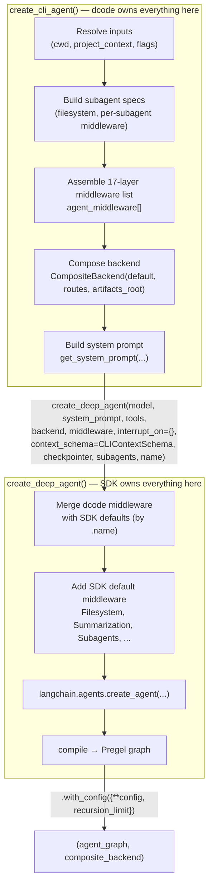

# 02 — Agent Construction: `create_cli_agent` and the SDK boundary

This is the most important document in the set. It shows **exactly how `dcode`
extends the Deep Agents SDK** rather than merely consuming it: the full middleware
stack, the composite backend, subagent wiring, and the precise point where
control passes to `create_deep_agent()`.

Everything here lives in
[`agent.py`](../../libs/code/deepagents_code/agent.py). The public entry is
`create_cli_agent()` at `agent.py:2181`; the SDK call is at `agent.py:3026`.

---

## 1. The boundary in one picture



**Key insight:** dcode does not subclass or fork the SDK graph. It (1) builds a
list of `AgentMiddleware` instances, (2) builds a `CompositeBackend`, (3) builds
a system prompt, and (4) passes all three to `create_deep_agent`, which merges
dcode's middleware with the SDK defaults and delegates to LangChain's
`create_agent`. dcode customizes behavior **entirely through the middleware
protocol, backends, tools, and a custom `context_schema`**.

---

## 2. The exact `create_deep_agent` call

Verbatim shape (`agent.py:3026`):

```python
agent = create_deep_agent(
    model=model,
    system_prompt=system_prompt,
    tools=tools,                       # web_search, fetch_url, get_current_thread_id, MCP tools
    backend=composite_backend,         # CompositeBackend (see §5)
    middleware=agent_middleware,       # the 17-layer stack (see §4)
    interrupt_on=interrupt_on,         # {} — dcode does its OWN HITL via middleware
    context_schema=CLIContextSchema,   # dcode's per-run context (approval mode, model, hooks, ...)
    checkpointer=checkpointer,         # AsyncSqliteSaver or None
    subagents=all_subagents or None,   # filesystem + async subagents (see §6)
    name=_sanitize_agent_message_name(assistant_id),
).with_config({**config, "recursion_limit": effective_recursion_limit})
return agent, composite_backend
```

Two subtle but important choices:

- **`interrupt_on={}`** — dcode deliberately passes an *empty* top-level
  interrupt map and installs its **own** HITL middleware
  (`AsyncApprovalHITLMiddleware` or `AutoModeHITLMiddleware`) so it can implement
  three-way approval modes and classifier auto-approval. See
  [05_approvals_goals_rubric.md](05_approvals_goals_rubric.md).
- **`context_schema=CLIContextSchema`** — a dcode-defined per-run context
  ([`_cli_context.py`](../../libs/code/deepagents_code/_cli_context.py)) carrying
  `approval_mode`, `model`/`model_params`, `thread_id`, `hooks_snapshot_id`,
  `hooks_server_events`, `offload_tool_call_id`, etc. Middleware read this from
  `runtime.context` to make per-request decisions without recompiling the graph.
- **`.with_config({**config, recursion_limit})`** — attaches dcode metadata and
  the resolved LangGraph step budget (env → `config.toml` `[runtime]` → default,
  via `resolve_recursion_limit`).

The return value is a `tuple[Pregel, CompositeBackend]` — the compiled graph plus
the routed backend (the caller keeps the backend for file operations).

---

## 3. Inputs to `create_cli_agent`

Signature at `agent.py:2181`. The most important parameters and what they gate:

| Parameter | Effect |
|-----------|--------|
| `model`, `assistant_id` | model spec + agent identity (memory/state dirs) |
| `tools`, `mcp_tools` | extra tools; `mcp_tools` also feed approval-policy derivation |
| `sandbox`, `sandbox_type` | swap local backend for a remote sandbox backend (§5) |
| `system_prompt` | override; if `None`, auto-generated by `get_system_prompt` (§7) |
| `interactive` | headless tailoring + terminal-stall recovery middleware |
| `auto_approve` | YOLO — disables all HITL interrupts |
| `auto_mode_enabled` | install classifier-backed Auto (local interactive only) |
| `interrupt_shell_only` | disable HITL; validate shell inline against an allow-list |
| `fs_tools` | explicit `FilesystemMiddleware` tool allowlist (`--allow-fs-tools`) |
| `enable_ask_user`/`enable_memory`/`memory_auto_save`/`enable_skills`/`enable_shell`/`enable_interpreter` | feature toggles |
| `rubric_model`/`rubric_max_iterations` | grader configuration |
| `goal_criteria_tools`/`rubric_grader_tools` | read-only context tools for goal/rubric agents |
| `async_subagents` | remote LangGraph deployments exposed as subagent tools |
| `checkpointer` | session persistence (`AsyncSqliteSaver`) |

Early in the body it also normalizes: `auto_mode_enabled` is force-disabled
outside the local interactive runtime (`agent.py:2366`); `effective_cwd` is
resolved from `cwd`/`project_context`; agent/skill/memory directories are
ensured on disk.

---

## 4. The middleware stack (append order)

The list `agent_middleware` is built by appending, in this order. Order matters —
middleware run outermost-first for `before_*`/`wrap_*` and innermost-first for
`after_*`. This is the single most important table for understanding dcode's
runtime behavior:

| # | Middleware | Source | Condition | Purpose |
|---|-----------|--------|-----------|---------|
| 1 | `ConfigurableModelMiddleware` | dcode `configurable_model.py` | always | Runtime `/model` switching; persists `_model_spec` for resume |
| 2 | `_GlmTerminalStallRecovery` | dcode `_glm_5p2_profile.py` | `not interactive` | No-op unless Fireworks GLM-5.2; recovers terminal stalls |
| 3 | `HeadlessMCPGuardMiddleware` | dcode `auto_mode.py` | headless + gated MCP tools | Rejects gated MCP calls (no approval UI in headless) |
| 4 | `ResumeStateMiddleware` | dcode `resume_state.py` | always | Declares checkpoint channels; writes `_context_tokens` |
| 5 | `GoalToolsMiddleware` | dcode `goal_tools.py` | always | `get_goal`/`get_rubric`/`update_goal`; goal-state notices |
| 6 | `AskUserMiddleware` | dcode `ask_user.py` | `enable_ask_user` | Clarifying-question tool |
| 7a | `MemoryMiddleware` | **SDK** | `enable_memory` | Loads user+project `AGENTS.md` into the prompt |
| 7b | `ManagedMemoryGuardMiddleware` | dcode `memory_guard.py` | `enable_memory` | Protects the managed onboarding-name block |
| 8 | `PluginSkillsMiddleware` | dcode `plugins/adapters/skills_middleware.py` (subclass of SDK `SkillsMiddleware`) | `enable_skills` | Discovers + injects skills, namespaces plugin skills |
| 9 | `CodeInterpreterMiddleware` | `langchain-quickjs` | `enable_interpreter` (local only) | `js_eval` sandboxed JS with PTC host bridge |
| 10 | `LocalContextMiddleware` | dcode `local_context.py` | executable backend | Injects cwd/git/project/MCP context |
| 11 | `ShellAllowListMiddleware` | dcode | `interrupt_shell_only` | Inline shell validation instead of HITL |
| 12 | `AutoModeHITLMiddleware` **or** `AsyncApprovalHITLMiddleware` | dcode `auto_mode.py` / `agent.py` | `resolved_interrupt_on is not None` | Human-in-the-loop / classifier auto-approval |
| 13 | `ServerHooksMiddleware` | dcode `hooks/server_middleware.py` | always | Emits Hooks v2 lifecycle events over the interrupt channel |
| 14 | `FilesystemMiddleware` | **SDK** | `fs_tools is not None` | Replaces SDK default to enforce `--allow-fs-tools` allowlist |
| 15 | `GoalCriteriaMiddleware` | dcode `goal_rubric.py` | `goal_criteria_tools is not None` | Turns a goal into rubric criteria via a nested agent |
| 16 | `CLICompactionMiddleware` | dcode `offload_middleware.py` (subclass of SDK `SummarizationToolMiddleware`) | always | `compact_conversation` tool + `/offload` |
| 17 | `ReliableRubricMiddleware` | dcode `reliable_rubric.py` (subclass of SDK `RubricMiddleware`) | always | Grades the finished turn against the rubric |

Notes:

- Items **12–13 order is deliberate**: `ServerHooksMiddleware` is appended
  *after* HITL so a hooks `PreToolUse` decision resolves **before** approval
  routing (`agent.py:2842`).
- Items **7b, 8, 14, 16, 17** are the clearest example of the "extend, don't
  fork" pattern: dcode **subclasses SDK middleware** (`SkillsMiddleware`,
  `SummarizationToolMiddleware`, `RubricMiddleware`) and augments them, or
  **replaces** the SDK's default (`FilesystemMiddleware`) by matching `.name` so
  the merge inside `create_deep_agent` swaps it in place.
- Item **12** uses a single HITL slot: both HITL classes report `name =
  "HumanInTheLoopMiddleware"`, so installing both would trip `create_agent`'s
  duplicate-name assertion — Auto's specialized replacement wins when active.

---

## 5. Backend composition

dcode always wraps its file/shell backend in a `CompositeBackend` so that
special virtual paths route to dedicated storage.

**Local mode** (`sandbox is None`, `agent.py:2731`):

```python
backend = LocalShellBackend(root_dir, virtual_mode=False, inherit_env=False, env=shell_env)
#   (or FilesystemBackend if enable_shell is False)
```

`shell_env` is a curated copy of `os.environ` that restores the user's original
`LANGSMITH_PROJECT`/tracing keys (so shell commands trace separately from the
agent) and re-applies a relayed `PYTHONPATH` only for approval-gated `execute`
commands.

**Remote mode** (`sandbox is not None`): `backend = sandbox` directly — a
`SandboxBackendProtocol` implementation supplies both file ops and `execute`.

Then the composite is assembled (`agent.py:2783`):

```python
composite_backend = CompositeBackend(
    default=backend,
    routes={
        f"{artifacts_root}/conversation_history/": conversation_history_backend,
        fallback_history_root:                    conversation_history_backend,
        f"{artifacts_root}/large_tool_results/":  large_results_backend,   # only in fallback mode
    },
    artifacts_root=artifacts_root,
)
```

The routes send **conversation-history archives** and **large tool results** to
dedicated `FilesystemBackend` instances so they never pollute the working tree.
In sandbox mode the routes are empty (`routes={}`). See
[03_subsystems.md](03_subsystems.md) §Context/Offload for the artifacts-root
resolution logic.

---

## 6. Subagents

dcode assembles subagent specs before the SDK call:

- **Filesystem subagents** are discovered from `~/.deepagents/.../agents/` and
  the project's `agents/` dir via `list_subagents(...)` (`agent.py:2493`). Each
  becomes a `SubAgent` dict with `name`/`description`/`system_prompt` and a
  per-subagent middleware list built by `_subagent_cli_middleware`
  (`agent.py:2438`): an `AsyncApprovalHITLMiddleware`, an optional
  `ConfigurableModelMiddleware`, a headless stall-recovery, a
  `ShellAllowListMiddleware`, a `ServerHooksMiddleware(emit_stop=False)`, and a
  `ManagedMemoryGuardMiddleware`.
- A **`general-purpose`** subagent is always injected if the user hasn't defined
  one (`agent.py:2521`), reusing the SDK's `GENERAL_PURPOSE_SUBAGENT` spec plus
  the same middleware.
- Each declarative subagent gets `interrupt_on = {}` so it does not inherit a
  second stock HITL from the parent — exactly one HITL middleware per subagent
  graph.
- When `--allow-fs-tools` is set, `_inject_fs_tools_into_subagents`
  (`agent.py:179`) injects a filesystem-restricted `FilesystemMiddleware` into
  **every** sync subagent, so delegating via `task` cannot bypass the allowlist.
- **Async subagents** (remote LangGraph deployments) are appended as-is
  (`async_subagents`), exposed as `start_async_task`/`update_async_task`/
  `cancel_async_task` tools.

All are combined into `all_subagents` and passed as `subagents=` to
`create_deep_agent`.

---

## 7. System prompt

If no explicit `system_prompt` is provided, `get_system_prompt()`
(`agent.py:1447`) loads [`system_prompt.md`](../../libs/code/deepagents_code/system_prompt.md)
and interpolates mode-specific sections (interactive vs headless), the model
identity, the working-directory/sandbox section, skills path, and
ambiguity/todo guidance. `LocalContextMiddleware` and `MemoryMiddleware` then
append live runtime context and `AGENTS.md` content at request time, so the
prompt is not fully static.

---

## 8. Why this design (extend, don't fork)

- **Every custom behavior is a middleware, tool, backend, or context field.**
  This keeps dcode compatible with SDK upgrades: the SDK owns graph assembly and
  the middleware protocol; dcode owns the *policy*.
- **Subclassing over replacement where the SDK does the heavy lifting**
  (`SkillsMiddleware`, `SummarizationToolMiddleware`, `RubricMiddleware`) means
  dcode inherits SDK fixes automatically and only overrides the CLI-specific
  seams (namespacing, `/offload` forcing, grader reliability).
- **Empty `interrupt_on` + custom HITL middleware** is what lets dcode offer
  Manual/Auto/YOLO modes and a classifier — something the SDK's declarative
  `interrupt_on` map cannot express.
- **`CLIContextSchema`** decouples per-request policy (approval mode, model,
  hooks snapshot) from graph structure, so the graph is compiled once and reused
  across turns and threads.

---

## Changed since the previous docs

- The middleware stack grew from ~11 entries to **17**, and its composition
  changed materially: `FilesystemEmptyResultMiddleware` was **removed**;
  `GoalToolsMiddleware`, `GoalCriteriaMiddleware`, `ReliableRubricMiddleware`,
  `ServerHooksMiddleware`, `HeadlessMCPGuardMiddleware`, `_GlmTerminalStallRecovery`,
  and the Auto/Async HITL split were **added**; `SummarizationToolMiddleware` is
  now the dcode subclass `CLICompactionMiddleware`; the skills middleware is now
  `PluginSkillsMiddleware`.
- The old docs listed a fixed backend `CompositeBackend(LocalShellBackend(),
  FilesystemBackend())`. The real composition is a `default` backend plus
  **path routes** for `conversation_history` and (conditionally)
  `large_tool_results`, with an `artifacts_root`.
- `create_deep_agent` is now called with `interrupt_on={}` (dcode owns HITL) and
  `context_schema=CLIContextSchema`.
