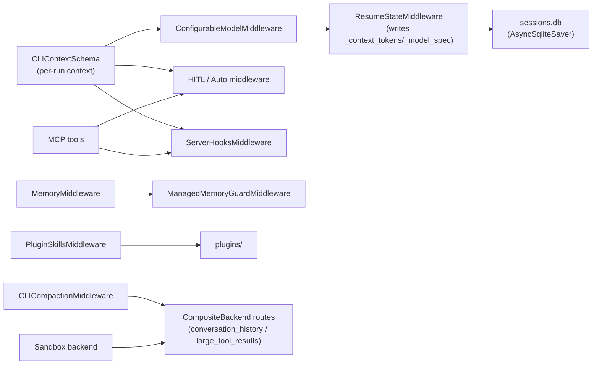

# 03 — Subsystems Reference

A component-by-component reference for the feature subsystems that `dcode` layers
on the SDK. For each: **purpose, key files, responsibilities, dependencies,
runtime interaction, extension points.** Approvals/auto-mode, goals/rubric,
hooks, and plugins are large enough to have their own docs
([04](04_hooks_and_plugins.md), [05](05_approvals_goals_rubric.md)).

---

## 3.1 Built-in tools

**Purpose.** Beyond the backend tools (`execute`, `read_file`, `write_file`,
`edit_file`, `ls`, `glob`, `grep`), dcode registers three custom tools.

**Key file:** [`tools.py`](../../libs/code/deepagents_code/tools.py).

- **`web_search`** — Tavily-backed search; requires `TAVILY_API_KEY`; lazily
  initialized module-level client; params `query`, `max_results`, `topic`,
  `include_raw_content`. Only added to the tool list when `settings.has_tavily`.
- **`fetch_url`** — fetches a URL and converts HTML→Markdown, with **multi-layer
  SSRF protection**: scheme allowlist (http/https), DNS resolution + blocked-IP
  checks (RFC1918/loopback/link-local incl. cloud IMDS `169.254.169.254`),
  IPv4-mapped-IPv6 unwrapping, **DNS pinning** (patches urllib3's
  `create_connection` to close the rebinding TOCTOU window), and per-redirect
  re-validation. A module-level lock serializes concurrent fetches because the
  connection-factory patch is process-global.
- **`get_current_thread_id`** — returns the active LangGraph thread id from the
  runtime config (for LangSmith/MCP correlation).

These three plus MCP tools are assembled in `server_graph._build_tools`
(`server_graph.py:66`) and passed to `create_cli_agent(tools=...)`.

**Extension point:** add a `@tool` in `tools.py` and include it in
`_build_tools`. Gate it behind a `settings` flag if it needs credentials.

---

## 3.2 Memory (`AGENTS.md`)

**Purpose.** Load persistent user/project instructions into the prompt, optionally
auto-save learnings, and protect a machine-managed block from being clobbered.

**Key files:** SDK `MemoryMiddleware` (wired in `agent.py:2578`),
[`memory_guard.py`](../../libs/code/deepagents_code/memory_guard.py),
[`onboarding.py`](../../libs/code/deepagents_code/onboarding.py).

- **`MemoryMiddleware`** (SDK) is configured with
  `sources = [user AGENTS.md, *project AGENTS.md]` and
  `FilesystemBackend(virtual_mode=False)` (real host FS). When
  `memory_auto_save=False`, a read-only system prompt
  (`_MEMORY_READONLY_SYSTEM_PROMPT`, `agent.py:180`) is passed that drops the
  "proactively persist learnings" guidance and adds credential-handling guardrails.
- **`ManagedMemoryGuardMiddleware`** (`memory_guard.py:96`) guards
  `write_file`/`edit_file`/`delete` (`memory_guard.py:51`) targeting the user
  `AGENTS.md`. On write/edit it restores the managed **onboarding-name block**
  (line-level `SequenceMatcher` diff) while keeping the agent's other edits; on
  delete it blocks removal (fails closed). All I/O is `O_NOFOLLOW` (symlink-safe).
  It is installed both on the main agent (`agent.py:2596`) and on every subagent.
- **Onboarding block.** `onboarding.py` writes a managed block between HTML-comment
  markers (`<!-- deepagents:onboarding-name:start/end -->`). `MemoryMiddleware`
  strips HTML comments before injection, so the model never sees the markers —
  hence the guard, which restores the block after any edit.

**Runtime interaction:** loaded at request time into the prompt; the guard wraps
tool calls so agent edits to `AGENTS.md` cannot damage the managed block.

**Extension point:** pass more paths to `ManagedMemoryGuardMiddleware([...])`;
add a new managed-block type by mirroring the onboarding marker/extract/upsert
helpers.

---

## 3.3 Skills

**Purpose.** Discover, list, and inject reusable `SKILL.md` capabilities from
multiple sources.

**Key files:** [`skills/`](../../libs/code/deepagents_code/skills) (CLI-facing:
`load.py`, `commands.py`, `invocation.py`, `merge.py`, `trust.py`),
[`built_in_skills/`](../../libs/code/deepagents_code/built_in_skills),
and the runtime middleware `PluginSkillsMiddleware`
([`plugins/adapters/skills_middleware.py`](../../libs/code/deepagents_code/plugins/adapters/skills_middleware.py)).

- **Source precedence** (lowest→highest, `agent.py:2607`): built-in → **plugins**
  → user `.deepagents` → user `.agents` → project `.deepagents` → project
  `.agents` → user `.claude` (experimental) → project `.claude` (experimental).
- **`PluginSkillsMiddleware`** subclasses the SDK `SkillsMiddleware`; it namespaces
  plugin skills as `{plugin_id}:{skill_name}` and supports nested skills
  (`plugin:sub:skill`), merging with last-one-wins.
- **Built-in skills** (exactly three): `remember` (capture learnings into
  `AGENTS.md`/skills), `skill-creator` (author/validate skills),
  `deepagents-thread-inspector` (inspect the local session store).
- The `skills/load.py` `list_skills` path powers the `/skills` CLI
  (list/create/info/delete); the runtime injection path is the middleware.

**Extension point:** drop a `SKILL.md` dir under `built_in_skills/`, or ship
skills via a plugin (see [04](04_hooks_and_plugins.md)).

---

## 3.4 Context management: offload & compaction

**Purpose.** Keep the context window bounded by (a) routing large tool results and
per-thread conversation archives to the filesystem, and (b) compacting older
messages into a summary.

**Key files:** [`offload.py`](../../libs/code/deepagents_code/offload.py),
[`offload_middleware.py`](../../libs/code/deepagents_code/offload_middleware.py).

- **Artifacts storage** (`offload.py`): `_artifacts_root()` returns a stable
  per-user hardened temp dir (`dcode-artifacts-<uid>`), or a virtual fallback
  root `/dcode-artifacts-fallback` plus a private `mkdtemp` when the predictable
  dir is unusable. `CONVERSATION_HISTORY_DIRNAME = "conversation_history"` holds
  per-thread `.md` archives; `delete_offloaded_history(thread_id)` cleans them up
  when a thread is deleted.
- **`CompositeBackend` routes** (`agent.py:2783`) send
  `.../conversation_history/` and (in fallback mode) `.../large_tool_results/` to
  dedicated backends; otherwise large results fall through to the default backend
  at the hardened `artifacts_root`.
- **`CLICompactionMiddleware`** (`offload_middleware.py:360`) subclasses the SDK
  `SummarizationToolMiddleware` and exposes the `compact_conversation` tool. Its
  `force` param is `Annotated[bool, InjectedToolArg]` (hidden from the model), so
  forced compaction (`/offload`) is authorized via a trusted `offload_tool_call_id`
  in the context, not by model input. `_offload_rejection` rejects every tool
  call except the exact seeded forced compaction during an `/offload` run.
- **`REQUIRE_COMPACT_TOOL_APPROVAL = True`** (`agent.py:147`) adds
  `compact_conversation` to the HITL interrupt map so compaction is user-approved
  like other mutating tools.

**Runtime interaction:** the model may call `compact_conversation` proactively
(SDK-gated); `/offload` seeds a forced call; large results route automatically.
The compaction tool is also handed to Auto mode as a `trusted_compaction_tool`.

**Extension point:** flip `REQUIRE_COMPACT_TOOL_APPROVAL`; add routed
subdirectories to `artifact_routes`; override the summarizer via
`_summarization_for_runtime`.

---

## 3.5 MCP integration

**Purpose.** Discover, trust, authenticate, and expose Model Context Protocol
servers' tools to the agent.

**Key files:** [`mcp_tools.py`](../../libs/code/deepagents_code/mcp_tools.py),
[`mcp_config.py`](../../libs/code/deepagents_code/mcp_config.py),
[`mcp_auth.py`](../../libs/code/deepagents_code/mcp_auth.py),
[`mcp_login_service.py`](../../libs/code/deepagents_code/mcp_login_service.py),
[`mcp_oauth_ui.py`](../../libs/code/deepagents_code/mcp_oauth_ui.py),
[`mcp_disabled.py`](../../libs/code/deepagents_code/mcp_disabled.py),
[`mcp_providers/`](../../libs/code/deepagents_code/mcp_providers).

**Discovery & precedence** (`discover_mcp_configs`, `mcp_tools.py:1010`), lowest→
highest: `~/.deepagents/.mcp.json` → `<project>/.deepagents/.mcp.json` →
`<project>/.mcp.json`; an explicit `--mcp-config` path is highest and its errors
are fatal. Later definitions win by server name. Transport is resolved from
`type`/`transport`/presence of `url` (`stdio`, `http`, `sse`;
`streamable_http`→`http`). Env `${VAR}`/`${VAR:-default}` interpolation is
deferred to activation so one missing var only fails its own server.

**Session lifecycle.** `MCPSessionManager` (`mcp_tools.py:263`) is a lazy
per-server cache. **Discovery uses throwaway sessions** (`stateless=True`); **live
sessions are created only on the first real tool call** on the server's event
loop, so stdio servers aren't restarted per invocation. One process-wide manager
is held by the server (`server_graph._get_mcp_session_manager`).

**Tool conversion.** `_build_cached_mcp_tool` (`mcp_tools.py:1516`) wraps each MCP
tool as a `StructuredTool` named `{server}_{tool}`, folding the tool's **protocol
annotations** into `.metadata` plus markers `_deepagents_code_mcp` /
`_deepagents_code_mcp_server`. Transient/reauth failures invalidate the session
and retry once.

**Approval derivation.** `mcp_tool_is_coherently_read_only` (`auto_mode.py:253`)
returns true only for literal `readOnlyHint=True` without `destructiveHint`;
`gated_mcp_tool_names` returns the complement — the tools that require approval.
This drives both interactive HITL and headless guarding.

**Auth/OAuth.** `FileTokenStorage` (`mcp_auth.py`) stores tokens under
`~/.deepagents/.state/mcp-tokens/` (atomic writes, `expires_at` sidecar, cross-
process `filelock`). `build_oauth_provider`/`login` drive the handshake via the
UI-agnostic `OAuthInteraction` protocol (`mcp_oauth_ui.py`). Provider policies
(`mcp_providers/`) are an ordered registry: `Slack`, `GitHub`, `Generic`
(fallback). 401 challenges / reauth are detected by walking the exception tree.

**Trust model.** **User-level** servers load without prompting; **project-level**
servers (repo `.mcp.json`) are gated because a committed config can spawn commands
or exfiltrate headers. The trust prompt (`main.py` `_ProjectMcpTrustAction`:
`ALLOW_ONCE`/`REMEMBER`/`DENY`) fails **closed** if the trust policy is unreadable.
Approvals are fingerprint-bound (`sha256` of canonical config) and scoped
(remote URLs bind to a git common dir; local commands to the exact worktree).
A committed `.mcp.json` can never self-approve — trust lists come only from user
config/env.

**Extension point:** add a transport in `_resolve_server_type` +
`_validate_server_config` + `_preflight_and_connect`; add an OAuth quirk by
adding one `OAuthProvider` subclass + one `_REGISTRY` entry (no edits to the
login orchestration).

---

## 3.6 Sandbox execution

**Purpose.** Run file ops and `execute` in a remote sandbox instead of the local
machine.

**Key files:** SDK `SandboxBackendProtocol`
([`backends/protocol.py`](../../libs/deepagents/deepagents/backends/protocol.py)),
[`integrations/`](../../libs/code/deepagents_code/integrations) (`sandbox_registry.py`,
`sandbox_factory.py`, `sandbox_provider.py`, `sandbox_config.py`), partner
packages under `libs/partners/`.

- **Contract:** `SandboxBackendProtocol` extends `BackendProtocol` with `id`,
  `execute(command, *, timeout)`, and `aexecute`. `BaseSandbox` implements file
  ops by delegating to `execute()`.
- **Registry:** `SandboxRegistry` merges three sources (config > entry-point >
  built-in). Built-ins in `BUILTIN_METADATA`: `agentcore`, `daytona`, `langsmith`,
  `modal`, `runloop`, `vercel`, each with a `working_dir` and a partner-package
  dependency probe. `get_default_working_dir(provider)` feeds the system prompt
  and grader roots.
- **Swap:** in `create_cli_agent`, `sandbox is not None` sets `backend = sandbox`
  and skips shell-allow-list and interpreter (interpreter + sandbox raises
  `ValueError`); Auto mode is disabled outside local interactive.
- **Lifecycle:** `server_graph` calls `create_sandbox(sandbox_type, ...)` at
  startup, `__enter__`s it, stores it for process lifetime, and registers an
  `atexit` cleanup (delete-on-cleanup only if it created the sandbox).

**Extension point:** publish a `SandboxProvider` under the entry-point group
`deepagents_code.sandbox_providers`, or declare `[sandboxes.providers.<name>]`
with a `class_path` in `config.toml`, or add a built-in (`BUILTIN_METADATA` +
`_*Provider` + `_create_builtin_provider`). The backend subclasses `BaseSandbox`.

---

## 3.7 Sessions & resume

**Purpose.** Persist conversation checkpoints and enable `dcode -r`.

**Key files:** [`sessions.py`](../../libs/code/deepagents_code/sessions.py),
[`resume_state.py`](../../libs/code/deepagents_code/resume_state.py),
[`state_migration.py`](../../libs/code/deepagents_code/state_migration.py).

- **Storage:** a single SQLite DB at **`~/.deepagents/.state/sessions.db`**
  (`get_db_path`, `sessions.py:266`) via LangGraph's `AsyncSqliteSaver`
  (`get_checkpointer`). Thread IDs are **UUID7** (time-ordered).
  `list_threads` uses a covering index (`idx_dcode_threads_list`) over the JSON
  `metadata` column (`agent_name`, `updated_at`, `git_branch`, `cwd`).
  Windows/asyncio robustness: `_patch_aiosqlite` (adds `is_alive` required by
  `langgraph-checkpoint>=2.1.0`) and `_drain_aiosqlite_worker` (joins the worker
  thread on close).
- **Resume:** `ResumeStateMiddleware` (`resume_state.py:221`) declares private
  checkpoint channels and writes `_context_tokens` in `after_model`
  (powering `/tokens` and the status bar). The model spec/params are written by
  `ConfigurableModelMiddleware`, so `dcode -r` restores the model the thread was
  actually using. Goal/rubric channels are declared on the shared
  `GoalRubricChannels` base.
- **Migration:** `migrate_legacy_state` moves legacy files (`sessions.db*`,
  `mcp-tokens`, markers) from `~/.deepagents/` into `~/.deepagents/.state/`
  (idempotent, best-effort).

**Extension point:** add a resume-restored fact as a `PrivateStateAttr` channel
on `ResumeState`, written from a middleware `after_model`/`wrap_model_call`.

---

## 3.8 Configuration & model resolution

**Purpose.** Resolve credentials, model, provider, and runtime settings.

**Key files:** [`config.py`](../../libs/code/deepagents_code/config.py),
[`model_config.py`](../../libs/code/deepagents_code/model_config.py),
[`configurable_model.py`](../../libs/code/deepagents_code/configurable_model.py),
[`reasoning_effort.py`](../../libs/code/deepagents_code/reasoning_effort.py),
[`config_manifest.py`](../../libs/code/deepagents_code/config_manifest.py).

- **Dotenv precedence** (`config._load_dotenv`): shell env > project `.env`
  (ancestor-walked) > global `~/.deepagents/.env`. Project `.env` is filtered
  through a denylist (`DYLD_INSERT_LIBRARIES`, `LD_PRELOAD`, `PATH`, `PYTHONPATH`,
  `NODE_OPTIONS`, `GIT_ASKPASS`, …) to block injection.
- **Prefixed override:** `resolve_env_var(name)` (`model_config.py:68`) checks
  `DEEPAGENTS_CODE_{name}` first; a present-but-empty prefixed var **shadows** the
  canonical value (returns `None`).
- **Model spec:** `ModelSpec` (`provider:model`, `parse`/`try_parse`).
  `[providers]` in `config.toml` (`ProviderConfig`) supports a `class_path`
  escape hatch to load an arbitrary `BaseChatModel`.
- **`ConfigurableModelMiddleware`** (`configurable_model.py:581`) is the outermost
  middleware: it reads `model`/`model_params` from `runtime.context` and swaps
  the model per request without recompiling the graph, injects provider
  prompt-cache hints (Fireworks `x-session-affinity`, OpenAI `prompt_cache_key`
  keyed on `thread_id`), and (when `persist_model_state`) checkpoints the resolved
  `_model_spec`/`_model_params` for resume. Subagents pass
  `persist_model_state=False`.
- **`/effort`** (`reasoning_effort.py`) offers reasoning levels gated by the
  active model's LangChain profile.
- **Shell security** (`config.py`): `DANGEROUS_SHELL_PATTERNS`,
  `RECOMMENDED_SAFE_SHELL_COMMANDS`, `is_shell_command_allowed`,
  `parse_shell_allow_list` (`"all"`/`"recommended"`/CSV).

**Extension point:** add a provider/model via `config.toml` `[providers]`; add an
env override consumer via `resolve_env_var`.

---

## Component interaction map

---

## Changed since the previous docs

- `SummarizationToolMiddleware` → dcode `CLICompactionMiddleware` with `/offload`
  forcing and artifact routing.
- `mcp_trust.py` → `mcp_config.py`; MCP trust is now fingerprint-bound and
  git-scoped, and plugin-provided MCP servers are treated as pre-trusted.
- Session DB is `sessions.db` (not `threads.db`) under `~/.deepagents/.state/`.
- Model configuration gained `ConfigurableModelMiddleware` runtime switching and
  provider prompt-cache routing.
