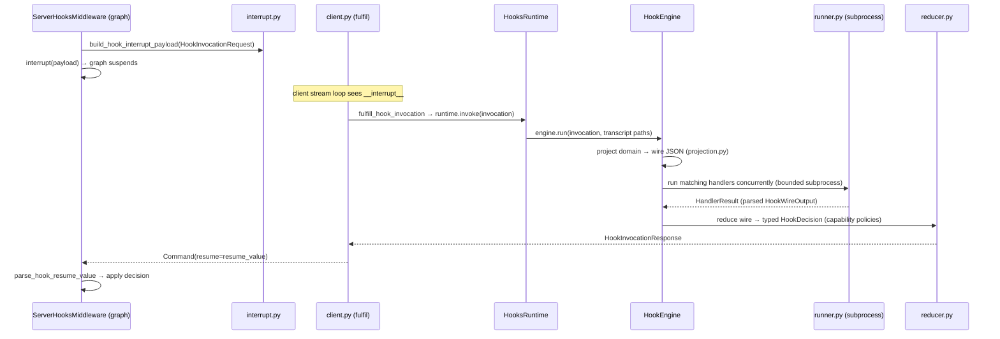
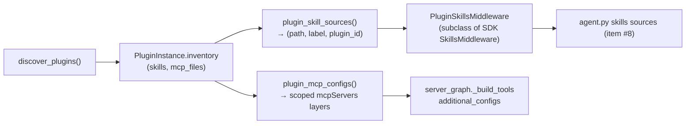

# 04 — Hooks and Plugins

The two dedicated extensibility subsystems `dcode` adds on top of the SDK. Both
are entirely dcode-owned; the SDK knows nothing about either.

---

## Part A — Hooks v2

### A.1 Purpose

Hooks let a user register **external command handlers** (in `hooks.json`) that
**observe and influence the agent lifecycle**, using a wire contract compatible
with Claude Code's hook protocol. A handler receives a JSON event on stdin and
returns JSON on stdout that can **allow/deny a tool call, inject context, force
loop continuation, or surface notices**.

There are **two coexisting systems** in the [`hooks/`](../../libs/code/deepagents_code/hooks)
package:

- **Hooks v2** — the modern lifecycle system (`models/`, `engine.py`,
  `server_middleware.py`, `runtime.py`, …).
- **Legacy v1** — dotted-event dispatch in
  [`legacy.py`](../../libs/code/deepagents_code/hooks/legacy.py), still live and
  used for tool telemetry; the package `__init__.py` deliberately re-exports only
  the legacy API. `migration.py` bridges v1 config to v2 (removal targeted
  2026-09-01).

### A.2 The 11 lifecycle events

Enum `HookEvent` ([`models/domain.py:36`](../../libs/code/deepagents_code/hooks/models/domain.py)),
each with an **owner** (client or server):

| Event | Owner | Emitted when |
|-------|-------|--------------|
| `SessionStart`, `UserPromptSubmit`, `SessionEnd`, `PermissionRequest`, `Notification`, `PreCompact` | **client** | run locally by the terminal client |
| `PreToolUse`, `PostToolUse`, `Stop`, `SubagentStart`, `SubagentStop` | **server** | inside the LangGraph graph, over the interrupt channel |

Server-owned events travel over the LangGraph **interrupt** transport (because the
graph runs in a separate process); client-owned events run directly in the TUI.

### A.3 The models split (domain / wire / transport / config)

Under [`hooks/models/`](../../libs/code/deepagents_code/hooks/models):

- **`domain.py`** — internal, strongly-typed lifecycle models (`extra="forbid"`):
  per-event payloads, the `HookDomainEvent` union, `HookContext`,
  `HookInvocation`, per-event `*Decision` models.
- **`wire.py`** — the external Claude-compatible JSON contract (camelCase aliases
  `hookEventName`/`additionalContext`/`permissionDecision`; ingress
  `extra="ignore"`, egress `extra="allow"`).
- **`transport.py`** — the versioned server↔client envelope
  (`HookInvocationRequest`/`HookInvocationResponse`, `protocol_version=1`,
  carrying `invocation_id`/`snapshot_id`/`run_id`/`deadline`).
- **`config.py`** — validated `hooks.json` shape (`CommandHandlerSpec`,
  `MatcherGroup`, `HooksConfig` keyed by `HookEvent`).
- **`adapters.py`** — cached Pydantic `TypeAdapter`s per boundary.

### A.4 Data flow of a server-owned event

The pipeline is: **project (domain→wire) → execute (subprocess) → reduce
(wire→domain)**. `capabilities.py` (`_HOOK_EVENT_SPECS`) is the single source of
per-event semantics (owner, matcher field, exit-code/plain-output/aggregation
policies). Client-owned events reuse the same project→run→reduce pipeline without
the interrupt hop.

### A.5 `ServerHooksMiddleware` — in-graph integration

[`server_middleware.py:137`](../../libs/code/deepagents_code/hooks/server_middleware.py).
Installed twice in `create_cli_agent`:

- **Main agent** (`agent.py:2848`, `emit_stop=True`) — appended **after** the HITL
  middleware so `PreToolUse` resolves before approval routing.
- **Subagents** (`agent.py:2462`, `emit_stop=False`) — wraps subagent tools so
  Pre/Post fire inside subagents, but does **not** emit the main-agent `Stop`
  (`SubagentStop` fires from the parent's wrap around `task`).

Middleware method mapping:

- `after_model` → emits **`PreToolUse`** per tool call, stores outcomes in state.
  A hook `deny` blocks the call; an `ask` escalates through the existing HITL
  interrupt channel.
- `wrap_tool_call` → replays the `PreToolUse` outcome, fires **`SubagentStart`**
  before a `task` call, runs the tool, then **`PostToolUse`** and (for `task`)
  **`SubagentStop`**.
- `after_agent` (`@hook_config(can_jump_to=["model"])`) → emits **`Stop`**; a
  continuation decision appends a `HumanMessage` and jumps back to `model`
  (bounded by `MAX_STOP_CONTINUATIONS = 8`).

**Runtime gating.** Every emission first checks `hooks_server_events` on the run
context (written by `apply_hooks_context` from `runtime.configured_server_events()`).
Idle sessions with no configured server handlers pay **no** interrupt round-trip.

### A.6 Client side & config loading

- **`HooksRuntime`** (`runtime.py:42`) is the session-scoped facade: loads config
  once, builds `HooksSnapshot`, `TranscriptStore`, `HookEngine`, and a
  `HookFulfillmentLedger`.
- **Config precedence** (`loading.py`): project `.deepagents/hooks.json` (only if
  workspace trusted) then user `~/.deepagents/hooks.json`. `snapshot_id` =
  SHA-256 of canonical JSON. The interactive TUI loads with
  `workspace_trusted=False` pending a trust prompt; headless uses
  `--trust-project-hooks`.
- **`HookEngine`** (`engine.py:32`) matches handlers, serializes wire input, runs
  matching handlers concurrently with per-handler timeouts, and reduces in stable
  config order. **`runner.py`** runs each handler as a bounded subprocess
  (sanitized env, 100 KB output cap, timeout, process-tree kill; exit code 2 →
  synthetic block).
- **`HookFulfillmentLedger`** dedups so a `(snapshot_id, invocation_id)` executes
  at most once under repeated interrupt delivery.
- **`TranscriptStore`** (`transcript.py`) writes redacted per-thread/per-subagent
  JSONL projections hooks can read; **`validate_terminal_sequence.py`** allowlists
  only OSC 0/1/2/9/99/777 + BEL for `terminalSequence` output; **`env.py`** strips
  secret-named env vars before running handlers.

### A.7 Extension points

**Add a lifecycle event** (touch the exhaustive unions/match statements):
`HookEvent` → domain `*Event`/`*Decision` + unions → wire `*WireInput`/output →
`_HOOK_EVENT_SPECS` + `get_event_spec` case → `projection.py` projector →
`reducer.py` branch → snapshot matcher target → (if server-owned) emit from
`ServerHooksMiddleware`.

**Add a handler type** (today only `command`): extend `HandlerType`, make
`HandlerSpec` a discriminated union in `config.py`, add executor support in
`runner.py`, list it in each event's `supported_handler_types`.

---

## Part B — Plugins

### B.1 Purpose

A **plugin** is a directory tree (Claude Code / Codex-compatible) that a
marketplace catalogs, dcode copies into a versioned cache, and that contributes
**skills** and **MCP servers** to a running agent. It deliberately does **not**
load agents, commands, or hooks (those component dirs are recognized but marked
`UnsupportedComponent`).

Package: [`plugins/`](../../libs/code/deepagents_code/plugins).

### B.2 Manifest & identity

- Manifest lookup: `.claude-plugin/plugin.json` then `.codex-plugin/plugin.json`
  ([`manifest.py:20`](../../libs/code/deepagents_code/plugins/manifest.py)). A
  manifest-less plugin is allowed (falls back to a root `SKILL.md` / `.mcp.json`).
- Path component fields recognized: `skills`, `mcpServers` (a dict `mcpServers`
  is inline MCP, not a path). All component paths must be `./`-prefixed, relative,
  and contained within the plugin root (POSIX + Windows absolute rejected).
- Identity is always **`{name}@{marketplace}`**, enforced in
  `PluginInstance.__post_init__`.

### B.3 Storage, marketplace, discovery

- **Store** (`store.py`): root `~/.deepagents/plugins/` (or `$PLUGIN_CACHE_DIR`)
  with `data/` (per-plugin writable), `marketplaces/`, and a versioned `cache/`.
  Three atomic JSON state files: `plugin_marketplaces.json`, `plugin_state.json`
  (`enabledPlugins`), `installed_plugins.json`. Install copies into
  `cache/{marketplace}/{plugin}/{version}/`, **stripping `.git`**.
- **Marketplace** (`marketplace.py`): sources are local dir/file, `github`
  owner/repo[@ref], `git` SSH/HTTPS, or catalog `url`. Git clones are
  `--depth 1`, `GIT_TERMINAL_PROMPT=0`, credential-redacted, HTTPS-only.
- **Discovery** (`discovery.py`): `discover_plugins()` reads **enabled** plugins
  from the **install cache** (not the marketplace) and rebuilds each inventory.
  Invalid ids become warnings, never aborting siblings.

### B.4 How contributions reach the agent

- **Skills:** `plugin_skill_sources` yields `(path, "Plugin: {id}", plugin_id)`;
  `PluginSkillsMiddleware` (`adapters/skills_middleware.py`) namespaces them
  `{plugin_id}:{skill}` (nested → `plugin:sub:skill`), then merges with SDK
  skills. Precedence puts plugins just above built-ins (`agent.py:2607`).
- **MCP:** `plugin_mcp_configs` scopes every server name as
  `plugin__{plugin}__{server}`, applies variable substitution
  (`CLAUDE_PLUGIN_ROOT`, `CLAUDE_PLUGIN_DATA`, …), and returns `mcpServers`
  layers passed to `resolve_and_load_mcp_tools` as `additional_configs`. Plugin
  MCP servers are treated as **pre-trusted** (installing the plugin was the trust
  decision), though the user deny policy still applies.

### B.5 Surfaces & the reload requirement

- **CLI** (`commands_cli.py`): `plugin[s] list|install|uninstall|enable|disable`
  and `plugin marketplace list|add|remove`.
- **TUI** (`tui/modals/plugin_manager/`): tabs `discover|installed|marketplaces|
  errors`; all mutations run off the UI thread.
- **Every mutation says "Run `/reload`"** because middleware is built once at
  agent construction — enabling/installing a plugin does not take effect live.

### B.6 Extension point — a new plugin capability type

Touch these seams: recognize the field in `manifest.py` (`_PATH_COMPONENT_FIELDS`
or inline) + `PluginManifest`; extend `ComponentInventory` + `build_inventory`;
add an adapter under `adapters/` mirroring `skills.py`/`mcp.py` (consume
`inventory`, namespace by `plugin_id`, substitute variables); wire it where the
agent/server graph consumes it. Discovery itself needs no change.

---

## Changed since the previous docs

- The old single `hooks.py` (fire-and-forget dotted events) became the `hooks/`
  package. **Hooks v2** adds server-owned lifecycle events over the interrupt
  channel, a typed return contract (allow/deny/ask/continue), snapshot hashing,
  transcript redaction, and Claude-compatible wire models. The old system lives
  on as `legacy.py` with a `migration.py` bridge.
- The **plugin system is entirely new**: a marketplace/store/discovery pipeline
  contributing namespaced skills and scoped MCP servers, surfaced via CLI and a
  TUI modal.
