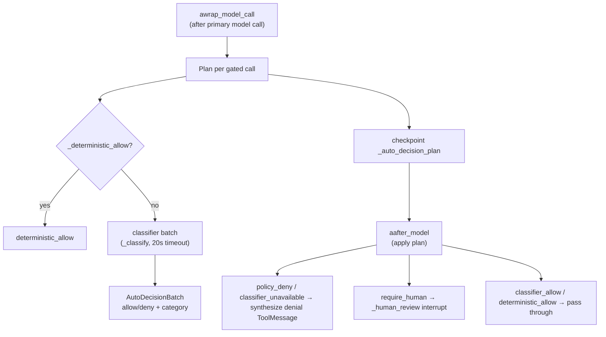
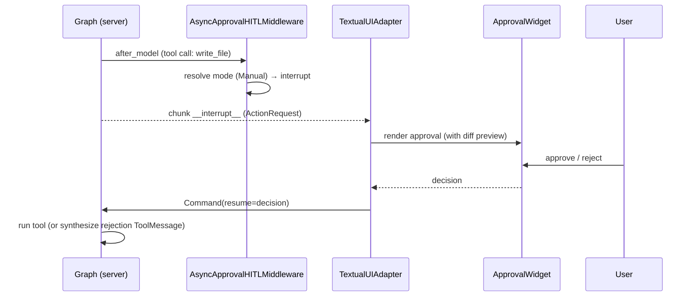
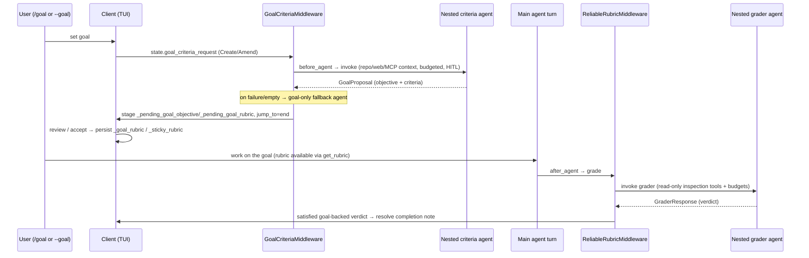

# 05 — Approvals, Auto Mode, and the Goal/Rubric Loop

Two of the most distinctive things `dcode` adds on top of the SDK: a three-way
**human-in-the-loop approval model** with a classifier-backed **Auto mode**, and
a **goal → rubric → grader** self-evaluation loop.

---

## Part A — Approvals & Auto Mode

### A.1 The three approval modes

[`approval_mode.py`](../../libs/code/deepagents_code/approval_mode.py) defines
`ApprovalMode(StrEnum)`: `MANUAL`, `AUTO`, `YOLO` (`approval_mode.py:38`).

| Mode | Behavior |
|------|----------|
| **Manual** | Every gated tool interrupts for human approval |
| **Auto** | Deterministically-safe and classifier-approved calls pass; unsafe/denied/threshold-exceeded fall back to human review |
| **YOLO** | No gated tool interrupts |

- `coerce_approval_mode` **fails closed to `MANUAL`** on any invalid value.
- `next_approval_mode` implements the Shift+Tab cycle **Manual → Auto → YOLO →
  Manual** (Auto omitted when not eligible, e.g. remote sandbox; YOLO omitted when
  disabled by policy).
- Mode is a **live per-thread Store record** (namespace
  `("deepagents_code","approval_mode")`, key `sha256(thread_id)`), read via
  `aread_approval_mode_from_store`. Because mode is per-request, graph
  construction is independent of it. Install-local acknowledgements (YOLO ack,
  Auto notice) persist to `~/.deepagents/.state/approval.json` under a
  file+thread lock.

### A.2 The gated-tool list

`_add_interrupt_on` (`agent.py:2048`) builds the interrupt map. Statically gated
tools (each `allowed_decisions=["approve","reject"]`):

`execute`, `write_file`, `edit_file`, `delete`, `web_search`, `fetch_url`,
`task`, `start_async_task`, `update_async_task`, `cancel_async_task`.

Plus **dynamically**: every MCP tool that is **not** coherently read-only
(`mcp_tool_is_coherently_read_only`), and — when `REQUIRE_COMPACT_TOOL_APPROVAL`
is `True` — `compact_conversation`.

The `when` predicate is `_should_interrupt_tool_call` (`agent.py:1916`), which
first consults Hooks v2 (`pre_tool_behavior`), then resolves the live mode:
**YOLO → don't interrupt; AUTO → interrupt only where the classifier is not
eligible; MANUAL → interrupt**.

### A.3 HITL middleware selection

`create_cli_agent` computes `hitl_active = not auto_approve and
restrictive_shell_allow_list is None`, and if active builds
`resolved_interrupt_on = _add_interrupt_on(...)`. Then (`agent.py:2825`):

- if `auto_mode_config` is set → **`AutoModeHITLMiddleware`**;
- else if `resolved_interrupt_on` → **`AsyncApprovalHITLMiddleware`**.

Both report `name = "HumanInTheLoopMiddleware"`, so **only one is ever installed**
(the SDK dedups by name; installing both would trip a duplicate-name assertion).

**`AsyncApprovalHITLMiddleware`** (`agent.py:1955`) subclasses the SDK
`HumanInTheLoopMiddleware`. Its `aafter_model` resolves the live mode from the
Store and injects a **trusted in-process `_RoutingDecision`** into a shallow state
copy (never checkpointed) before delegating to the stock `after_model`. The
`_RoutingDecision` *type identity* is the trust signal — graph input deserializes
to plain dicts and cannot forge an autonomous mode. The sync `after_model` fails
closed to Manual (a sync Store read is rejected on the event loop).

### A.4 Auto mode internals

[`auto_mode.py`](../../libs/code/deepagents_code/auto_mode.py) —
`AutoModeHITLMiddleware` (`auto_mode.py:1607`) is a two-phase policy:

- **Deterministic allow** (`_deterministic_allow`, `auto_mode.py:1561`):
  `compact_conversation` only if it is the trusted compaction tool; MCP tools only
  if coherently read-only; `write_file`/`edit_file` only for routine writes inside
  the worktree (`_routine_write_allowed` — not sensitive/dependency files, suffix
  allowlist); `execute` only for fixed read-only repo commands
  (`git diff|log|ls-files|rev-parse|show|status`, no shell metacharacters, paths
  inside the worktree) or a narrow configured allow-list.
- **Classifier** (`_classify`): `model.with_structured_output(AutoDecisionBatch)`
  under a 20 s timeout, run-name `dcode_auto_classifier`. Categories drive denials.
- **Fallback thresholds** (server-owned counters in the Store): total denials ≥ 20,
  consecutive denials ≥ 3, consecutive classifier-unavailable ≥ 2 → force human
  review; counters reset on mode/turn change.
- **Managed scratch protection:** registers `create_temp_artifact`/
  `delete_temp_artifact` and rejects generic `write_file`/`edit_file`/`delete`
  targeting a managed scratch path.

**`HeadlessMCPGuardMiddleware`** (`auto_mode.py:2763`) is the headless counterpart:
with no approval UI, it rejects any gated MCP call with an explanatory
`ToolMessage(status="error")`.

### A.5 Approval sequence (interactive Manual)

---

## Part B — Goal / Rubric self-evaluation

### B.1 Purpose

Turn a user's **goal** into acceptance **criteria** (a rubric) via a nested
criteria agent, expose read-only goal/rubric tools to the main agent, and **grade**
the finished turn against the rubric via a nested grader agent — all inside the
main server graph, budget-bounded.

Key files: [`goal_tools.py`](../../libs/code/deepagents_code/goal_tools.py),
[`goal_rubric.py`](../../libs/code/deepagents_code/goal_rubric.py),
[`reliable_rubric.py`](../../libs/code/deepagents_code/reliable_rubric.py),
[`goal_state_notice.py`](../../libs/code/deepagents_code/goal_state_notice.py),
budgets in [`_repository_bounds.py`](../../libs/code/deepagents_code/_repository_bounds.py).

### B.2 The three middleware and their tools

| Middleware | Stack position | Role |
|-----------|----------------|------|
| `GoalToolsMiddleware` (`goal_tools.py:349`) | #5 | Exposes `get_goal`/`get_rubric` (read-only) and `update_goal` (status `complete`/`blocked` + note); maintains a goal-state notice pinned into history |
| `GoalCriteriaMiddleware` (`goal_rubric.py:1141`) | #15 | On a `goal_criteria_request`, runs a **nested criteria agent** to produce a `GoalProposal` |
| `ReliableRubricMiddleware` (`reliable_rubric.py:107`) | #17 (last) | On a graded turn, runs a **nested grader agent** to score against the rubric |

`update_goal(complete)` **stages** a `_pending_goal_completion_note` that is only
resolved into goal completion after the rubric verdict; `blocked` commits
immediately.

### B.3 Goal → criteria → grade lifecycle

### B.4 Nested agents & budgets

Both nested agents are built with the SDK's `create_agent` (not
`create_deep_agent`) and their own middleware:

- **Criteria agent** (`_create_goal_criteria_agent`, `goal_rubric.py:1339`):
  `response_format=ToolStrategy(schema=GoalProposal)`,
  `context_schema=CLIContextSchema`, middleware =
  `ConfigurableModelMiddleware(persist_model_state=False)` +
  `_GoalContextFallbackMiddleware` + `_WebSearchBudgetMiddleware` +
  `_CriteriaContextBudgetMiddleware` + (if a repo backend) a narrowed
  `FilesystemMiddleware` (`ls`/`read_file`/`glob`/`grep`) +
  `_RepositoryToolBudgetMiddleware` + `AsyncApprovalHITLMiddleware`. A goal-only
  **fallback agent** (no tools/HITL) runs on error or empty proposal.
- **Grader agent** (`reliable_rubric._ensure_grader`): `response_format=
  GraderResponse`; grader tools built by `_create_rubric_grader_tools`
  (`agent.py:456`) — always a `read_file` over offloaded results, optionally
  bounded repository inspection. Retries once on transient transport errors
  (`_is_transient_grader_transport_error`); strips dcode control turns before
  building evidence.
- **Budgets** (`_repository_bounds.py`): `REPOSITORY_TOOL_CALL_LIMIT = 25`, plus
  read/line/byte/glob/grep caps enforced by `_ContextToolCallBudgetMiddleware`,
  `_RepositoryToolBudgetMiddleware`, and `_WebSearchBudgetMiddleware`
  (`_WEB_SEARCH_CALL_LIMIT = 3`). Repository roots come from
  `get_default_working_dir` (sandbox) or a virtual `FilesystemBackend` (local).

### B.5 CLI/TUI surface

- `--goal` / `--rubric` / `--rubric-model` / `--rubric-max-iterations`
  (`main.py:1990`); `--goal` is **interactive-only** and mutually exclusive with
  the `--rubric*` flags.
- Interactive `/goal` and `/rubric` handled by `DeepAgentsApp._handle_goal_command`
  (`app.py:10952`), with a one-time "auto-accept criteria" preference prompt.

### B.6 Extension points

- Add read-only context tools via `goal_criteria_tools` / `rubric_grader_tools`
  (dcode passes the read-only MCP tools here).
- Tune budgets in `_repository_bounds.py` / `_WEB_SEARCH_CALL_LIMIT` / recursion
  limits; configure `rubric_model` / `rubric_max_iterations`.
- Improve grader resilience via `_is_transient_grader_transport_error`.

---

## Changed since the previous docs

- The boolean `auto_approve` model became the three-way `ApprovalMode`
  (manual/auto/yolo) with per-thread Store persistence and a Shift+Tab cycle.
- **Classifier-backed Auto mode** (`auto_mode.py`) is entirely new, as is the
  `AsyncApprovalHITLMiddleware` that resolves live mode per request.
- The entire **goal/rubric self-evaluation** subsystem (nested criteria + grader
  agents, budgets, staged completion) is new.
- `_add_interrupt_on` now gates async-subagent tools and (conditionally)
  `compact_conversation`, plus dynamic MCP gating from protocol annotations.
