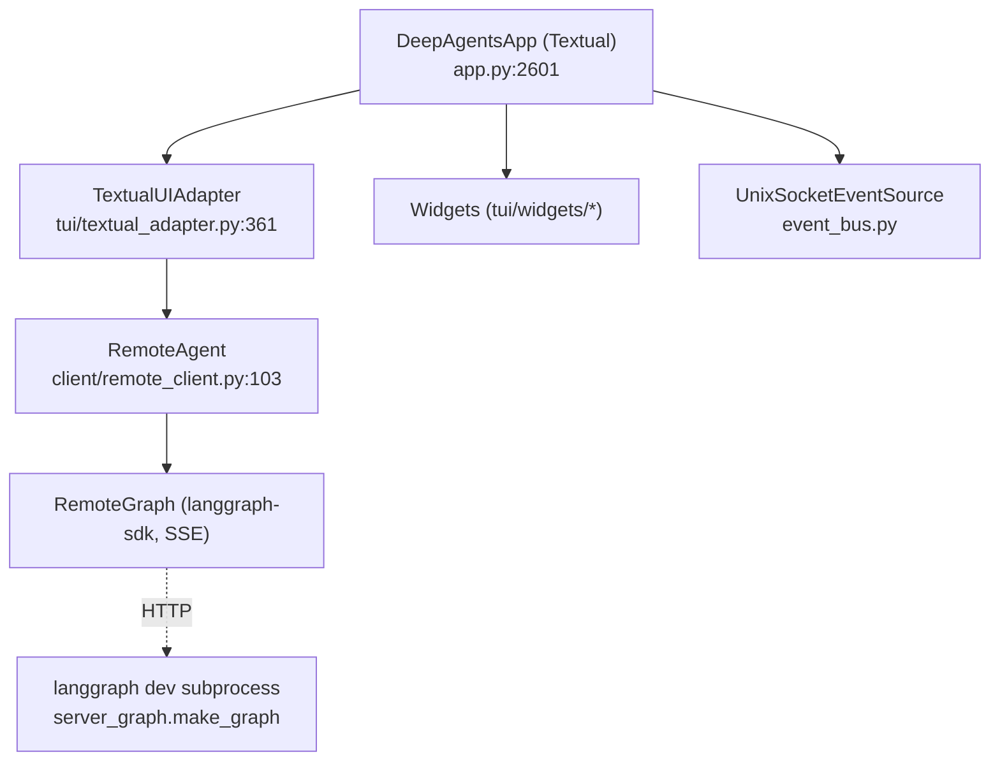
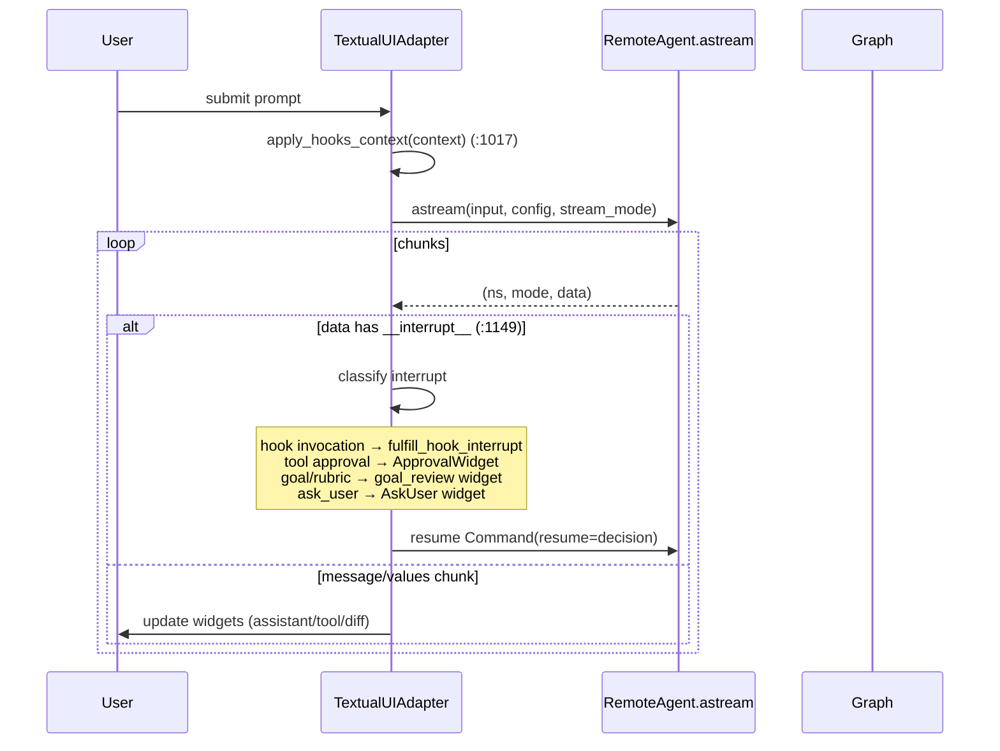

# 06 — TUI and Client Internals

How the terminal UI is wired to the agent graph: the Textual application, the
streaming/interrupt broker, the widget system, the external event bus, and the
remote client.

---

## 6.1 The client/server relationship

`dcode`'s TUI is a **remote client** of the agent graph, which runs in a separate
`langgraph dev` subprocess (see [01_execution_flow.md](01_execution_flow.md)).
The three client-side layers:

- **`DeepAgentsApp(App)`** (`app.py:2601`) is the Textual application. It owns the
  layout (`compose`, `app.py:3795`), keybindings, the message store, and all the
  command handlers (`/model`, `/goal`, `/offload`, `/threads`, `/skills`, …).
  `run_textual_app` (`app.py:22917`) is the async entry, returning an `AppResult`
  (`app.py:22900`) with the return code and final thread id.
- **`TextualUIAdapter`** (`tui/textual_adapter.py:361`) is the broker between the
  app and the graph: it drives `astream`, translates chunks into widget updates,
  and routes interrupts.
- **`RemoteAgent`** (`client/remote_client.py:103`) is a thin wrapper over
  `langgraph.pregel.remote.RemoteGraph` handling SSE parsing and message
  deserialization; `astream` (`:157`) yields `(namespace, mode, data)` tuples.

---

## 6.2 The stream/interrupt loop

The core loop lives in `TextualUIAdapter` (`tui/textual_adapter.py:1033`):

- A *Thinking* spinner is shown before each `astream` iteration
  (`textual_adapter.py:1025`).
- `apply_hooks_context` writes `hooks_snapshot_id`/`hooks_server_events`/
  `prompt_id` into the run context before every stream so the in-graph
  `ServerHooksMiddleware` knows which events to emit.
- The interrupt payload is multiplexed: **Hooks v2** (`is_hook_interrupt_payload`
  → `fulfill_hook_interrupt`, resume stored in `pending_hook_resumes`), **tool
  approval** (raises the approval widget), **goal/rubric review**, and
  **`ask_user`**. Each decision is returned as `Command(resume=...)`.

---

## 6.3 Widget system

~50 widgets under [`tui/widgets/`](../../libs/code/deepagents_code/tui/widgets),
grouped by role:

| Group | Widgets |
|-------|---------|
| Conversation | `messages.py`, `message_store.py`, `history.py`, `chat_input.py`, `_paste_textarea.py` |
| Tool rendering | `tool_renderers.py`, `tool_widgets.py`, `diff.py`, `_js_eval_display.py`, `subagent_panel.py` |
| Approvals / HITL | `approval.py`, `ask_user.py`, `goal_review.py`, `goal_status.py`, `auto_mode_notice.py`, `yolo_mode_notice.py`, `_inline_prompt.py` |
| Selectors | `model_selector.py`, `agent_selector.py`, `thread_selector.py`, `theme_selector.py`, `effort_selector.py`, `autocomplete.py`, `cwd_switch.py` |
| MCP / auth | `mcp_login.py`, `mcp_reconnect.py`, `mcp_viewer.py`, `auth.py`, `codex_auth.py`, `skill_trust.py` |
| Update / onboarding | `update_available.py`, `update_confirm.py`, `update_progress.py`, `install_confirm.py`, `launch_init.py`, `welcome.py`, `startup_tip.py`, `restart_prompt.py`, `plugin_reload.py` |
| Chrome | `status.py`, `loading.py`, `notification_center.py`, `notification_detail.py`, `notification_settings.py`, `debug_console.py` |

Modal screens (full-screen overlays) live under
[`tui/modals/`](../../libs/code/deepagents_code/tui/modals), e.g. the
`plugin_manager/` modal (tabs discover/installed/marketplaces/errors).

`MessageStore` (`message_store.py`) holds typed `MessageData` records with a
`MessageType` enum for structured conversation tracking, decoupling the rendered
transcript from the raw graph message stream.

---

## 6.4 External event bus

[`event_bus.py`](../../libs/code/deepagents_code/event_bus.py) provides
`UnixSocketEventSource`: a **Unix-domain-socket** ingress that lets external
processes inject commands, prompts, and signals (interrupt, force-clear) into the
running TUI. Wire protocol is **newline-delimited JSON** with a **64 KB per-line
limit** (`_MAX_LINE_BYTES`). The socket is created under a transient
`umask(0o077)` so it is `0o600` from `bind()`, and stale sockets are cleaned up
safely (a non-socket file at the path is left untouched). This backs
integrations like [`ralph_mode`](../../examples/ralph_mode) and external drivers.

---

## 6.5 Headless client

The non-interactive path ([`client/non_interactive.py`](../../libs/code/deepagents_code/client/non_interactive.py))
reuses `RemoteAgent`/the same graph but renders to stdout/stderr instead of
Textual. It has no approval UI: it collects interrupts, fulfills pending hook
interrupts (`fulfill_pending_hook_interrupts`), and relies on
`HeadlessMCPGuardMiddleware` + `--shell-allow-list` for safety. It supports
`--max-turns`, `--timeout`, `--quiet`, and `--no-stream`.

---

## 6.6 Extension points

- **New slash command:** add a handler in `DeepAgentsApp` and register it in
  [`command_registry.py`](../../libs/code/deepagents_code/command_registry.py).
- **New widget:** add under `tui/widgets/` and mount it from the app or adapter;
  render new tool types by extending `tool_renderers.py`.
- **New interrupt type:** classify it in the adapter's interrupt loop
  (`textual_adapter.py:1149`) and add the resume shape.
- **External driver:** connect to the Unix socket and speak the newline-JSON
  protocol.

---

## Changed since the previous docs

- `textual_adapter.py` and the widget package moved under `tui/`; the widget set
  roughly doubled (goal/rubric, auto-mode/yolo notices, plugin reload, subagent
  panel, debug console, effort/theme selectors, skill trust, …).
- The interrupt loop is now a **multiplexer** over hook fulfilment, tool approval,
  goal/rubric review, and `ask_user`, and applies hooks context before each
  stream.
- `app.py` grew into the single largest module (the `DeepAgentsApp` command
  surface); the client was split into `client/` (`remote_client.py`,
  `non_interactive.py`, `launch/`, `commands/`).
