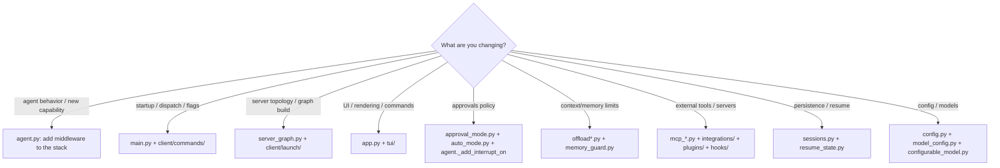

# 07 — Extensibility, Design Decisions, and Building Your Own

A consolidated reference for contributors: every extension point in one place, the
design decisions that shaped the architecture, and a recipe for building a similar
coding agent on the SDK.

---

## 7.1 Extension points at a glance

| I want to… | Touch | Notes |
|------------|-------|-------|
| Add a built-in tool | `tools.py` + `server_graph._build_tools` | Gate on `settings` if it needs creds |
| Add/replace agent behavior | a new `AgentMiddleware` + append in `create_cli_agent` | The primary extension mechanism |
| Add a subagent | `~/.deepagents/.../agents/` or project `agents/` (filesystem), or `async_subagents` | Gets per-subagent middleware automatically |
| Add a slash command | `DeepAgentsApp` handler + `command_registry.py` | |
| Add a TUI widget / tool renderer | `tui/widgets/` + `tool_renderers.py` | |
| Add a new interrupt type | adapter loop `textual_adapter.py:1149` | Define the resume shape |
| Add a hook lifecycle event | `HookEvent` + domain/wire/decision models + `capabilities` + `projection` + `reducer` (+ emit) | See [04](04_hooks_and_plugins.md) §A.7 |
| Add a hook handler type | `HandlerType` + `config.HandlerSpec` union + `runner.py` | Currently only `command` |
| Add a plugin capability type | `manifest.py` + `ComponentInventory` + `adapters/` + consumer wiring | See [04](04_hooks_and_plugins.md) §B.6 |
| Add a sandbox provider | entry-point `deepagents_code.sandbox_providers`, or `config.toml` `class_path`, or built-in in `sandbox_registry` | Backend subclasses `BaseSandbox` |
| Add an MCP transport | `_resolve_server_type` + `_validate_server_config` + `_preflight_and_connect` | |
| Add an MCP OAuth provider | one `OAuthProvider` subclass + one `_REGISTRY` entry | No edits to login orchestration |
| Add a model provider | `config.toml` `[providers]` (`ProviderConfig`, optional `class_path`) | |
| Add an env override | `resolve_env_var` (`DEEPAGENTS_CODE_` prefix) | |
| Add a resume-restored fact | `PrivateStateAttr` channel on `ResumeState`, written in a middleware | |
| Tune goal/rubric budgets | `_repository_bounds.py`, `_WEB_SEARCH_CALL_LIMIT`, recursion limits | |
| Add a built-in skill | drop a `SKILL.md` dir under `built_in_skills/` | Or ship via a plugin |

---

## 7.2 Design decisions (and why)

**1. Extend the SDK through middleware, never fork it.** Every custom behavior is
an `AgentMiddleware`, a tool, a backend, or a `CLIContextSchema` field. dcode
subclasses SDK middleware (`SkillsMiddleware`, `SummarizationToolMiddleware`,
`RubricMiddleware`) where the SDK does the heavy lifting, and *replaces* SDK
defaults by matching `.name` (`FilesystemMiddleware`). Result: SDK upgrades flow
through with minimal friction; dcode owns *policy*, the SDK owns *graph assembly*.

**2. Client/server split with the graph in a subprocess.** Running the agent in a
`langgraph dev` subprocess (rather than in-process) gives clean isolation,
lets the TUI stay responsive while the graph boots, matches the deployed
LangGraph Platform topology (so the same graph works locally and remotely), and
makes **interrupts the universal control channel** for approvals, hooks, and goal
reviews.

**3. Empty `interrupt_on` + custom HITL middleware.** The SDK's declarative
`interrupt_on` map cannot express Manual/Auto/YOLO or a classifier. dcode passes
`interrupt_on={}` and installs its own HITL middleware, resolving the live mode
per request from a per-thread Store record. The single HITL slot is enforced by
sharing the `HumanInTheLoopMiddleware` name.

**4. Per-request policy in `CLIContextSchema`, not in graph structure.** Approval
mode, model, hooks snapshot, and offload authorization all ride the run context,
so the graph is compiled **once** and reused across turns/threads. Trust signals
(e.g. `_RoutingDecision`) use *type identity* that graph input can't forge.

**5. Fail closed on trust decisions.** Unreadable MCP trust policy → deny;
malformed approval mode → Manual; missing annotations → gate the tool;
project hooks/MCP untrusted by default. Security posture is consistently
conservative.

**6. Offload large data to the filesystem, not the context window.** Conversation
archives and large tool results route to dedicated backends via `CompositeBackend`,
keeping the model's context lean and the working tree clean.

**7. Bound every nested agent.** The criteria and grader agents run with strict
tool-call/web-search/recursion budgets (`_repository_bounds.py`) so
self-evaluation can't run away.

**8. Startup performance is a first-class constraint.** Lazy imports throughout
`main.py`, cheap display-model resolution before the expensive `create_model`,
and a cached single-build graph factory all serve the "`dcode -v` must be fast"
rule in [`AGENTS.md`](../../libs/code/AGENTS.md).

---

## 7.3 Recipe: build a similar coding agent on the SDK

The minimal spine, mirroring what `create_cli_agent` does:

```python
from deepagents import create_deep_agent
from deepagents.backends import CompositeBackend, LocalShellBackend

# 1. Backend: local shell + filesystem, wrapped for artifact routing.
backend = CompositeBackend(
    default=LocalShellBackend(root_dir=cwd, virtual_mode=False),
    routes={},                       # add conversation_history / large_tool_results routes
)

# 2. Middleware: your policy layers (subclass SDK middleware where possible).
middleware = [
    ConfigurableModelMiddleware(),   # runtime model switching
    MemoryMiddleware(backend=..., sources=[...AGENTS.md]),
    SkillsMiddleware(backend=..., sources=[...]),
    MyApprovalHITLMiddleware(interrupt_on_map),  # your HITL policy
    # ... offload, hooks, rubric, etc.
]

# 3. Custom per-run context so policy stays out of graph structure.
class MyContext(TypedDict, total=False):
    approval_mode: str
    model: str
    thread_id: str

# 4. The seam.
agent = create_deep_agent(
    model=model,
    system_prompt=system_prompt,
    tools=[web_search, fetch_url, *mcp_tools],
    backend=backend,
    middleware=middleware,
    interrupt_on={},                 # own your HITL via middleware
    context_schema=MyContext,
    checkpointer=checkpointer,       # AsyncSqliteSaver for sessions
    subagents=subagents or None,
).with_config({"recursion_limit": 200})
```

Then wrap it with:

- a **transport** (in-process, or a `langgraph dev` subprocess + `RemoteGraph`
  client like dcode);
- a **stream/interrupt loop** that renders messages and resumes on `__interrupt__`
  (`Command(resume=...)`);
- **session persistence** (SQLite via `AsyncSqliteSaver`) and a resume path;
- your **UI** (a TUI, a web app, or stdout for headless).

Everything else in dcode — hooks, plugins, auto-mode, goal/rubric, MCP trust,
sandboxes — is an *optional* layer added the same way: middleware, tools,
backends, and context fields.

---

## 7.4 A contributor's map of "where do I change X?"



---

## 7.5 Gotchas for new contributors

- **Middleware order matters.** Adding a middleware in the wrong position can
  change HITL/hook resolution. Read [02_agent_construction.md](02_agent_construction.md) §4 first.
- **Plugins/hooks changes need `/reload`.** Middleware is built once at agent
  construction; enabling a plugin or editing `hooks.json` mid-session won't take
  effect until reload.
- **Two hook systems coexist.** Don't confuse `hooks/legacy.py` (dotted events,
  telemetry) with Hooks v2 (lifecycle, `models/`). Removal of legacy is scheduled.
- **The session DB is `sessions.db`**, under `~/.deepagents/.state/`, not
  `threads.db`.
- **Config crosses the process boundary as env vars** (`ServerConfig.to_env`/
  `from_env`); a new server-affecting option must be threaded through
  `_server_config.py`, `server_manager`, and `server_graph`.
- **Respect the fail-closed trust posture** when touching MCP/sandbox/plugins.
- **Keep startup fast** — use lazy imports for anything heavy.
- **Follow the monorepo conventions** in [`libs/code/AGENTS.md`](../../libs/code/AGENTS.md)
  and the root [`AGENTS.md`](../../AGENTS.md) (types, docstrings, tests, `uv`,
  Conventional Commits).

---

## 7.6 Related SDK documentation

For the primitives dcode builds on, see the generic Deep Agents docs:
[06_graph.md](../06_graph.md) (graph assembly), [08_tools.md](../08_tools.md),
[10_backends.md](../10_backends.md), [11_middleware_overview.md](../11_middleware_overview.md),
[12_filesystem_middleware.md](../12_filesystem_middleware.md),
[17_subagents.md](../17_subagents.md), [18_memory.md](../18_memory.md),
[19_rubric.md](../19_rubric.md). The updated dcode summary lives in
[25_code_agent.md](../25_code_agent.md).
