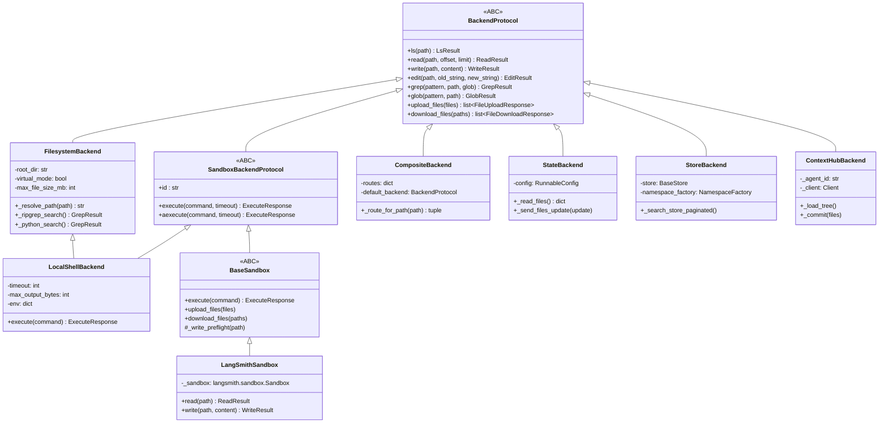

# Chapter 10 -- The Backend System

> **Source directory:** `libs/deepagents/deepagents/backends/`
> **Public API:** `libs/deepagents/deepagents/backends/__init__.py`

---

## 1. What Backends Do

A "backend" in Deep Agents is a **pluggable file storage adapter**. Every
file operation the agent performs -- read, write, edit, grep, glob, ls --
is routed through a backend. The agent does not know whether it is
operating on a local filesystem, an ephemeral LangGraph state channel, a
persistent LangSmith store, or a remote cloud sandbox. The backend
abstraction makes all of these look the same.

This chapter covers:

- The `BackendProtocol` ABC hierarchy and why it uses `abc.ABC`, not
  `typing.Protocol`.
- Every concrete backend class: what it stores, how it stores it, and
  where it breaks the general contract.
- `CompositeBackend`: the path-prefix router that wires multiple backends
  together.
- Cross-cutting concerns: virtual mode, ripgrep integration, CRLF
  normalisation, write-once semantics, and FileFormat versioning.

---

## 2. Protocol Hierarchy



### Why `abc.ABC` and Not `typing.Protocol`?

`BackendProtocol` inherits from `abc.ABC`, not `typing.Protocol`. This is
a deliberate choice:

1. **Nominal subtyping:** All backend implementations must explicitly
   inherit from `BackendProtocol`. A duck-typed class with the right
   methods would *not* satisfy `isinstance(obj, BackendProtocol)`.

2. **Deprecated method shims:** `BackendProtocol` provides concrete
   fallback logic for deprecated methods (`ls` delegates to `ls_info` if
   the subclass overrides the old name, etc.). A `Protocol` class cannot
   contain this kind of default implementation logic with `super()` calls.

3. **Runtime checks:** `CompositeBackend.execute()` does
   `isinstance(backend, SandboxBackendProtocol)` to verify that the
   default backend supports command execution. Structural subtyping would
   make this check unreliable.

---

## 3. BackendProtocol: The Base ABC

**File:** `protocol.py` (892 lines)

### 3.1 Core Methods

Every backend must implement these (or inherit a default):

| Method | Signature | Purpose |
|--------|-----------|---------|
| `ls` | `(path, depth) -> LsResult` | List directory contents |
| `read` | `(path, offset, limit, format) -> ReadResult` | Read file content with optional line slicing |
| `write` | `(path, content, encoding) -> WriteResult` | Create a new file (write-once semantics) |
| `edit` | `(path, old_string, new_string, replace_all) -> EditResult` | String replacement in existing file |
| `grep` | `(pattern, path, include, output_mode) -> GrepResult` | Search file contents |
| `glob` | `(pattern, path) -> GlobResult` | Find files by glob pattern |
| `upload_files` | `(files) -> list[FileUploadResponse]` | Batch file upload |
| `download_files` | `(paths) -> list[FileDownloadResponse]` | Batch file download |

Each method also has an async variant prefixed with `a` (`als`, `aread`,
`awrite`, etc.) that defaults to running the sync version in a thread
executor.

### 3.2 Result Types

All results are `TypedDict` subclasses defined in `protocol.py`:

| Type | Key Fields |
|------|-----------|
| `ReadResult` | `content`, `error`, `file_info` |
| `WriteResult` | `path`, `error` |
| `EditResult` | `diff`, `error`, `content` |
| `LsResult` | `files: list[FileInfo]`, `error` |
| `GrepResult` | `matches: list[GrepMatch]`, `error` |
| `GlobResult` | `files: list[str]`, `error` |
| `ExecuteResponse` | `output`, `exit_code` |
| `FileInfo` | `type`, `path`, `size`, `last_modified` |
| `GrepMatch` | `path`, `line`, `text` |

### 3.3 Constants

```python
DEFAULT_GREP_TIMEOUT = 30        # Sync grep timeout in seconds
ASYNC_GREP_TIMEOUT = 65          # Async grep timeout (longer for remote sandboxes)
FileFormat = Literal["v1", "v2"] # v1 = list[str] content, v2 = str + encoding field
```

### 3.4 Deprecated Method Shims

`BackendProtocol` contains backwards-compatibility logic for three renamed
methods:

| Old Name | New Name | Fallback Logic |
|----------|----------|----------------|
| `ls_info` | `ls` | If a subclass overrides `ls_info` but not `ls`, `ls()` delegates to `ls_info()`. Vice versa also supported. |
| `grep_raw` | `grep` | Same pattern. |
| `glob_info` | `glob` | Same pattern. |

The shim works by checking `type(self).ls_info is not BackendProtocol.ls_info`
to detect whether a subclass has overridden the deprecated name. This
introspection is cached to avoid repeated MRO lookups.

### 3.5 `execute_accepts_timeout`

```python
@functools.lru_cache(maxsize=None)
def execute_accepts_timeout(cls: type) -> bool:
```

A cached introspection helper that checks whether a backend's `execute()`
method accepts a `timeout` keyword argument. Used by the middleware to
decide whether to pass timeout values through or handle them externally.

### 3.6 Error Types

```python
FileOperationError = Literal["file_not_found", "permission_denied", "is_directory", "invalid_path"]
```

Backends return structured error literals in result dicts rather than
raising exceptions. This keeps the agent loop running even when a file
operation fails -- the error is surfaced as a tool result message rather
than crashing the graph.

---

## 4. FilesystemBackend

**File:** `filesystem.py` (1102 lines)

The most complex backend. Provides direct filesystem access with
security hardening.

### 4.1 Initialisation

```python
def __init__(
    self,
    root_dir: str,
    virtual_mode: bool | None = None,  # Deprecation warning if None
    max_file_size_mb: int = 10,
)
```

- **`root_dir`**: The filesystem directory that becomes the virtual root `/`.
- **`virtual_mode`**: When `True`, all paths are resolved relative to
  `root_dir` and path traversal is blocked. When `False` (legacy),
  absolute paths are passed through to the OS. A deprecation warning is
  emitted if `None` (the default), nudging callers to opt into virtual mode.
- **`max_file_size_mb`**: Files larger than this are rejected on read.

### 4.2 Virtual Mode and Path Resolution

```python
def _resolve_path(self, path: str) -> str:
```

In virtual mode:
1. The path is normalised (leading `/` added, `..` rejected).
2. Joined with `root_dir` to produce an absolute filesystem path.
3. A `realpath` check ensures the resolved path is still under `root_dir`
   (prevents symlink escapes).

In legacy mode:
- Absolute paths are used as-is.
- Relative paths are joined with `root_dir`.
- No traversal blocking.

```python
def _to_virtual_path(self, fs_path: str) -> str:
```

The reverse operation: converts an absolute filesystem path back to a
virtual path relative to `root_dir`. Used when returning results (grep
matches, glob results) to the agent, which only sees virtual paths.

### 4.3 Write: CRLF Prevention

```python
def write(self, path, content, encoding="utf-8"):
    fd = os.open(full_path, os.O_WRONLY | os.O_CREAT | os.O_EXCL | os.O_NOFOLLOW)
    with os.fdopen(fd, "w", newline="") as f:
        f.write(content)
```

Two critical flags:
- **`os.O_NOFOLLOW`**: Refuses to follow symlinks. Prevents an attacker
  from creating a symlink at the target path pointing outside `root_dir`.
- **`newline=""`**: Disables Python's universal newline translation.
  Without this, on Windows, every `\n` in the content would be written as
  `\r\n`, corrupting file content and breaking exact-match edits.

### 4.4 Edit: CRLF Normalisation (Issue #2880)

```python
def edit(self, path, old_string, new_string, replace_all=False):
    # Normalize old_string and new_string
    old_string = old_string.replace("\r\n", "\n").replace("\r", "\n")
    new_string = new_string.replace("\r\n", "\n").replace("\r", "\n")
```

Even with `newline=""` on write, files may contain CRLF content if they
were created outside the agent (e.g., by `git clone` on Windows with
`autocrlf=true`). The edit method normalises the search/replace strings
to LF before matching, ensuring that edits work regardless of the file's
line ending convention.

This was introduced to fix issue #2880 where edits would fail silently
on Windows because the `old_string` (from the model, always LF) did not
match the file content (CRLF from the OS).

### 4.5 Grep: Ripgrep Integration

The grep method implements a two-tier search strategy:

**Tier 1: Ripgrep (`_ripgrep_search`)**

```python
def _ripgrep_search(self, pattern, path, include, ...):
    cmd = [rg_path, "--json", "-F", pattern]  # Fixed-string, JSON output
```

- Uses `rg --json -F` for literal (non-regex) search with structured
  JSON output.
- Sets `cwd=base_full` so that ripgrep's directory-relative globs work
  correctly.
- Performs a containment check: the resolved search path must be under
  `root_dir`.
- Remaps all result paths from absolute filesystem paths to virtual paths
  via `_to_virtual_path()`.

**Tier 2: Python fallback (`_python_search`)**

When ripgrep is not available (not installed, or `_resolve_ripgrep_path()`
returns `None`):

- Uses `wcmatch.glob` for file discovery.
- Streams files line-by-line with a wall-clock timeout.
- Catches `UnicodeDecodeError` to skip binary files gracefully.

**Ripgrep Path Caching:**

```python
@functools.cache
def _resolve_ripgrep_path() -> str | None:
    return shutil.which("rg")
```

The `@functools.cache` decorator (unbounded, permanent cache) ensures
`shutil.which("rg")` is called at most once per process lifetime. This
is safe because the ripgrep binary location does not change during a
process's lifetime.

### 4.6 Symlink Loop Detection

```python
def _raise_if_symlink_loop(self, path: str) -> None:
def _is_symlink_loop_error(self, error: OSError) -> bool:
def _is_eloop_oserror(self, error: OSError) -> bool:
```

A chain of methods detects circular symlink references:
- On Linux/macOS: checks for `errno.ELOOP`.
- On Windows: checks for `winerror=1921` (the Windows equivalent of ELOOP).

When detected, a clear error message is returned instead of an opaque
OS error.

---

## 5. SandboxBackendProtocol

**File:** `protocol.py`

Extends `BackendProtocol` with command execution:

```python
class SandboxBackendProtocol(BackendProtocol):
    @abc.abstractmethod
    def execute(self, command: str, timeout: int | None = None) -> ExecuteResponse: ...

    @abc.abstractmethod
    async def aexecute(self, command: str, timeout: int | None = None) -> ExecuteResponse: ...

    @property
    @abc.abstractmethod
    def id(self) -> str: ...
```

The `id` property provides a unique identifier for the sandbox instance,
used for logging and session tracking.

---

## 6. BaseSandbox

**File:** `sandbox.py` (894 lines)

An ABC that extends `SandboxBackendProtocol` and provides default
implementations for file operations by executing Python scripts inside
the sandbox via `execute()`.

### 6.1 Server-Side Script Templates

`BaseSandbox` defines Python script templates as module-level constants:

| Template | Purpose |
|----------|---------|
| `_READ_COMMAND_TEMPLATE` | Reads a file, returns content with line numbers |
| `_EDIT_COMMAND_TEMPLATE` | String replacement inside the sandbox |
| `_EDIT_TMPFILE_TEMPLATE` | Large-payload edit via temporary file upload |
| `_GLOB_COMMAND_TEMPLATE` | Glob search inside the sandbox |
| `_WRITE_CHECK_TEMPLATE` | Pre-write existence check + parent directory creation |

These templates are formatted with parameters and executed inside the
sandbox as Python scripts. This avoids shell escaping issues and provides
structured output.

### 6.2 Constants

```python
MAX_BINARY_BYTES = 500 * 1024     # 500 KB max for binary file content
MAX_OUTPUT_BYTES = 500 * 1024     # 500 KB max command output
_EDIT_INLINE_MAX_BYTES = 50_000   # 50 KB threshold: inline vs tmpfile edit
TRUNCATION_MSG = "..."            # Appended when output is truncated
```

### 6.3 Edit: Inline vs. Temporary File

The `edit()` method chooses between two strategies based on payload size:

- **Inline** (payload < 50 KB): The old/new strings are embedded directly
  in the Python script template and executed via `execute()`.
- **Temporary file** (payload >= 50 KB): The old/new strings are uploaded
  as temporary files, and a script reads them from disk before performing
  the replacement. This avoids command-line argument length limits
  (`ARG_MAX`).

### 6.4 CRLF Handling in Edit Templates (Issue #2880)

The `_EDIT_COMMAND_TEMPLATE` contains a three-stage matching strategy:

1. Try `old_string` as-is.
2. If no match, try converting `old_string`'s `\n` to `\r\n` (CRLF).
3. If no match, try converting `old_string`'s `\r\n` to `\n` (LF).

The same transformation is applied to `new_string` to keep line endings
consistent. This handles the case where the sandbox filesystem uses
different line endings than the model's output.

### 6.5 Grep via Shell Command

```python
def grep(self, pattern, path, include, ...):
    # Uses: grep -rHnFZ pattern path
```

`BaseSandbox.grep()` executes `grep -rHnFZ` inside the sandbox:
- `-r`: Recursive.
- `-H`: Print filename with each match.
- `-n`: Print line numbers.
- `-F`: Fixed-string matching (literal, not regex).
- `-Z`: NUL-separated filenames (handles filenames containing colons).

### 6.6 Write Preflight

```python
def _write_preflight(self, path: str) -> str | None:
```

A reusable method that:
1. Checks if the file already exists (write-once enforcement).
2. Creates parent directories if needed (`mkdir -p`).
3. Returns an error string if the file exists, `None` if safe to proceed.

Subclasses (like `LangSmithSandbox`) call this before their own write
implementation.

---

## 7. LangSmithSandbox

**File:** `langsmith.py` (275 lines)

Wraps `langsmith.sandbox.Sandbox` for remote execution in LangSmith's
cloud sandbox environment.

### 7.1 Why Override `read()` and `write()`?

`BaseSandbox`'s default `read()` and `write()` work by executing Python
scripts via `execute()`. This has two problems for LangSmith:

1. **ARG_MAX limits:** Large file content embedded in a Python script may
   exceed the command-line argument length limit of the sandbox.
2. **Transport overhead:** Content is double-encoded (embedded in a
   Python string literal, then sent over HTTP). The native SDK methods
   use a direct HTTP body transfer.

`LangSmithSandbox` overrides both methods to use the native SDK:

```python
def read(self, path, ...):
    content = self._sandbox.read(path)
    # Universal newline normalisation
    content = content.replace("\r\n", "\n").replace("\r", "\n")
```

```python
def write(self, path, content, ...):
    error = self._write_preflight(path)  # Reuse BaseSandbox's check
    if error:
        return WriteResult(error=error)
    self._sandbox.write(path, content)
```

### 7.2 CRLF Normalisation in `read()`

The native SDK's `read()` returns raw bytes from the sandbox. The
sandbox may be running on a system with CRLF line endings. The
override normalises to LF before returning, ensuring consistency
with the rest of the pipeline.

### 7.3 Default Timeout

`LangSmithSandbox` uses a 30-minute default timeout, significantly
longer than local backends, because remote sandbox operations include
network latency and may involve long-running computations.

---

## 8. LocalShellBackend

**File:** `local_shell.py` (369 lines)

### 8.1 Multiple Inheritance (MRO)

```python
class LocalShellBackend(FilesystemBackend, SandboxBackendProtocol):
```

`LocalShellBackend` combines:
- **`FilesystemBackend`**: All file operations (read, write, edit, grep,
  glob, ls) are handled by the filesystem implementation.
- **`SandboxBackendProtocol`**: Adds `execute()` for running shell
  commands locally.

The MRO ensures `FilesystemBackend`'s methods are used for file operations,
and `LocalShellBackend`'s own `execute()` implementation handles command
execution.

### 8.2 Command Execution

```python
def execute(self, command, timeout=None):
    result = subprocess.run(
        command,
        shell=True,
        stdin=subprocess.DEVNULL,
        capture_output=True,
        timeout=effective_timeout,
        cwd=self.root_dir,
    )
```

Key properties:
- **`shell=True`**: Runs through the system shell (bash on Unix, cmd on
  Windows). Enables pipes, redirects, and shell built-ins.
- **`stdin=DEVNULL`**: Prevents the subprocess from blocking on stdin
  input. Interactive commands fail immediately rather than hanging.
- **`stderr` handling**: stderr output is prefixed with `[stderr]` and
  appended to stdout in the response.
- **Output truncation**: Output exceeding `max_output_bytes` (default
  100 KB) is truncated with a warning.
- **Timeout**: Defaults to 120 seconds. On timeout, exit code is set to
  124 (matching the convention of the Unix `timeout` command).

### 8.3 Sandbox ID

```python
@property
def id(self) -> str:
    return f"local-{uuid4().hex[:8]}"
```

Each `LocalShellBackend` instance gets a unique ID of the form
`local-a1b2c3d4`. This is generated fresh each time the property is
accessed, which means it is not stable across calls -- this is
acceptable because `LocalShellBackend` is not used in contexts where
sandbox persistence is needed.

### 8.4 Environment Variables

```python
def __init__(self, ..., env: dict | None = None, inherit_env: bool = True):
```

- **`env`**: Additional environment variables to set for child processes.
- **`inherit_env`**: When `True` (default), the child process inherits
  the parent's environment plus the `env` additions. When `False`, only
  the `env` dict is used.

---

## 9. CompositeBackend

**File:** `composite.py` (741 lines)

The **path-prefix router** that wires multiple backends together under a
single interface.

### 9.1 Route Registration

```python
CompositeBackend(
    backends={
        "/": local_backend,          # Default backend
        "/sandbox": sandbox_backend, # Remote sandbox
        "/hub": hub_backend,         # Context hub
    }
)
```

Routes are path prefixes. The default backend is mounted at `/`.

### 9.2 Routing Algorithm: Longest Prefix First

```python
def _route_for_path(self, path: str) -> tuple[BackendProtocol, str, str]:
```

Given a path like `/sandbox/src/main.py`:

1. Routes are sorted by prefix length, longest first.
2. The first route whose prefix matches the path wins.
3. Returns a tuple of `(backend, normalised_path, route_prefix)`.

The `normalised_path` has the route prefix stripped:
- `/sandbox/src/main.py` with route `/sandbox` yields path `/src/main.py`.
- `/sandbox` (exact match) yields path `/`.

This ensures the underlying backend sees paths relative to its own root,
not the composite root.

### 9.3 Fan-Out Operations

For operations that do not target a specific path (or target `/`),
`CompositeBackend` fans out to all backends:

- **`ls("/")`**: Aggregates the default backend's listing with virtual
  directory entries for each route prefix.
- **`grep(path=None)` or `grep(path="/")`**: Searches all backends and
  merges results.
- **`glob(path=None)` or `glob(path="/")`**: Searches all backends and
  merges results.

Results from non-default backends have their paths remapped to include
the route prefix:

```python
def _remap_grep_path(self, match: GrepMatch, route: str) -> GrepMatch:
    # /src/main.py from sandbox -> /sandbox/src/main.py in composite
```

### 9.4 Execute: Default Backend Only

```python
def execute(self, command, timeout=None):
    if not isinstance(self._default_backend, SandboxBackendProtocol):
        raise TypeError("Default backend does not support execute()")
    return self._default_backend.execute(command, timeout)
```

Command execution is **not** path-routable -- it always delegates to the
default backend. This makes sense because shell commands do not carry an
explicit file path that can be used for routing.

### 9.5 Batch Upload/Download

```python
def upload_files(self, files):
    # Group files by target backend
    batches = defaultdict(list)
    for file in files:
        backend, path, _ = self._route_for_path(file.path)
        batches[backend].append(file._replace(path=path))
    # Execute batch per backend
    results = []
    for backend, batch in batches.items():
        results.extend(backend.upload_files(batch))
    return results
```

Files are grouped by their target backend based on path prefix, then
each backend receives a single batch call. This avoids N individual
upload calls when uploading N files to the same backend.

### 9.6 `artifacts_root`

```python
@property
def artifacts_root(self) -> str | None:
```

An optional attribute that tells middleware where to offload large
message artifacts (e.g., tool output that exceeds token limits). This
is set on the composite backend and propagated to the middleware layer.

---

## 10. StateBackend

**File:** `state.py` (382 lines)

An **ephemeral** backend that stores files in LangGraph's state channels.
Files exist only for the duration of a single graph invocation and are
included in the checkpoint.

### 10.1 Read-Your-Writes Semantics

```python
def _read_files(self) -> dict:
    reader = self._config["configurable"][CONFIG_KEY_READ]
    state = reader.read("files", fresh=True)
    return state or {}
```

The `fresh=True` parameter is critical. Without it, the reader returns
the state as of the last checkpoint, which does not include writes from
the current step. With `fresh=True`, the reader includes pending
(uncommitted) writes, enabling read-your-writes consistency within a
single graph step.

### 10.2 Writes via Channel Send

```python
def _send_files_update(self, update: dict) -> None:
    sender = self._config["configurable"][CONFIG_KEY_SEND]
    sender([("files", update)])
```

Writes are queued as channel updates via `CONFIG_KEY_SEND`. They are not
immediately visible via `CONFIG_KEY_READ` -- the channel reducer must
process them first. The `fresh=True` flag on read ensures pending writes
are included.

### 10.3 FileFormat Versioning

`StateBackend` supports two file data formats:

| Format | `content` type | Has `encoding`? | Notes |
|--------|---------------|-----------------|-------|
| `v1` | `list[str]` (lines) | No | Legacy format. Deprecated since 0.5.0. |
| `v2` | `str` | Yes (`"utf-8"` or `"base64"`) | Current format. Preferred. |

The `file_format` parameter on `__init__` controls which format is used
for new writes. Reading always supports both formats via the
`_normalize_content` helper in `utils.py`, which joins `list[str]` back
to a single string when encountered.

### 10.4 Write-Once Semantics

```python
def write(self, path, content, encoding="utf-8"):
    files = self._read_files()
    if path in files:
        return WriteResult(error=f"File already exists: {path}")
    # ... create and send
```

`StateBackend.write()` checks whether the file already exists before
creating it. If it does, an error is returned. This enforces the
**write-once** contract: `write()` creates new files; `edit()` modifies
existing ones. This separation exists because:

1. It prevents accidental overwrites.
2. It gives the middleware a clear signal about whether a tool call
   created or modified a file.
3. It aligns with the model's mental model of "write = create new,
   edit = modify existing."

---

## 11. StoreBackend

**File:** `store.py` (803 lines)

A **persistent** backend that stores files across threads and invocations
using LangGraph's `BaseStore` (a key-value store abstraction).

### 11.1 Namespace Factories

```python
NamespaceFactory = Callable[[Runtime[Any]], tuple[str, ...]]
```

A callable that, given a `Runtime` context, returns a tuple of namespace
segments. Example: `lambda rt: ("agents", rt.agent_id, "files")`.

Namespaces partition the store so that different agents, threads, or
users do not collide. The factory is called at operation time, not at
construction time, allowing the namespace to vary per invocation.

### 11.2 Namespace Validation

```python
def _validate_namespace(namespace: tuple[str, ...]) -> None:
    for segment in namespace:
        if not re.fullmatch(r"[A-Za-z0-9\-_.@+:~]+", segment):
            raise ValueError(f"Invalid namespace segment: {segment}")
```

Each namespace segment is validated against a strict regex. This prevents:
- **Wildcard injection:** A segment like `*` would match all namespaces
  in a store query.
- **Path traversal:** Segments like `..` or `/` are rejected.
- **Empty segments:** The `+` quantifier requires at least one character.

### 11.3 Paginated Store Search

```python
def _search_store_paginated(self, namespace, ...) -> list:
    results = []
    offset = 0
    while True:
        page = self._store.search(namespace, offset=offset, limit=100)
        results.extend(page)
        if len(page) < 100:
            break
        offset += len(page)
    return results
```

`BaseStore.search()` may return paginated results. This helper
transparently handles pagination by incrementing the offset until a
partial page is returned.

### 11.4 Write-Once with Store Check

```python
def write(self, path, content, encoding="utf-8"):
    existing = self._store.get(namespace, key)
    if existing is not None:
        return WriteResult(error=f"File already exists: {path}")
    self._store.put(namespace, key, file_data)
```

Like `StateBackend`, `StoreBackend` enforces write-once by checking for
existing entries before writing.

### 11.5 Legacy Compatibility

`_NamespaceRuntimeCompat` is a shim class that duck-types as both the
new `Runtime` protocol and the deprecated `BackendContext` class. This
allows old namespace factories (written for `BackendContext`) to work
with the new `Runtime`-based interface without modification.

### 11.6 `BackendContext` (Deprecated)

The `BackendContext` class was the original way to pass invocation context
to namespace factories. It has been replaced by `Runtime` but is still
exported from `__init__.py` for backwards compatibility. A deprecation
warning is emitted when it is used.

---

## 12. ContextHubBackend

**File:** `context_hub.py` (338 lines)

Stores files in a LangSmith Hub **agent repository** with commit-based
versioning.

### 12.1 Architecture

```
LangSmith Hub
  +-- Agent Repo (identified by agent_id)
       +-- commit abc123
       |   +-- /src/main.py
       |   +-- /config.yaml
       +-- commit def456  (parent: abc123)
           +-- /src/main.py  (modified)
           +-- /config.yaml
           +-- /src/utils.py (new)
```

### 12.2 Cache-Based Operation

```python
def _load_tree(self) -> dict:
    # Pulls full file tree from LangSmith API
    # Separates FileEntry vs linked entries (AgentEntry, SkillEntry)
    # Returns dict mapping path -> content
```

`ContextHubBackend` loads the **entire** repository tree into memory on
first access. Subsequent reads hit the in-memory cache. Writes accumulate
in the cache and are flushed to the remote via `_commit()`.

### 12.3 Commit-Based Versioning

```python
def _commit(self, files: dict) -> str:
    # Pushes files to LangSmith Hub
    # Uses parent_commit for optimistic concurrency
    # Extracts commit hash from response URL via regex
```

Each write operation creates a new commit with a `parent_commit` field.
If the remote has advanced since the last load (another client committed),
the push fails with a conflict error. This is **optimistic concurrency
control** -- no locks, conflicts detected at commit time.

### 12.4 Contract Deviations

`ContextHubBackend` breaks two conventions shared by other backends:

1. **`grep()` uses regex, not literal matching.** All other backends
   (and `BaseSandbox.grep()`) use fixed-string (`-F`) matching.
   `ContextHubBackend` uses `re.search()` because the in-memory search
   does not shell out to `grep`.

2. **`write()` does NOT enforce write-once semantics.** Unlike every
   other backend, `ContextHubBackend.write()` will overwrite an existing
   file. This is intentional: the commit-based versioning provides
   history, so overwriting is recoverable.

3. **`upload_files()` rejects non-UTF-8 content.** Binary files cannot
   be stored in a Hub repository. Valid files are batched into a single
   commit.

---

## 13. Shared Utilities

**File:** `utils.py` (736 lines)

### 13.1 `perform_string_replacement`

The core edit logic shared by `StateBackend` and `StoreBackend`:

```python
def perform_string_replacement(content, old_string, new_string, replace_all=False):
    occurrences = content.count(old_string)
    if occurrences == 0:
        # Special case: trailing newline mismatch detection
        if old_string.endswith("\n") and content.endswith(old_string.removesuffix("\n")):
            return "Error: old_string ends with a newline, but the file does not..."
        return f"Error: String not found in file: '{old_string}'"
    if occurrences > 1 and not replace_all:
        return f"Error: String '{old_string}' appears {occurrences} times..."
    return content.replace(old_string, new_string), occurrences
```

The trailing-newline mismatch detection is notable: when the model sends
an `old_string` with a trailing `\n` but the file's last line lacks a
trailing newline, the function detects this specific case and returns a
targeted error message suggesting the fix. This dramatically reduces
failed edit retries.

### 13.2 `slice_read_response`

Handles line-range slicing for the `read()` operation:

```python
def slice_read_response(file_data, offset, limit):
    lines = content.splitlines(keepends=True)
    # Normalize line endings to LF in the output window
    return "".join(lines[start_idx:end_idx]).replace("\r\n", "\n").replace("\r", "\n")
```

Uses `splitlines(keepends=True)` to preserve trailing newline state,
then normalises the output to LF. This ensures that `edit()` can
accurately report EOF-newline mismatches.

### 13.3 `create_file_data` / `update_file_data` / `file_data_to_string`

Factory functions for `FileData` dicts:

- `create_file_data(content, encoding="utf-8")`: Creates a new `FileData`
  with timestamps.
- `update_file_data(file_data, content)`: Updates content, preserves
  `created_at`, bumps `modified_at`.
- `file_data_to_string(file_data)`: Normalises content to a plain string
  (handles legacy `list[str]` format).

### 13.4 `validate_path`

Security-critical path validation:

```python
def validate_path(path, *, allowed_prefixes=None):
    # Rejects: "..", "~", Windows absolute paths (C:\...)
    # Normalises: adds leading "/", collapses "//", resolves "."
    # Optional: checks against allowed_prefixes whitelist
```

### 13.5 `grep_matches_from_files`

In-memory grep used by `StateBackend` and `StoreBackend`:

```python
def grep_matches_from_files(files, pattern, path=None, glob=None):
    # Literal substring search (not regex)
    # Optional glob filter on filenames
    # Returns GrepResult with structured matches
```

### 13.6 `_glob_search_files`

In-memory glob used by `StateBackend` and `StoreBackend`:

- Uses `wcmatch.glob.globmatch` for pattern matching.
- Respects standard glob semantics: `*.py` matches in current directory
  only; `**/*.py` matches recursively.
- Results sorted by modification time (most recent first).

### 13.7 Truncation and Formatting

- `format_content_with_line_numbers`: cat-n style formatting with
  continuation markers for long lines (e.g., `5.1`, `5.2`).
- `truncate_if_too_long`: Caps output at `TOOL_RESULT_TOKEN_LIMIT * 4`
  characters (roughly 20K tokens).
- `check_empty_content`: Returns a warning string for empty files.

### 13.8 File Type Classification

```python
FileType = Literal["text", "image", "audio", "video", "file"]
```

The `_get_file_type(path)` function classifies files by extension using
the `_EXTENSION_TO_FILE_TYPE` mapping. Unknown extensions default to
`"text"`. This classification determines how the middleware formats and
truncates file content in tool results.

### 13.9 Path Utilities

- **`to_posix_path(path)`**: Converts backslashes to forward slashes.
  Used for Windows compatibility.
- **`_normalize_path(path)`**: Canonical form with leading `/`, no
  trailing slash except for root.
- **`_paths_overlap(call_path, rule_anchor)`**: Component-wise prefix
  check for subtree intersection. Used by glob filtering.
- **`_glob_anchor(pattern)`**: Extracts the longest leading directory
  path without wildcards from a glob pattern.

---

## 14. CRLF Normalisation: A Cross-Cutting Concern (Issue #2880)

CRLF handling is scattered across multiple backends because each backend
reads and writes content through different mechanisms:

| Location | Mechanism | Why |
|----------|-----------|-----|
| `filesystem.py` `write()` | `newline=""` on `os.fdopen` | Prevents Python from translating `\n` to `\r\n` on Windows |
| `filesystem.py` `edit()` | `.replace("\r\n", "\n").replace("\r", "\n")` on old/new strings | Matches model output (LF) against file content (possibly CRLF) |
| `sandbox.py` edit templates | Three-stage matching (as-is, CRLF, LF) | Sandbox filesystem may have CRLF content |
| `langsmith.py` `read()` | `.replace("\r\n", "\n").replace("\r", "\n")` on returned content | Normalise remote content to LF before returning to pipeline |
| `utils.py` `slice_read_response()` | `.replace("\r\n", "\n").replace("\r", "\n")` on output window | Ensure consistent line endings for downstream edit matching |

The guiding principle: **all content flowing through the agent pipeline
uses LF line endings.** CRLF is normalised to LF as early as possible
(on read) and prevented from being introduced (on write). This ensures
that string matching in `edit()` works regardless of the underlying OS
or filesystem.

---

## 15. Write-Once Semantics Across Backends

| Backend | Enforces Write-Once? | Mechanism |
|---------|---------------------|-----------|
| `FilesystemBackend` | Yes | `os.O_EXCL` flag (kernel-level atomicity) |
| `StateBackend` | Yes | `_read_files()` check before `_send_files_update()` |
| `StoreBackend` | Yes | `store.get()` check before `store.put()` |
| `BaseSandbox` (and `LangSmithSandbox`) | Yes | `_write_preflight()` existence check via `execute()` |
| `ContextHubBackend` | **No** | Commit-based versioning makes overwrites recoverable |
| `CompositeBackend` | Delegates | Passes through to the underlying backend's behavior |

The write-once contract means `write()` creates new files and `edit()`
modifies existing ones. This separation is important because:

1. The middleware tracks file creation vs. modification differently.
2. The model receives different error messages for "file exists" vs.
   "string not found," guiding it toward the correct tool.
3. Accidental data loss from overwriting is prevented.

---

## 16. FileFormat Versions

| Version | `content` type | `encoding` field | Used by |
|---------|---------------|-----------------|---------|
| `v1` | `list[str]` (split on `\n`) | Not present | Legacy `StateBackend` and `StoreBackend` data |
| `v2` | `str` | `"utf-8"` or `"base64"` | All new writes |

The `_normalize_content` function in `utils.py` provides backward
compatibility: when it encounters a `list[str]` content, it joins with
`\n` and emits a deprecation warning. The `_to_legacy_file_data` function
converts v2 data back to v1 for backends that need to interoperate with
old consumers.

---

## 17. What Would Break With Concrete Classes Instead of ABCs

If `BackendProtocol` were a concrete class (no ABC enforcement):

1. **Missing method detection at import time would be lost.** A subclass
   that forgets to implement `read()` would not fail until the first
   `read()` call at runtime, deep in a user's agent session.

2. **Deprecated method shims would break.** The shim logic uses
   `type(self).method is not BackendProtocol.method` to detect overrides.
   Without ABC, a concrete base class method would always exist, making
   override detection ambiguous.

3. **`isinstance` checks in CompositeBackend would match too broadly.**
   `isinstance(obj, SandboxBackendProtocol)` must only match backends
   that actually implement `execute()`. A non-ABC base would let any
   subclass pass this check even without implementing the method.

4. **The `@abstractmethod` decorator would have no effect.** Without ABC,
   `@abstractmethod` is just documentation. Subclasses could be
   instantiated without implementing required methods.

If `BackendProtocol` were `typing.Protocol` (structural subtyping):

1. **Runtime `isinstance` checks would fail** unless
   `runtime_checkable` is added, and even then the checks would only
   verify method *names*, not signatures.

2. **Default implementations (deprecated method shims) could not live on
   the Protocol class** because Protocol classes cannot have non-abstract
   method bodies that use `self`.

3. **Mixin patterns (like `LocalShellBackend`) would not work** because
   Protocol does not participate in MRO in the same way as ABC.

---

## 18. Backend resolution

> **Changed:** earlier versions documented a `_resolve_backend()` helper that
> accepted either a backend instance or a `BackendFactory` callable. The
> `BackendFactory` type has been **removed** — `create_deep_agent(backend=...)`
> takes a `BackendProtocol` instance (or `None`, which defaults to a
> `StateBackend`). There is no lazy backend-factory resolution step. (The only
> remaining factory callable is `NamespaceFactory` on `StoreBackend`, used to
> compute a store namespace from the `Runtime` — not to build a backend.)

---

## 19. Summary Table: All Backends at a Glance

| Backend | Storage | Persistence | Execute? | Write-Once? | Grep Mode | Special Feature |
|---------|---------|------------|----------|-------------|-----------|-----------------|
| `FilesystemBackend` | Local disk | Permanent | No | Yes | Ripgrep / Python fallback | Virtual mode, symlink protection |
| `LocalShellBackend` | Local disk | Permanent | Yes (subprocess) | Yes | Ripgrep / Python fallback | Shell command execution |
| `BaseSandbox` | Remote sandbox | Session | Yes (abstract) | Yes | `grep -rHnFZ` | Script template execution |
| `LangSmithSandbox` | LangSmith cloud | Session | Yes (SDK) | Yes | `grep -rHnFZ` | Native SDK for read/write |
| `StateBackend` | LangGraph channels | Checkpoint | No | Yes | In-memory literal | Read-your-writes via `fresh=True` |
| `StoreBackend` | LangGraph BaseStore | Cross-thread | No | Yes | In-memory literal | Namespace factories, pagination |
| `ContextHubBackend` | LangSmith Hub | Permanent (versioned) | No | **No** | In-memory **regex** | Commit-based versioning |
| `CompositeBackend` | Delegates | Delegates | Default only | Delegates | Delegates | Path-prefix routing |

---

## 20. Knowledge Check

**Q1.** Why does `FilesystemBackend.write()` use `os.O_NOFOLLOW` and
`newline=""`?

<details><summary>Answer</summary>

`os.O_NOFOLLOW` prevents following symlinks, which could allow writing
outside the `root_dir` boundary. `newline=""` disables Python's universal
newline translation, preventing `\n` from being written as `\r\n` on
Windows. Together, they ensure security and content integrity.

</details>

**Q2.** How does `CompositeBackend._route_for_path()` resolve which
backend handles `/sandbox/src/main.py`?

<details><summary>Answer</summary>

Routes are sorted by prefix length, longest first. The path
`/sandbox/src/main.py` matches the `/sandbox` route (assuming it is
registered). The backend for that route is returned, along with the
normalised path `/src/main.py` (route prefix stripped) and the route
prefix `/sandbox`.

</details>

**Q3.** What is the difference between `StateBackend` and `StoreBackend`
in terms of persistence?

<details><summary>Answer</summary>

`StateBackend` is ephemeral: files live in LangGraph state channels and
are included in the checkpoint, but they only exist within a single
thread's execution context. `StoreBackend` is persistent: files are
stored in LangGraph's `BaseStore` (a key-value store) and persist across
threads and invocations. A `StoreBackend` file written in one thread can
be read by a completely different thread.

</details>

**Q4.** Why does `ContextHubBackend.grep()` use regex while all other
backends use literal matching?

<details><summary>Answer</summary>

Other backends shell out to `grep -F` (fixed-string) or ripgrep `-F` for
performance. `ContextHubBackend` operates on an in-memory dict loaded
from the LangSmith Hub API. It uses `re.search()` because there is no
shell to invoke and the in-memory dataset is small enough that regex
performance is not a concern. This is a known contract deviation.

</details>

**Q5.** How does the CRLF normalisation in `sandbox.py`'s edit template
differ from `filesystem.py`'s edit method?

<details><summary>Answer</summary>

`filesystem.py` normalises the `old_string` and `new_string` to LF
*before* matching. `sandbox.py`'s edit template uses a three-stage
strategy: (1) try the `old_string` as-is, (2) try converting LF to CRLF,
(3) try converting CRLF to LF. The sandbox approach is more permissive
because it cannot pre-normalise the file content (it is on a remote
filesystem accessed via `execute()`).

</details>

**Q6.** What prevents `StoreBackend` namespace factories from returning
dangerous segments like `*` or `..`?

<details><summary>Answer</summary>

`_validate_namespace()` validates every segment against the regex
`[A-Za-z0-9\-_.@+:~]+`. The `*` character is not in this character class,
so it would be rejected. Similarly, `..` contains only dots which are
allowed, but the segment validation works in conjunction with the broader
path validation logic. The strict regex prevents wildcard injection
attacks where `*` could match all namespaces in a store query.

</details>

**Q7.** Why does `LangSmithSandbox` override `read()` and `write()`
instead of using `BaseSandbox`'s default implementations?

<details><summary>Answer</summary>

`BaseSandbox`'s defaults work by embedding file content in a Python
script and running it via `execute()`. This has two problems: (1) large
files may exceed the `ARG_MAX` command-line length limit of the sandbox,
and (2) content is double-encoded (embedded in a Python string literal,
then sent over HTTP). `LangSmithSandbox` uses the native SDK methods
(`self._sandbox.read()` / `self._sandbox.write()`) which transfer content
via HTTP body, avoiding both limits.

</details>

**Q8.** What is `execute_accepts_timeout` used for, and why is it cached?

<details><summary>Answer</summary>

It is a helper that inspects a backend class's `execute()` method
signature to check whether it accepts a `timeout` keyword argument. The
middleware uses this to decide whether to pass timeout values through to
the backend or handle timeouts externally (e.g., via `asyncio.wait_for`).
It is cached with `@lru_cache(maxsize=None)` because method signature
introspection involves `inspect.signature()` which is expensive, and a
class's method signature does not change at runtime.

</details>

**Q9.** How does `CompositeBackend` handle `upload_files()` when files
target different backends?

<details><summary>Answer</summary>

Files are grouped by their target backend using `_route_for_path()` on
each file's path. Each backend receives a single batch `upload_files()`
call with only the files targeting it. Paths are normalised (route prefix
stripped) before being passed to the underlying backend. Results from all
backends are merged into a single list, preserving the original ordering.

</details>

**Q10.** Why does `ContextHubBackend.write()` NOT enforce write-once
semantics, unlike every other backend?

<details><summary>Answer</summary>

`ContextHubBackend` uses commit-based versioning. Every write creates a
new commit, and the previous version is preserved in the commit history.
This makes overwrites recoverable -- you can always go back to a previous
commit. The other backends do not have this safety net, so they enforce
write-once to prevent accidental data loss.

</details>

---

*Previous: [Chapter 9 -- The Messages Reducer](09_messages_reducer.md)*
*Next: [Chapter 11 -- Middleware Architecture](11_middleware_architecture.md)*
