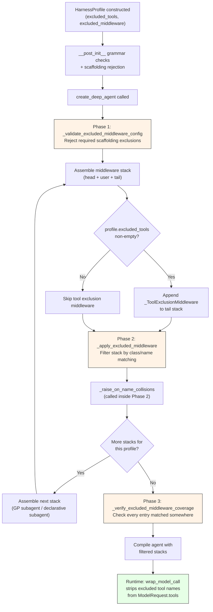

# 16 - Tool Exclusion Middleware

## Source Files

| File | Lines | Purpose |
|------|-------|---------|
| `libs/deepagents/deepagents/middleware/_tool_exclusion.py` | 66 | `_ToolExclusionMiddleware` class and its local `_tool_name` helper |
| `libs/deepagents/deepagents/_excluded_middleware.py` | 226 | Three-phase pipeline: validate, apply, verify |

---

## 1. Overview -- What Tool Exclusion Does and Why It Exists

The Tool Exclusion Middleware is a two-layer system that controls what an
agent sees at runtime -- both at the individual tool level and the middleware
level. It addresses a fundamental tension in the Deep Agents architecture:
middleware injects tools into the agent's tool set (e.g., `FilesystemMiddleware`
adds `read_file`, `write_file`; `SubAgentMiddleware` adds `task`), but some
model profiles need to hide specific tools without removing the middleware
that backs them. Removing `FilesystemMiddleware` to hide `read_file` would
also destroy permission enforcement -- a security guarantee. Removing
`SubAgentMiddleware` to hide `task` would break the entire subagent dispatch
mechanism.

Tool exclusion solves this by operating at two distinct levels:

1. **Tool-level exclusion** (`_ToolExclusionMiddleware` in
   `middleware/_tool_exclusion.py`) -- filters individual tool names from
   the `ModelRequest.tools` list before the LLM sees them. Driven by
   `HarnessProfile.excluded_tools`.
2. **Middleware-level exclusion** (pipeline in `_excluded_middleware.py`) --
   removes entire middleware instances from the assembled stack before the
   agent is compiled. Driven by `HarnessProfile.excluded_middleware`.

The separation is intentional: a profile can hide a tool from the model
(tool-level) while keeping the middleware that implements it and its side
effects intact, or it can remove an entire middleware (middleware-level) when
the middleware's behavior itself is unwanted (e.g., summarization).

---

## 2. `_ToolExclusionMiddleware` Class

**Location:** `middleware/_tool_exclusion.py`, line 31.

```python
class _ToolExclusionMiddleware(AgentMiddleware[Any, Any, Any]):
```

This middleware sits in the **tail stack** of every agent and subagent that
has a non-empty `excluded_tools` set. It is always placed after all
tool-injecting middleware (filesystem, subagent, skills, etc.) so it can
intercept every tool regardless of which middleware added it.

### 2.1 Constructor (line 42)

```python
def __init__(self, *, excluded: frozenset[str]) -> None:
    self._excluded = excluded
```

- **`excluded`** (keyword-only, enforced by `*`): A `frozenset[str]` of tool
  names to strip. Sourced directly from `HarnessProfile.excluded_tools`.
  The `frozenset` is immutable, preventing accidental modification after
  construction.
- Stored as `self._excluded` for use in both sync and async hooks.

### 2.2 `wrap_model_call` -- Sync Hook (line 45)

```python
def wrap_model_call(
    self,
    request: ModelRequest[Any],
    handler: Callable[[ModelRequest[Any]], ModelResponse[Any]],
) -> ModelResponse[Any]:
```

The sync model-call hook executes the following logic:

1. **Short-circuit**: If `self._excluded` is falsy (empty frozenset), skip
   filtering entirely and call `handler(request)` directly. No list
   comprehension, no override -- pure passthrough.
2. **Filter**: Build a new tool list via list comprehension, keeping only
   tools whose `_tool_name(t)` is **not** in `self._excluded`. Because
   `_tool_name` returns `None` for tools with no extractable name, those
   tools are always preserved (they can never match a string in the
   exclusion set).
3. **Override**: Call `request.override(tools=filtered)` to produce a new
   `ModelRequest` with the reduced tool list. The original request is not
   mutated.
4. **Delegate**: Pass the overridden request to `handler`.

### 2.3 `awrap_model_call` -- Async Hook (line 56)

```python
async def awrap_model_call(
    self,
    request: ModelRequest[Any],
    handler: Callable[[ModelRequest[Any]], Awaitable[ModelResponse[ResponseT]]],
) -> ModelResponse[ResponseT] | AIMessage | ExtendedModelResponse[ResponseT]:
```

Identical logic to `wrap_model_call` except that it `await`s the handler.
The filtering step itself is synchronous -- only the handler invocation is
async. The return type is a union because the async protocol permits richer
response types (`AIMessage`, `ExtendedModelResponse`).

### 2.4 Stack Placement in `create_deep_agent`

Inside `create_deep_agent` in `graph.py`, `_ToolExclusionMiddleware` is
appended conditionally in three places:

1. **Main agent stack** (`graph.py`, line ~796):
   ```python
   if _profile.excluded_tools:
       deepagent_middleware.append(
           _ToolExclusionMiddleware(excluded=_profile.excluded_tools)
       )
   ```

2. **General-purpose subagent stack** (line ~713):
   ```python
   if _profile.excluded_tools:
       gp_middleware.append(
           _ToolExclusionMiddleware(excluded=_profile.excluded_tools)
       )
   ```

3. **Declarative subagent stacks** (line ~637):
   ```python
   if _subagent_profile.excluded_tools:
       subagent_middleware.append(
           _ToolExclusionMiddleware(excluded=_subagent_profile.excluded_tools)
       )
   ```

In all three cases it is inserted just before `AnthropicPromptCachingMiddleware`,
after `extra_middleware` from the profile. The docstring at line 350 of
`graph.py` confirms this placement in the tail stack ordering:

> `_ToolExclusionMiddleware` (if profile has `excluded_tools`)

This guarantees every tool-injecting middleware has already run, so the
filter can see and strip middleware-injected tools too.

---

## 3. The Excluded Middleware Pipeline: Three Phases

**Source:** `_excluded_middleware.py` (226 lines).

This pipeline implements the middleware-level exclusion system. Unlike
`_ToolExclusionMiddleware` (which removes individual tools at runtime), this
pipeline removes entire middleware **instances** from the assembled stack at
assembly time -- before the agent is even compiled.

The three phases are:

1. **Validate** (`_validate_excluded_middleware_config`) -- reject forbidden entries
2. **Apply** (`_apply_excluded_middleware`) -- filter the stack
3. **Verify** (`_verify_excluded_middleware_coverage`) -- detect typos and stale entries

### 3.1 Phase 1: Validate (`_validate_excluded_middleware_config`, line 23)

```python
def _validate_excluded_middleware_config(
    profile: HarnessProfile,
    *,
    required_classes: frozenset[type[AgentMiddleware[Any, Any, Any]]],
    required_names: frozenset[str],
) -> None:
```

**Purpose:** Reject profiles that attempt to exclude required scaffolding
middleware, before any stack assembly work begins.

**Logic:**

1. If `profile.excluded_middleware` is empty, return immediately (lines 46-47).
2. Partition entries into `excluded_classes` (type entries) and
   `excluded_names` (string entries) by checking `isinstance(entry, type)`
   (lines 49-55).
3. Compute `forbidden_classes = excluded_classes & required_classes` and
   `forbidden_names = excluded_names & required_names` (lines 57-58).
4. If either set is non-empty, lazily import `_format_scaffolding_rejection`
   from `harness_profiles` and raise `ValueError` with formatted labels
   (lines 59-64).

The lazy import on line 61 avoids a top-level cycle: `_excluded_middleware`
is imported by `graph.py`, which is already imported by `harness_profiles`.

**When called:** Once per profile. For the main profile, at line ~571 of
`graph.py`. For each declarative subagent profile, at line ~644.

### 3.2 Phase 2: Apply (`_apply_excluded_middleware`, line 90)

```python
def _apply_excluded_middleware(
    stack: list[AgentMiddleware[Any, Any, Any]],
    profile: HarnessProfile,
    *,
    matched_classes: set[type[AgentMiddleware[Any, Any, Any]]] | None = None,
    matched_names: set[str] | None = None,
) -> list[AgentMiddleware[Any, Any, Any]]:
```

**Purpose:** Filter the fully assembled middleware stack, removing instances
that match any entry in `profile.excluded_middleware`.

**Two matching modes:**

1. **Class entries:** Match on `type(mw) in excluded_classes` (line 143).
   Uses **exact type identity**, not `isinstance()`.
2. **String entries:** Match on `mw.name in excluded_names` (line 147).
   The `.name` property defaults to `type(self).__name__` but can be
   overridden.

**Step-by-step logic (lines 126-165):**

1. If `profile.excluded_middleware` is empty, return `list(stack)` -- always
   a fresh copy so callers can mutate freely (lines 127-128).
2. Partition entries into `excluded_classes` and `excluded_names` (same
   pattern as Phase 1, lines 130-136).
3. Initialize `filtered: list` and `name_matched_types: dict[str, set[type]]`
   (lines 138-139).
4. Iterate the stack. For each middleware instance `mw` (lines 140-152):
   - Compute `mw_type = type(mw)` (line 141).
   - Compute `mw_name = mw.name` (line 142).
   - If `mw_type in excluded_classes`: skip the instance. Record
     `mw_type` in `matched_classes` if the set was provided (lines 143-145).
   - Else if `mw_name in excluded_names`: skip the instance. Record
     `mw_name` in `matched_names`, and track
     `name_matched_types[mw_name].add(mw_type)` for collision detection
     (lines 147-151).
   - Otherwise: append `mw` to `filtered` (line 152).
5. Call `_raise_on_name_collisions(name_matched_types)` (line 154).
6. Log a debug message with removal count and match details (lines 156-164).
7. Return `filtered`.

**Return value:** Always a fresh list, even when nothing was removed. This
contract allows callers to mutate the result freely without affecting the
original stack.

**When called:** Once per assembled stack. For the main profile, that means
up to twice: once for the main agent stack (line ~815 of `graph.py`) and once
for the GP subagent stack (line ~717). For declarative subagents, once each
(line ~649).

### 3.3 Phase 3: Verify (`_verify_excluded_middleware_coverage`, line 168)

```python
def _verify_excluded_middleware_coverage(
    profile: HarnessProfile,
    matched_classes: set[type[AgentMiddleware[Any, Any, Any]]],
    matched_names: set[str],
    *,
    required_classes: frozenset[type[AgentMiddleware[Any, Any, Any]]],
    required_names: frozenset[str],
) -> None:
```

**Purpose:** Detect typos and stale profiles by ensuring every exclusion
entry matched at least one middleware instance **somewhere** across all stacks.

**Logic (lines 197-225):**

1. If `profile.excluded_middleware` is empty, return immediately (lines 197-199).
2. Partition into `excluded_classes` and `excluded_names` (lines 201-207).
3. Compute unmatched sets (lines 209-210):
   - `unmatched_classes = excluded_classes - matched_classes - required_classes`
   - `unmatched_names = excluded_names - matched_names - required_names`
4. Filter out `_`-prefixed names from `unmatched_names` (line 213) --
   these are already rejected by the config guard in construction, so skip
   them here to keep the error message focused.
5. If anything remains unmatched, raise `ValueError` with a descriptive
   message suggesting class-form exclusion for import-time typo detection
   (lines 214-225).

**When called:** Once per profile, after all stacks have been filtered.
For the main profile this is at line ~828 of `graph.py`, after both the
main agent and GP subagent stacks have been processed.

---

## 4. Exact-Type Matching (Not `isinstance`) and Why This Design Was Chosen

The `_apply_excluded_middleware` function uses `type(mw)` for class-form
exclusion checks (line 141), **not** `isinstance(mw, excluded_class)`.
The docstring at lines 99-101 explicitly documents this:

> Class entries match on exact type (not `isinstance`), mirroring the
> slot-identity semantics of `_merge_middleware` so a subclass introduced
> by the caller is preserved when the profile excludes the base class.

### Why Not `isinstance()`

Consider this inheritance hierarchy:

```
SummarizationMiddleware (base)
    |
    +-- CustomSummarizationMiddleware (user subclass)
```

If a profile excludes `SummarizationMiddleware`:

- **With `isinstance()`:** Both the base class and the user's subclass would
  be excluded. The user's custom summarization middleware -- which they
  deliberately created and registered -- would be silently removed.

- **With `type(mw)` (exact match):** Only instances of the exact base class
  are excluded. The user's subclass survives because
  `type(custom_instance)` is `CustomSummarizationMiddleware`, not
  `SummarizationMiddleware`. If the user wants to exclude their subclass
  too, they must explicitly list it.

### Consistency with `_merge_middleware`

The middleware merging system (which handles slot replacement when combining
middleware from different sources) also uses exact-type identity. Using the
same semantics in exclusion means the two systems compose predictably: a
subclass occupying its own slot in the merge system will not be accidentally
removed by an exclusion targeting its parent's slot.

### What Would Break if `isinstance()` Were Used

1. **User subclasses silently excluded.** A user who extends a built-in
   middleware would find their custom version mysteriously removed.
2. **No way to preserve subclasses.** With `isinstance()`, exclusion is
   all-or-nothing for the entire inheritance tree.
3. **Inconsistency with the slot model.** A subclass that occupies its own
   merge slot would be removed by an exclusion targeting a different slot.

---

## 5. Cross-Stack Coverage Tracking and Name Collision Detection

### 5.1 Cross-Stack Coverage Tracking

The `_apply_excluded_middleware` function accepts optional mutable sets:
`matched_classes: set | None` and `matched_names: set | None`. When
provided, every match is recorded into these sets.

In `create_deep_agent`, one pair of sets is created per profile and shared
across all `_apply_excluded_middleware` calls for that profile:

```python
# graph.py, lines ~580-581
_main_matched_classes: set[type[AgentMiddleware[Any, Any, Any]]] = set()
_main_matched_names: set[str] = set()

# Applied to main agent stack (line ~815)
deepagent_middleware = _apply_excluded_middleware(
    deepagent_middleware, _profile,
    matched_classes=_main_matched_classes,
    matched_names=_main_matched_names,
)

# Applied to GP subagent stack (line ~717)
gp_middleware = _apply_excluded_middleware(
    gp_middleware, _profile,
    matched_classes=_main_matched_classes,
    matched_names=_main_matched_names,
)

# Verified across both (line ~828)
_verify_excluded_middleware_coverage(
    _profile, _main_matched_classes, _main_matched_names,
    required_classes=_REQUIRED_MIDDLEWARE_CLASSES,
    required_names=_REQUIRED_MIDDLEWARE_NAMES,
)
```

**Why cross-stack, not per-stack:** A profile legitimately targets middleware
that only one stack carries. For example, a middleware present in the GP
subagent stack but not the main agent stack. Per-stack verification would
incorrectly flag this as "unmatched." Cross-stack verification aggregates
matches, so an entry that matched in **any** stack passes Phase 3.

### 5.2 Name Collision Detection (`_raise_on_name_collisions`, line 67)

```python
def _raise_on_name_collisions(
    name_matched_types: dict[str, set[type[AgentMiddleware[Any, Any, Any]]]],
) -> None:
```

Called from within `_apply_excluded_middleware` at line 154, after the
filtering loop. If a single string exclusion entry (e.g., `"MyMiddleware"`)
matched instances of **multiple distinct classes** within the same stack
(because two different middleware classes share the same `.name`), this
function raises `ValueError`:

```
ValueError: HarnessProfile.excluded_middleware name entry matched multiple
distinct middleware classes within a single stack: 'MyMiddleware' matched
['ClassA', 'ClassB']. Use a class-form exclusion via the runtime
HarnessProfile to disambiguate.
```

**When collisions occur:**
- A user middleware accidentally uses the same `.name` as a built-in.
- Two independent middleware libraries define classes with the same name.
- A middleware overrides `.name` to match another class's name.

Without this check, a string exclusion would silently remove both classes --
almost certainly unintended.

---

## 6. Required Middleware Protection

### 6.1 What Cannot Be Excluded

Two middleware classes are designated as required scaffolding in `graph.py`
(lines 206-221):

```python
_REQUIRED_MIDDLEWARE: tuple[...] = (
    (FilesystemMiddleware, ()),
    (SubAgentMiddleware, ()),
)
```

Each entry is a `(class, extra_aliases)` tuple. Currently neither class
declares extra aliases, so:

```python
_REQUIRED_MIDDLEWARE_CLASSES = frozenset({FilesystemMiddleware, SubAgentMiddleware})
_REQUIRED_MIDDLEWARE_NAMES = frozenset({"FilesystemMiddleware", "SubAgentMiddleware"})
```

| Class | Why it is required |
|-------|-------------------|
| `FilesystemMiddleware` | Backs all built-in file tools (`read_file`, `write_file`, etc.) **and** enforces `permissions` rules -- a security guarantee |
| `SubAgentMiddleware` | Backs the `task` tool handler for subagent dispatch |

### 6.2 Three Protection Layers (Defense in Depth)

Protection fires at three points, ensuring no code path can slip a
scaffolding exclusion through:

1. **`HarnessProfile.__post_init__`** (`harness_profiles.py`, line ~760):
   Iterates `self.excluded_middleware`, calls `_scaffolding_violation_label`
   on each entry. If any match, raises `ValueError` via
   `_format_scaffolding_rejection`. Catches both class-form and string-form
   exclusions at profile construction time.

2. **`HarnessProfileConfig.__post_init__`** (line ~322):
   Same check for the declarative config variant (string-only entries).
   Catches scaffolding exclusions at config construction time.

3. **`_validate_excluded_middleware_config`** (`_excluded_middleware.py`,
   line 23): Assembly-time guard called inside `create_deep_agent`. Even if
   a profile were somehow constructed without `__post_init__` (e.g., via
   `object.__setattr__`), this gate stops it before any stack is assembled.

Additionally, Phase 3 (`_verify_excluded_middleware_coverage`) subtracts
required classes/names from the unmatched set (lines 209-210), so that if a
required entry somehow survived Phase 1, it does not surface as a confusing
"unmatched" error.

### 6.3 Workaround: Hiding Scaffolding Tools Without Removing Middleware

To hide tools provided by required middleware, use `excluded_tools`:

```python
HarnessProfile(excluded_tools=frozenset({"task"}))
```

Or to remove the `task` tool entirely, disable the subagent that backs it:

```python
HarnessProfile(
    general_purpose_subagent=GeneralPurposeSubagentProfile(enabled=False),
)
```

The error message from `_format_scaffolding_rejection` (line 65 of
`harness_profiles.py`) explicitly guides users toward this:

> "use excluded_tools for per-tool visibility or adjust profile settings
> instead of stripping scaffolding"

---

## 7. The `_tool_name` Function: Two Versions and Why Both Exist

There are two `_tool_name` functions in the codebase. Both extract a tool
name from heterogeneous tool representations, but they serve different
contexts with different type universes.

### 7.1 `_tool_name` in `middleware/_tool_exclusion.py` (line 22)

```python
def _tool_name(tool: BaseTool | dict[str, str]) -> str | None:
```

- Accepts `BaseTool` or `dict[str, str]`.
- Does **not** handle `Callable` tools.
- Used exclusively inside `_ToolExclusionMiddleware.wrap_model_call` /
  `awrap_model_call`, where the tool list comes from `ModelRequest.tools`.
  By the time tools reach a model request, plain callables have already been
  converted to `BaseTool` or dict form by the middleware pipeline, so
  `Callable` support is unnecessary.

**Implementation:** For dicts, calls `tool.get("name")` and returns it if
it is a `str`. For non-dicts, uses `getattr(tool, "name", None)` and
returns it if it is a `str`. Returns `None` in all other cases, meaning the
tool will never match any exclusion entry and is preserved.

### 7.2 `_tool_name` in `_tools.py` (line 13)

```python
def _tool_name(tool: BaseTool | Callable | dict[str, Any]) -> str | None:
```

- Accepts `BaseTool | Callable | dict[str, Any]` -- the full union of
  types `create_deep_agent` accepts in its `tools` parameter.
- Used by `_apply_tool_description_overrides` (line 51 of `_tools.py`),
  which runs during agent construction before tools are normalized.
  At this stage, user-supplied tools may still be raw callables, so
  `Callable` support is required.

**Implementation:** Structurally identical logic (dict branch with
`.get("name")`, attribute branch with `getattr`), but the type signature
is wider. Note the dict value type is `Any` rather than `str`, matching the
looser shape of user-supplied tool dicts at construction time.

### 7.3 Why Both Exist

The duplication is intentional, not accidental:

- **Different type contracts**: The model-request layer (`ModelRequest.tools`)
  only carries `BaseTool | dict`; the construction layer carries
  `BaseTool | Callable | dict`. Narrowing the type signature in the
  middleware version makes the contract explicit and prevents accepting
  types that cannot appear there.
- **Import isolation**: `_tool_exclusion.py` is a middleware module.
  Importing from `_tools.py` would create a cross-concern dependency --
  coupling the middleware layer to construction-time utilities. Keeping a
  minimal local copy avoids this.

---

## 8. How Tool Exclusion Integrates with `HarnessProfile.excluded_middleware`

### 8.1 `excluded_tools` Field (`harness_profiles.py`, line 616)

```python
excluded_tools: frozenset[str] = frozenset()
```

A `frozenset[str]` of tool names. Fed directly into
`_ToolExclusionMiddleware(excluded=...)`. When profiles are merged,
exclusions are **additive** (union), not replacing.

### 8.2 `excluded_middleware` Field (line 629)

```python
excluded_middleware: frozenset[type[AgentMiddleware] | str] = frozenset()
```

A `frozenset` containing either class objects or strings. Fed into the
three-phase pipeline. Grammar rules are enforced at construction time by
`_validate_config_middleware_string` (line 864 of `harness_profiles.py`):

| Rule | Error type | Check location |
|------|-----------|----------------|
| Empty or whitespace-only string | `ValueError` | Line 892-893 |
| String containing `:` (reserved for future class-path syntax) | `ValueError` | Line 895-898 |
| String starting with `_` (private middleware) | `ValueError` | Line 900-903 |
| Non-string, non-type entry in `HarnessProfileConfig` | `TypeError` | Line 889-891 |
| Scaffolding class or name | `ValueError` | `__post_init__`, lines ~760-768 |

### 8.3 `HarnessProfileConfig` -- Declarative Variant (line 192)

The config variant stores `excluded_middleware` as `frozenset[str]` (string
names only, line 285). Conversion to runtime `HarnessProfile` happens in
`to_harness_profile()` (line ~435):

```python
excluded_middleware=frozenset(self.excluded_middleware),
```

Class-form exclusions are only available through the runtime `HarnessProfile`
constructed in Python code, not through YAML/JSON config files. The
`from_dict` method (line ~375) uses `_coerce_frozen_strset` to build the
frozenset from the parsed list.

### 8.4 The `serialized_name` / `.name` Override Pattern

Middleware whose concrete class name differs from its public alias can
expose a `serialized_name: ClassVar[str]` and override the `.name` property.
Example from `_DeepAgentsSummarizationMiddleware` (`summarization.py`,
lines 267-282):

```python
serialized_name: ClassVar[str] = "SummarizationMiddleware"

@property
def name(self) -> str:
    if type(self) is _DeepAgentsSummarizationMiddleware:
        return "SummarizationMiddleware"
    return type(self).__name__
```

This allows string-form exclusion via `"SummarizationMiddleware"` to target
the private `_DeepAgentsSummarizationMiddleware` class. Note the `type(self) is`
guard: subclasses fall back to `type(self).__name__` so they do not
silently inherit the alias.

---

## 9. Configuration Flow from Profile to Runtime

### 9.1 End-to-End Sequence

```
1. Profile registration
   register_harness_profile("openai:gpt-5.4", profile)
   --> __post_init__ grammar checks + scaffolding rejection fire immediately

2. create_deep_agent(model="openai:gpt-5.4", ...) called
   --> _harness_profile_for_model(model, _model_spec) resolves profile

3. Phase 1: _validate_excluded_middleware_config(_profile, ...)
   --> Rejects required scaffolding exclusions (defense in depth)

4. Stack assembly
   --> Head stack: FilesystemMiddleware, SubAgentMiddleware,
       PatchToolCallsMiddleware, SkillsMiddleware, Summarization, user middleware
   --> Tail stack: extra_middleware, _ToolExclusionMiddleware (if excluded_tools),
       AnthropicPromptCachingMiddleware, MemoryMiddleware, HumanInTheLoopMiddleware

5. _ToolExclusionMiddleware insertion (conditional)
   --> if _profile.excluded_tools is non-empty, appended to tail stack

6. Phase 2: _apply_excluded_middleware(stack, _profile, matched_classes, matched_names)
   --> Filters the assembled stack by class/name
   --> _raise_on_name_collisions runs inside Phase 2

7. (Repeat steps 4-6 for GP subagent stack, sharing matched_* sets)

8. Phase 3: _verify_excluded_middleware_coverage(_profile, matched_*, ...)
   --> Ensures every entry matched something across all stacks

9. Agent compilation with filtered stack

10. Runtime: on each LLM call, _ToolExclusionMiddleware.wrap_model_call
    strips excluded tool names from ModelRequest.tools
```

### 9.2 Subagent Handling

Each declarative subagent goes through its own validate-apply-verify cycle
with its own profile (which may differ from the main profile if the subagent
uses a different model). For these, `matched_classes` / `matched_names` are
**local** to the subagent (lines 642-643 of `graph.py`), not shared with
the main profile's sets.

For the main profile, the matched sets are shared between the main agent
stack and the GP subagent stack so that Phase 3 coverage checking spans both.
An exclusion entry only needs to match in one of these stacks to pass.

---

## 10. What Would Break if This Middleware Were Removed

### 10.1 Without `_ToolExclusionMiddleware`

- **Tool visibility becomes all-or-nothing**: Profiles could no longer hide
  individual tools from the model. The only way to remove a tool would be
  to exclude the middleware that provides it, which may be impossible
  (required scaffolding) or may remove other tools and side effects the
  profile still needs.
- **`HarnessProfile.excluded_tools` becomes a dead field**: The field would
  still exist and accept values, but nothing would act on them. No error
  would be raised -- tools would silently remain visible to the model.
- **Model-specific tool tuning breaks**: Some models handle certain tools
  poorly (e.g., calling `execute` in loops). Profiles that exclude those
  tools to improve model behavior would stop working, leading to degraded
  agent performance.
- **Security surface expands**: If tool exclusion is used to restrict an
  agent's capabilities (e.g., preventing code execution in a read-only
  deployment), removing this middleware would bypass those restrictions.

### 10.2 Without the `_excluded_middleware.py` Pipeline

- **No middleware exclusion**: `HarnessProfile.excluded_middleware` would be
  ignored entirely. All middleware in the assembled stack would always run,
  including those a profile explicitly wants to suppress (e.g.,
  summarization for models that handle long context natively).
- **No scaffolding protection**: Without `_validate_excluded_middleware_config`,
  there would be no assembly-time guard against profiles that attempt to
  exclude `FilesystemMiddleware` or `SubAgentMiddleware`. A future code
  change that bypasses `__post_init__` could silently break agents.
- **No typo detection**: Without `_verify_excluded_middleware_coverage`,
  stale profile entries that reference renamed or removed middleware would
  silently do nothing. Users would think they excluded a middleware, but it
  would still be active.
- **No collision safety**: Without `_raise_on_name_collisions`, a string
  exclusion that accidentally matches two unrelated middleware classes would
  silently remove both, with no diagnostic.

---

## 11. Mermaid Diagram of the Exclusion Pipeline



---

## 12. Key Implementation Details Summary

| Aspect | Detail |
|--------|--------|
| Tool exclusion matching | String equality on tool name via `_tool_name()` |
| Middleware class matching | `type(mw)` exact match, not `isinstance` |
| Middleware name matching | `mw.name` exact string match |
| Stack return semantics | `_apply_excluded_middleware` always returns a fresh list |
| Cross-stack accumulation | Mutable `set` params `matched_classes` / `matched_names` |
| Scaffolding check timing | Profile construction + assembly time (defense in depth) |
| `_ToolExclusionMiddleware` position | After all tool-injecting middleware, before prompt caching |
| Private name filtering | `_`-prefixed names excluded from coverage errors (line 213) |
| `serialized_name` example | `_DeepAgentsSummarizationMiddleware.serialized_name = "SummarizationMiddleware"` |
| Lazy import | `_format_scaffolding_rejection` imported lazily in Phase 1 to avoid cycles |

---

## 13. Knowledge Verification Questions

### Question 1
Why does `_apply_excluded_middleware` use `type(mw) in excluded_classes`
(exact type) rather than `isinstance(mw, tuple(excluded_classes))`?

**Answer:** Exact-type matching ensures that only instances of the precise
class are excluded, not subclasses. This mirrors the slot-identity semantics
of `_merge_middleware`, where each concrete class occupies its own slot.
If `isinstance()` were used, a user who subclasses a built-in middleware
would find their custom version silently removed when a profile excludes the
base class. With exact-type matching, the subclass survives because it is a
different type, and the user must explicitly list it if they want it excluded.

### Question 2
Why does the pipeline track matches across stacks via shared mutable sets
(`matched_classes`, `matched_names`) instead of checking per-stack?

**Answer:** A profile legitimately targets middleware that exists only in one
stack (e.g., a middleware present in the GP subagent stack but not the main
agent stack). Per-stack verification would incorrectly flag such entries as
"unmatched" when checking the stack that does not carry them. Cross-stack
aggregation accumulates matches across all stacks before verifying, so an
entry that matched anywhere passes. The mutable sets are shared across
`_apply_excluded_middleware` calls (for the same profile) to accumulate
this state. Note that declarative subagent profiles maintain their own
separate sets (lines 642-643 of `graph.py`), since they use independent
profiles that may differ from the main profile.

### Question 3
What is the purpose of `_raise_on_name_collisions`, and when would a
collision actually occur?

**Answer:** It detects when a string exclusion entry matches instances of
two or more distinct middleware classes within a single stack. This happens
when different middleware classes share the same `.name` -- for example, a
user middleware that accidentally uses the same name as a built-in. Without
this check, the string exclusion would silently remove both, which is almost
certainly unintended. The error directs users to use class-form exclusion
(e.g., `excluded_middleware={MyMiddleware}`) to unambiguously target the
intended class.

### Question 4
A developer registers a `HarnessProfileConfig` via YAML with
`excluded_middleware: ["SummarizationMiddleware"]`. Trace the path from
YAML load to runtime exclusion. How does the string
`"SummarizationMiddleware"` ultimately match `_DeepAgentsSummarizationMiddleware`?

**Answer:** The YAML dict is passed to `HarnessProfileConfig.from_dict()`,
which calls `_coerce_frozen_strset` to produce a `frozenset[str]`. The
`__post_init__` method validates the string via
`_validate_config_middleware_string` (rejecting empty, colon, and
underscore-prefixed entries) and checks for scaffolding violations via
`_scaffolding_violation_label`. When `create_deep_agent` runs,
`to_harness_profile()` converts the config to a `HarnessProfile` with the
same frozenset. In Phase 2, `_apply_excluded_middleware` iterates the
stack and checks each middleware's `mw.name` against `excluded_names`.
`_DeepAgentsSummarizationMiddleware` overrides its `.name` property
(line 271 of `summarization.py`) to return `"SummarizationMiddleware"`
when `type(self) is _DeepAgentsSummarizationMiddleware`, so the string
match succeeds and the instance is excluded from the stack.

### Question 5
Why are there two `_tool_name` functions in the codebase -- one in
`middleware/_tool_exclusion.py` and one in `_tools.py`? Could the
middleware version simply import from `_tools.py`?

**Answer:** The two functions have different type signatures reflecting
different stages of the pipeline. The `_tools.py` version accepts
`BaseTool | Callable | dict[str, Any]` because it operates at construction
time when user-supplied tools may still be raw callables. The
`_tool_exclusion.py` version accepts only `BaseTool | dict[str, str]`
because by the time `ModelRequest.tools` reaches the middleware, callables
have been converted. Importing from `_tools.py` would work functionally
but would couple the middleware layer to construction-time utilities and
would widen the accepted type signature unnecessarily, weakening the
type-level documentation of what can actually appear at that point.
