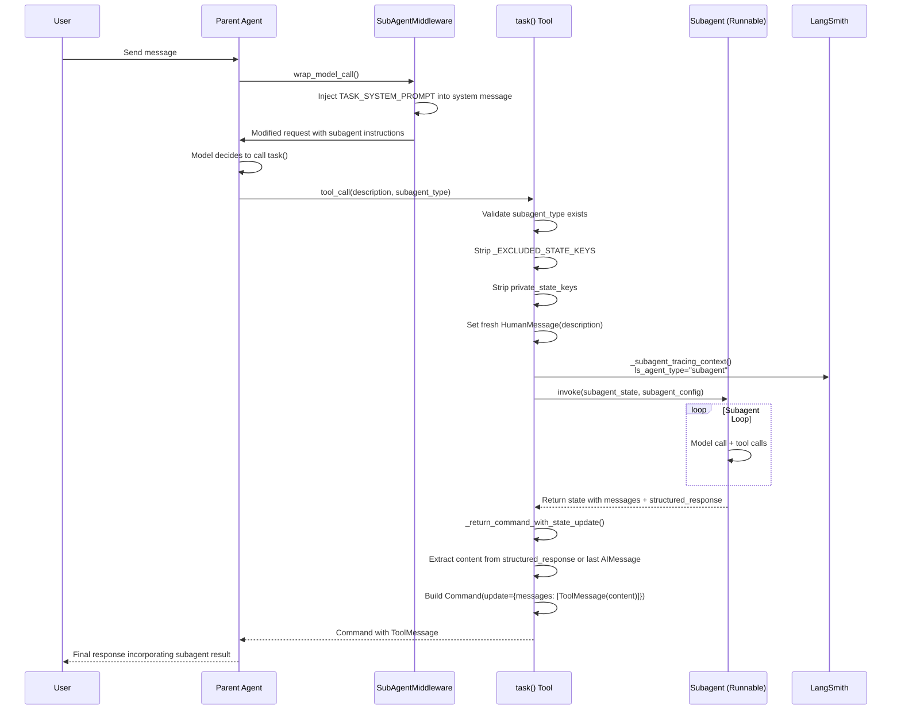
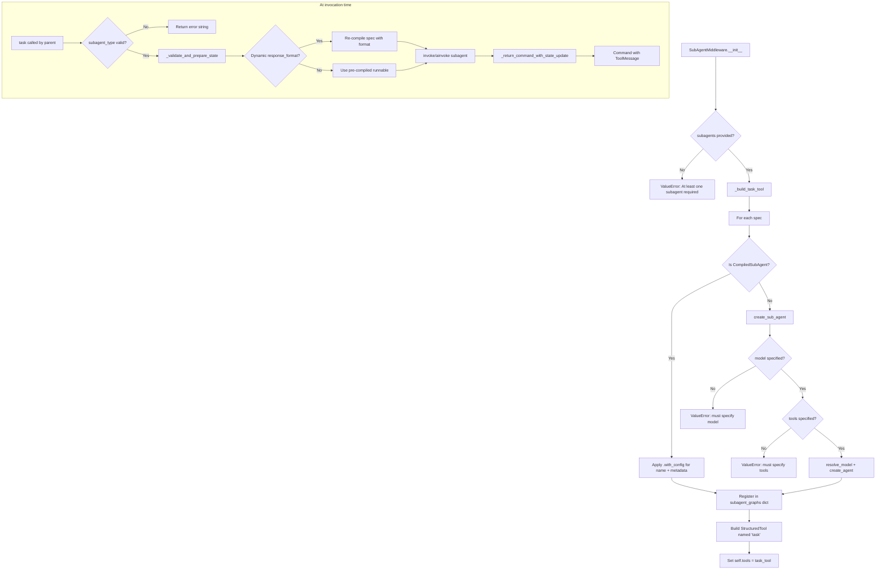

# SubAgent Middleware -- Implementation-Level Documentation

**Source file:** `libs/deepagents/deepagents/middleware/subagents.py` (869 lines)

**Module purpose:** Provides the `task` tool to a parent agent, enabling it to spawn
short-lived child agents ("subagents") that handle isolated, multi-step tasks and
return a single result. This is the mechanism by which a Deep Agent delegates work.

---

## Table of Contents

1. [Subagent Types](#1-subagent-types)
2. [State Isolation via PrivateStateAttr](#2-state-isolation-via-privatestateattr)
3. [Routing Logic -- How the Parent Decides to Delegate](#3-routing-logic----how-the-parent-decides-to-delegate)
4. [Tool Provision -- The `task` Tool](#4-tool-provision----the-task-tool)
5. [General-Purpose Subagent](#5-general-purpose-subagent)
6. [Permission Inheritance](#6-permission-inheritance)
7. [Skills Isolation](#7-skills-isolation)
8. [Structured Output](#8-structured-output)
9. [LangSmith Tracing](#9-langsmith-tracing)
10. [wrap_model_call Hook](#10-wrap_model_call-hook)
11. [Internal Constants and Excluded State Keys](#11-internal-constants-and-excluded-state-keys)
12. [What Would Break If Removed](#12-what-would-break-if-removed)
13. [Mermaid Diagram -- Parent-Subagent Interaction Flow](#13-mermaid-diagram----parent-subagent-interaction-flow)
14. [Knowledge Verification Questions](#14-knowledge-verification-questions)

---

## 1. Subagent Types

The middleware defines two `TypedDict` types that represent a subagent specification.
Both are immutable declarations -- the middleware creates copies to avoid shared-state
corruption between invocations.

### 1.1 SubAgent (TypedDict) -- Declarative Definition

`SubAgent` is the standard way to declare a subagent. It is a `TypedDict` with
required and optional fields:

**Required fields:**

| Field | Type | Description |
|-------|------|-------------|
| `name` | `str` | Unique identifier. The parent agent references this when calling the `task()` tool via `subagent_type`. |
| `description` | `str` | What the subagent does. Should be specific and action-oriented; the parent agent uses it to decide when to delegate. |
| `system_prompt` | `str` | Instructions for the subagent. Should include tool usage guidance and output format requirements. |

**Optional fields:**

| Field | Type | Description |
|-------|------|-------------|
| `tools` | `Sequence[BaseTool \| Callable \| dict]` | Tools the subagent can use. If not specified, inherits from the parent via `default_tools`. |
| `model` | `str \| BaseChatModel` | Override the parent's model. Use format `'provider:model-name'` (e.g. `'openai:gpt-5.5'`). |
| `middleware` | `list[AgentMiddleware]` | Additional middleware for custom behavior, logging, or rate limiting. |
| `interrupt_on` | `dict[str, bool \| InterruptOnConfig]` | Configure human-in-the-loop for specific tools. Requires a checkpointer. |
| `skills` | `list[str]` | Skill source paths for `SkillsMiddleware` (e.g. `["/skills/user/", "/skills/project/"]`). |
| `permissions` | `list[FilesystemPermission]` | Filesystem permission rules for the subagent. If omitted, inherits parent's. If provided, replaces them entirely. Rules are evaluated in declaration order; first match wins. |
| `response_format` | `ResponseFormat[Any] \| type \| dict[str, Any]` | Structured output schema. See section 8. |

**Immutability contract:** The middleware copies each spec before compilation. A shared
`SubAgent` dict can be registered under multiple names without cross-contamination:

```python
# Safe -- _compile_spec uses .with_config() on runnables, not attribute mutation
analyzer: SubAgent = {
    "name": "analyzer",
    "description": "Analyzes data",
    "system_prompt": "You analyze data.",
    "model": "openai:gpt-5.5",
    "tools": [search_tool],
}
```

### 1.2 CompiledSubAgent (TypedDict) -- Pre-compiled Graph

`CompiledSubAgent` allows callers to bring their own `Runnable` (a pre-compiled
LangGraph `CompiledStateGraph` or any `Runnable`):

| Field | Type | Description |
|-------|------|-------------|
| `name` | `str` | Unique identifier. |
| `description` | `str` | What the subagent does. |
| `runnable` | `Runnable` | A pre-compiled agent. Must have a state schema that includes a `messages` key. |

**Key constraints:**

- The `runnable`'s state schema **must** include a `messages` key. This is how the
  subagent communicates results back to the parent. A `ValueError` is raised at
  runtime if the returned state lacks `messages`.
- `CompiledSubAgent` runnables do **not** inherit `create_deep_agent(state_schema=...)`.
  If the runnable needs custom state fields, the caller must compile it with a
  compatible state schema.
- Dynamic `response_format` override is **not** supported for compiled subagents;
  attempting it raises a `ValueError` with the message: `"response_schema cannot be
  used with compiled subagent..."`.

**How results are extracted from a CompiledSubAgent:**

When the subagent completes, the parent reads the returned state dict:
1. If `structured_response` is non-`None`, it is JSON-serialized and used as the
   `ToolMessage` content.
2. Otherwise, the middleware walks backward through `result["messages"]` to find the
   last `AIMessage` with non-empty text. This handles Anthropic's occasional trailing
   empty `end_turn` AIMessage.

```python
# Example: pre-compiled subagent
from langchain.agents import create_agent
from pydantic import BaseModel

class Findings(BaseModel):
    summary: str
    confidence: float

researcher: CompiledSubAgent = {
    "name": "researcher",
    "description": "Researches a topic and returns findings.",
    "runnable": create_agent(
        "openai:gpt-5.5",
        tools=[],
        response_format=Findings,
    ),
}
```

### 1.3 Differences Between SubAgent and CompiledSubAgent

| Aspect | SubAgent | CompiledSubAgent |
|--------|----------|------------------|
| Compilation | Compiled lazily by `create_sub_agent()` | Already compiled; used as-is |
| Model/tools | Specified declaratively; resolved at build time | Embedded in the runnable |
| Dynamic response_format | Supported via config key | Not supported (raises ValueError) |
| Default middleware stack | Receives default middleware from `create_deep_agent` | No default middleware added |
| State schema | Forwarded from `state_schema` parameter | Caller owns the schema |

---

## 2. State Isolation via PrivateStateAttr

`PrivateStateAttr` is an annotation marker (from `langchain.agents.middleware.types`)
that prevents state fields from leaking between the parent agent and its subagents.

### How it works

1. The `_state.py` module provides `private_state_field_names(*state_schemas)` which
   introspects type hints and collects field names annotated with `PrivateStateAttr`.
2. `SubAgentMiddleware.__init__` accepts a `private_state_keys: frozenset[str]`
   parameter (typically computed by the graph builder from all middleware state schemas).
3. When the `task` tool prepares state for a subagent invocation, it strips private
   keys in two steps (see `_validate_and_prepare_state`):

```python
# Step 1: Remove _EXCLUDED_STATE_KEYS (messages, todos, structured_response)
subagent_state = {k: v for k, v in runtime.state.items()
                  if k not in _EXCLUDED_STATE_KEYS}
# Step 2: Remove PrivateStateAttr fields
subagent_state = {k: v for k, v in subagent_state.items()
                  if k not in private_state_keys}
# Step 3: Set fresh messages for the subagent
subagent_state["messages"] = [HumanMessage(content=description)]
```

4. When the subagent returns, `_return_command_with_state_update` also strips
   `_EXCLUDED_STATE_KEYS` from the result:

```python
state_update = {k: v for k, v in result.items()
                if k not in _EXCLUDED_STATE_KEYS}
```

### Excluded state keys (constant: `_EXCLUDED_STATE_KEYS`)

```python
_EXCLUDED_STATE_KEYS = {"messages", "todos", "structured_response"}
```

- `messages` -- handled explicitly to ensure only the final message is included.
- `todos` -- excluded because they have no defined reducer and no clear meaning when
  returned from a subagent.
- `structured_response` -- handled separately for JSON serialization.

### Why this matters

Without state isolation, a subagent could:
- Read and modify the parent's private bookkeeping fields (e.g. `memory_contents`,
  `_rubric_evaluations`, `skills_metadata`).
- Corrupt shared state if the parent runs multiple subagents concurrently.
- Leak sensitive middleware-internal data into the subagent's context window.

---

## 3. Routing Logic -- How the Parent Decides to Delegate

The parent agent does **not** have an explicit routing table. Instead, routing is
emergent from the `task` tool's description, which is dynamically generated from the
registered subagent specs.

### The routing mechanism

1. `SubAgentMiddleware.__init__` builds the `task` tool with a description that lists
   all available subagents and their descriptions.
2. The `TASK_SYSTEM_PROMPT` constant (lines 392-422) is appended to the parent's
   system prompt via `wrap_model_call`. This prompt teaches the model **when** and
   **how** to use the `task` tool.
3. The model selects a `subagent_type` from the available types listed in the tool
   description.
4. The `task` tool validates `subagent_type` against `subagent_graphs`:

```python
if subagent_type not in subagent_graphs:
    allowed_types = ", ".join([f"`{k}`" for k in subagent_graphs])
    return f"We cannot invoke subagent {subagent_type} because it does not exist, ..."
```

### The TaskToolSchema

The `task` tool uses the `TaskToolSchema` Pydantic model:

```python
class TaskToolSchema(BaseModel):
    description: str = Field(
        description="A detailed description of the task for the subagent..."
    )
    subagent_type: str = Field(
        description="The type of subagent to use..."
    )
```

Both fields are required. The model must specify **both** which subagent to use and
what the subagent should do.

### Prompt-driven routing decisions

The `TASK_TOOL_DESCRIPTION` constant (lines 282-390) includes extensive few-shot
examples demonstrating:

- When to use subagents (complex multi-step tasks, independent parallel tasks,
  context-heavy research).
- When NOT to use subagents (trivial tasks, simple tool calls).
- How to use custom agent types (content-reviewer, greeting-responder, etc.).
- How to parallelize by sending multiple `task` tool calls in a single response.

The system prompt also includes a lifecycle model:
1. **Spawn** -- Provide clear role, instructions, expected output.
2. **Run** -- The subagent completes autonomously.
3. **Return** -- Single structured result.
4. **Reconcile** -- Incorporate into the main thread.

---

## 4. Tool Provision -- The `task` Tool

### How the tool is built

`_build_task_tool()` (lines 528-731) is a factory function that creates a
`StructuredTool` from the registered subagent specs. The returned tool:

- Is named `"task"`.
- Has both sync (`task`) and async (`atask`) implementations.
- Uses `TaskToolSchema` as its args schema.
- Returns either a `str` (error message) or a `Command` (state update with the
  subagent's result).

### Tool lifecycle per invocation

1. **Validation:** Check `subagent_type` exists in the registered graphs.
2. **State preparation:** Strip excluded and private state keys, set fresh messages.
3. **Subagent selection:** If a dynamic `response_format` is carried in the config,
   compile a fresh spec with that format. Otherwise use the pre-compiled runnable.
4. **Tracing context:** Wrap invocation in `_subagent_tracing_context()` to tag the
   run with `ls_agent_type="subagent"`.
5. **Invocation:** Call `subagent.invoke()` (sync) or `subagent.ainvoke()` (async).
6. **Result extraction:** Call `_return_command_with_state_update()` to produce a
   `Command` with the result.

### The Command return

The `task` tool returns a LangGraph `Command` object, not a plain string. This
allows it to update the parent's state atomically:

```python
return Command(
    update={
        **state_update,          # non-excluded state fields from subagent
        "messages": [ToolMessage(content, tool_call_id=tool_call_id)],
    }
)
```

The `tool_call_id` is required -- the middleware raises `ValueError` if it is
missing. This ID links the `ToolMessage` back to the original `AIMessage` tool call.

### Dynamic response format via config

A caller can request a dynamic response format by passing it through the
`RunnableConfig` under the key `__deepagents_subagent_response_format`:

```python
config = {"configurable": {
    "__deepagents_subagent_response_format": MyResponseSchema
}}
```

When detected by `_get_subagent_response_format()`, the middleware re-compiles the
subagent spec with the overridden format. This is **only** supported for raw
`SubAgent` specs -- `CompiledSubAgent` raises `ValueError`.

---

## 5. General-Purpose Subagent

### What it is

A default subagent that is **automatically added** by `create_deep_agent` unless
explicitly disabled. It has the same tools as the parent agent and acts as a general
delegation target.

### The constant definition

```python
GENERAL_PURPOSE_SUBAGENT: SubAgent = {
    "name": "general-purpose",
    "description": DEFAULT_GENERAL_PURPOSE_DESCRIPTION,
    "system_prompt": DEFAULT_SUBAGENT_PROMPT,
}
```

- `DEFAULT_GENERAL_PURPOSE_DESCRIPTION`: "General-purpose agent for researching
  complex questions, searching for files and content, and executing multi-step tasks.
  When you are searching for a keyword or file and are not confident that you will
  find the right match in the first few tries use this agent to perform the search for
  you. This agent has access to all tools as the main agent."
- `DEFAULT_SUBAGENT_PROMPT`: "In order to complete the objective that the user asks
  of you, you have access to a number of standard tools. The calling agent only sees
  your final assistant message, not your intermediate work..."

### Auto-addition logic (in graph.py)

The `create_deep_agent` function in `graph.py` (around line 688-739):

1. Resolves the `GeneralPurposeSubagentProfile` from the harness profile (defaults
   to `GeneralPurposeSubagentProfile()` if none is set).
2. Checks two conditions to decide whether to add the general-purpose subagent:
   - `gp_profile.enabled is not False` (three-state: `None` = inherit/default on,
     `True` = force on, `False` = disable).
   - No caller-supplied subagent already has the name `"general-purpose"`.
3. If added, the general-purpose subagent receives a **full middleware stack**:
   - `FilesystemMiddleware` (with parent's backend, permissions, tool descriptions)
   - `create_summarization_middleware` (with parent's model and backend)
   - `PatchToolCallsMiddleware`
   - `SkillsMiddleware` (if skills are configured)
   - Harness profile extra middleware
   - `_ToolExclusionMiddleware` (if tools are excluded)
   - `AnthropicPromptCachingMiddleware`

   (There is no `TodoListMiddleware` \u2014 it is a harness-profile opt-in, not a
   default.)

### Disabling the general-purpose subagent

```python
from deepagents import GeneralPurposeSubagentProfile

agent = create_deep_agent(
    model="...",
    general_purpose_subagent=GeneralPurposeSubagentProfile(enabled=False),
)
```

### Customizing the general-purpose subagent

The `GeneralPurposeSubagentProfile` dataclass (frozen, immutable) allows:

| Field | Default | Description |
|-------|---------|-------------|
| `enabled` | `None` (defaults to on) | Three-state boolean controlling auto-addition |
| `description` | `None` (use default) | Override the subagent's description |
| `system_prompt` | `None` (use default) | Override the subagent's system prompt. Takes precedence over `HarnessProfile.base_system_prompt`. |

---

## 6. Permission Inheritance

### How permissions flow

1. **Default:** If a `SubAgent` spec does **not** specify `permissions`, the subagent
   inherits the parent agent's `FilesystemPermission` rules.
2. **Override:** If a `SubAgent` spec specifies `permissions`, those rules **entirely
   replace** the parent's permissions for that subagent.
3. **Rule evaluation:** Rules are evaluated in declaration order; the first match wins.
   `FilesystemMiddleware` enforces these rules for the built-in filesystem tools on
   the subagent's stack.

### Implementation detail

The permission propagation happens in `create_deep_agent` (in `graph.py`), not in
the `SubAgentMiddleware` itself. The graph builder reads `spec.get("permissions")`
and passes the appropriate permission set to the subagent's `FilesystemMiddleware`
instance.

### Example

```python
from deepagents.middleware.filesystem import FilesystemPermission

restricted_subagent: SubAgent = {
    "name": "restricted-writer",
    "description": "Agent that can only write to /tmp",
    "system_prompt": "You write files.",
    "model": "openai:gpt-5.5",
    "tools": [],
    "permissions": [
        FilesystemPermission(pattern="/tmp/**", allow="rw"),
        FilesystemPermission(pattern="**", allow="r"),  # read-only everywhere else
    ],
}
```

---

## 7. Skills Isolation

### How skills are scoped to subagents

Each `SubAgent` spec can declare its own `skills` field -- a list of paths to skill
directories:

```python
researcher: SubAgent = {
    "name": "researcher",
    # ...
    "skills": ["/skills/research/", "/skills/shared/"],
}
```

### Scoping behavior

1. If `skills` is specified on the subagent spec, **only** those skill paths are
   available to the subagent. The parent's skill paths are **not** inherited
   automatically.
2. If `skills` is omitted, the subagent's `SkillsMiddleware` (if added by
   `create_deep_agent`) will use the same skill sources as the parent.
3. Each subagent gets its own `SkillsMiddleware` instance with its own
   `SkillsState`, so loaded skill metadata is not shared between subagents or
   between a subagent and its parent.

### For the general-purpose subagent

When the general-purpose subagent is auto-added, it receives `SkillsMiddleware`
with the parent's skill sources (if any skills are configured on the parent). This
means the general-purpose subagent has access to the same skills as the parent.

---

## 8. Structured Output

### How subagents can return structured data

There are three ways to configure structured output for a subagent:

#### 8.1 Static `response_format` on SubAgent spec

```python
from pydantic import BaseModel

class Findings(BaseModel):
    findings: str
    confidence: float

analyzer: SubAgent = {
    "name": "analyzer",
    "description": "Analyzes data and returns structured findings",
    "system_prompt": "Analyze the data.",
    "model": "openai:gpt-5.5",
    "tools": [],
    "response_format": Findings,
}
```

Accepted formats (from `langchain.agents.structured_output`):
- `ToolStrategy(schema)` -- uses tool calling.
- `ProviderStrategy(schema)` -- uses the model provider's native structured output.
- `AutoStrategy(schema)` -- automatically selects the best strategy.
- A bare Python `type` (Pydantic `BaseModel`, `dataclass`, or `TypedDict`).
  Equivalent to `AutoStrategy(schema)`.
- `dict[str, Any]` -- a JSON schema dictionary.

#### 8.2 Dynamic response format via config

A caller can pass a response format at invocation time through
`SUBAGENT_RESPONSE_FORMAT_CONFIG_KEY` (`"__deepagents_subagent_response_format"`):

```python
config = {"configurable": {
    "__deepagents_subagent_response_format": MySchema
}}
```

When the `task` tool detects this, it re-compiles the subagent spec with the
overridden format. This only works for raw `SubAgent` specs.

#### 8.3 Pre-compiled subagent with response_format

For `CompiledSubAgent`, the response format is baked into the runnable at compile
time. The caller manages the schema themselves.

### Result extraction flow

In `_return_command_with_state_update`:

1. Check `result.get("structured_response")`.
2. If present and is a Pydantic model: call `model_dump_json()`.
3. If present and is a dataclass: call `json.dumps(dataclasses.asdict(structured))`.
4. If present and is anything else: call `json.dumps(structured)`.
5. If absent: walk backward through `result["messages"]` to find the last `AIMessage`
   with non-empty text.
6. Wrap the content in a `ToolMessage` and return as a `Command`.

---

## 9. LangSmith Tracing

### How subagent runs are traced

The `_subagent_tracing_context()` context manager (lines 435-456) sets
`ls_agent_type="subagent"` on the LangSmith tracing context metadata:

```python
@contextlib.contextmanager
def _subagent_tracing_context() -> Generator[None, None, None]:
    current = get_tracing_context()
    merged_metadata = {
        **(current.get("metadata") or {}),
        "ls_agent_type": "subagent",
    }
    kwargs: dict[str, Any] = {**current, "metadata": merged_metadata}
    with tracing_context(**kwargs):
        yield
```

### Key design decisions

1. **Forwards all current tracing context:** The context manager passes every field
   from the current tracing context through, only modifying `metadata`. This prevents
   clobbering fields like `parent`, `client`, `tags`, etc.
2. **Mirrors root agent behavior:** This mirrors LangChain's `ls_agent_type="root"`
   tagging behavior for the root agent.
3. **No explicit config forwarding:** The parent's callbacks, tags, and configurable
   reach the subagent automatically via LangGraph's `ensure_config` which seeds each
   run from the ambient parent config. Explicitly forwarding would double-count under
   the merge (e.g. duplicate `tags`).
4. **Subagent-specific config:** The subagent receives
   `{"configurable": {"ls_agent_type": "subagent"}}` as its `RunnableConfig`.

### In LangSmith

Subagent runs appear with:
- `metadata.ls_agent_type = "subagent"` (set by `_subagent_tracing_context`).
- `metadata.lc_agent_name = spec["name"]` (set by `_compile_spec` via `with_config`).
- `run_name = spec["name"]` (set by `_compile_spec` via `with_config`).

---

## 10. wrap_model_call Hook

### What the middleware does during model calls

`SubAgentMiddleware` implements `wrap_model_call` (sync) and `awrap_model_call`
(async) to inject the `TASK_SYSTEM_PROMPT` into the parent agent's system message
on every model call:

```python
def wrap_model_call(
    self,
    request: ModelRequest[ContextT],
    handler: Callable[[ModelRequest[ContextT]], ModelResponse[ResponseT]],
) -> ModelResponse[ResponseT]:
    if self.system_prompt is not None:
        new_system_message = append_to_system_message(
            request.system_message, self.system_prompt
        )
        return handler(request.override(system_message=new_system_message))
    return handler(request)
```

### What gets injected

The system prompt includes:
1. `TASK_SYSTEM_PROMPT` (lines 392-422): Instructions on when to use the `task` tool,
   the subagent lifecycle, and examples.
2. A dynamically generated list of available subagent types and their descriptions,
   appended during `__init__`:

```python
agents_desc = "\n".join(f"- {s['name']}: {s['description']}" for s in subagents)
self.system_prompt = system_prompt + "\n\nAvailable subagent types:\n\n" + agents_desc
```

### Customization

The `system_prompt` parameter of `SubAgentMiddleware.__init__` defaults to
`TASK_SYSTEM_PROMPT` but can be overridden or set to `None` to skip injection.

The `task_description` parameter customizes the `task` tool's description itself
(separate from the system prompt). It supports `{available_agents}` as a placeholder.

---

## 11. Internal Constants and Excluded State Keys

### SUBAGENT_RESPONSE_FORMAT_CONFIG_KEY

```python
SUBAGENT_RESPONSE_FORMAT_CONFIG_KEY = "__deepagents_subagent_response_format"
```

Configurable key used by task-tool callers to request a dynamic response format at
invocation time.

### _EXCLUDED_STATE_KEYS

```python
_EXCLUDED_STATE_KEYS = {"messages", "todos", "structured_response"}
```

Stripped from both subagent input and output:
- `messages`: handled explicitly (subagent gets fresh `HumanMessage`; parent gets
  `ToolMessage`).
- `todos`: no defined reducer, no clear meaning for cross-agent transfer.
- `structured_response`: handled separately for JSON serialization.

### DEFAULT_SUBAGENT_PROMPT

Short prompt injected into every subagent telling it that the calling agent only
sees the final assistant message.

### TASK_TOOL_DESCRIPTION

Large (lines 282-390) description template for the `task` tool. Contains:
- Usage notes (parallelize, silo tasks, etc.).
- Examples with commentary showing correct and incorrect usage patterns.
- Support for `{available_agents}` placeholder.

### TASK_SYSTEM_PROMPT

System prompt fragment (lines 392-422) appended to the parent agent's system
message. Teaches the model about when to use, when not to use, and the lifecycle
of subagent calls.

---

## 12. What Would Break If Removed

Removing `SubAgentMiddleware` would eliminate the following capabilities:

1. **No subagent spawning:** The `task` tool would not exist. The parent agent would
   have no way to delegate complex, multi-step tasks to isolated child agents.
2. **No context isolation:** Complex tasks that require many tool calls would bloat the
   parent agent's context window. Subagents provide a clean "summarize and return"
   boundary.
3. **No parallel delegation:** The parent agent could not fan out multiple independent
   tasks concurrently via parallel `task` tool calls.
4. **No domain specialization:** Custom subagents (research-analyst, code-reviewer,
   etc.) with narrowed tool sets and focused system prompts would not be available.
5. **No state isolation:** Without the `private_state_keys` stripping, custom
   middleware state fields would leak between parent and child agents.
6. **Security implications:** The subagent middleware enforces permission scoping via
   `FilesystemPermission` inheritance. Without it, there is no mechanism to create
   restricted execution environments for delegated tasks.
7. **LangSmith observability:** Subagent runs would not be tagged with
   `ls_agent_type="subagent"`, making it impossible to distinguish subagent traces
   from root agent traces in LangSmith.
8. **General-purpose subagent:** The default general-purpose subagent (auto-added by
   `create_deep_agent`) would not exist, removing the out-of-the-box delegation
   capability.

---

## 13. Mermaid Diagram -- Parent-Subagent Interaction Flow





---

## 14. Knowledge Verification Questions

1. **What are the two TypedDict types for specifying a subagent, and what is the key
   difference between them?**
   *Answer:* `SubAgent` (declarative, compiled lazily by `create_sub_agent()`) and
   `CompiledSubAgent` (pre-compiled, brings its own `Runnable`). The key difference
   is that `SubAgent` is compiled by the middleware with options like dynamic
   `response_format`, while `CompiledSubAgent` is used as-is and does not support
   dynamic response format overrides.

2. **What happens if a CompiledSubAgent's returned state does not contain a `messages`
   key?**
   *Answer:* A `ValueError` is raised with the message: "CompiledSubAgent must return
   a state containing a 'messages' key..."

3. **How does `PrivateStateAttr` prevent state leakage between parent and subagent?**
   *Answer:* Fields annotated with `PrivateStateAttr` are collected into a
   `frozenset[str]` of key names. Before invoking a subagent, the `task` tool strips
   these keys from the parent's state dict. On return, `_EXCLUDED_STATE_KEYS` (which
   includes `messages`, `todos`, `structured_response`) are stripped from the subagent's
   output. Private fields from middleware state schemas are also excluded from subagent
   outputs.

4. **What are the three members of `_EXCLUDED_STATE_KEYS` and why is each excluded?**
   *Answer:* `messages` (handled explicitly -- subagent gets a fresh `HumanMessage`,
   parent gets a `ToolMessage`), `todos` (no defined reducer, no clear cross-agent
   meaning), `structured_response` (handled separately for JSON serialization).

5. **How does `_subagent_tracing_context()` tag subagent runs in LangSmith?**
   *Answer:* It reads the current tracing context, merges
   `{"ls_agent_type": "subagent"}` into the metadata dict, and calls
   `tracing_context(**kwargs)` with all other fields forwarded unchanged. This tags
   the subagent run without clobbering parent, client, tags, etc.

6. **What is the `GeneralPurposeSubagentProfile` and how can it be disabled?**
   *Answer:* It is a frozen dataclass that controls the auto-added general-purpose
   subagent. It has three fields: `enabled` (three-state bool), `description`, and
   `system_prompt`. It can be disabled by passing
   `GeneralPurposeSubagentProfile(enabled=False)` to `create_deep_agent`.

7. **How does the middleware handle the case where Anthropic emits a trailing empty
   `end_turn` AIMessage?**
   *Answer:* In `_return_command_with_state_update`, when no `structured_response` is
   present, the middleware walks backward through `result["messages"]` to find the
   last `AIMessage` with non-empty `text.rstrip()`. This skips trailing empty
   messages.

8. **Why does the `task` tool return a `Command` instead of a plain string?**
   *Answer:* A `Command` allows atomic state updates to the parent's state graph,
   including both the `ToolMessage` (which links back via `tool_call_id`) and any
   non-excluded state fields from the subagent's output.

9. **What validation does `SubAgentMiddleware.__init__` perform?**
   *Answer:* It raises `ValueError` if the `subagents` list is empty ("At least one
   subagent must be specified").

10. **How does permission inheritance work for subagents?**
    *Answer:* If a `SubAgent` spec omits `permissions`, the subagent inherits the
    parent agent's `FilesystemPermission` rules. If `permissions` is provided, it
    **entirely replaces** the parent's permissions. Rules are evaluated in declaration
    order with first-match-wins semantics.
