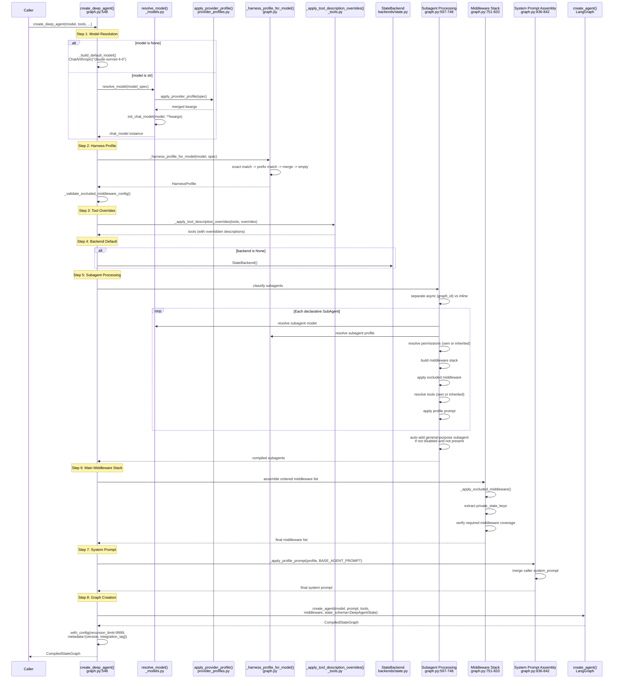
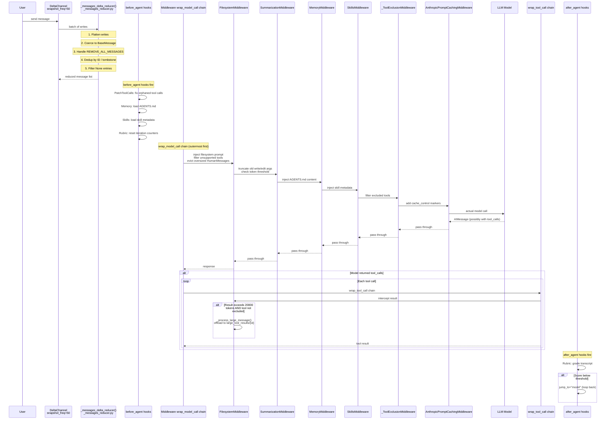
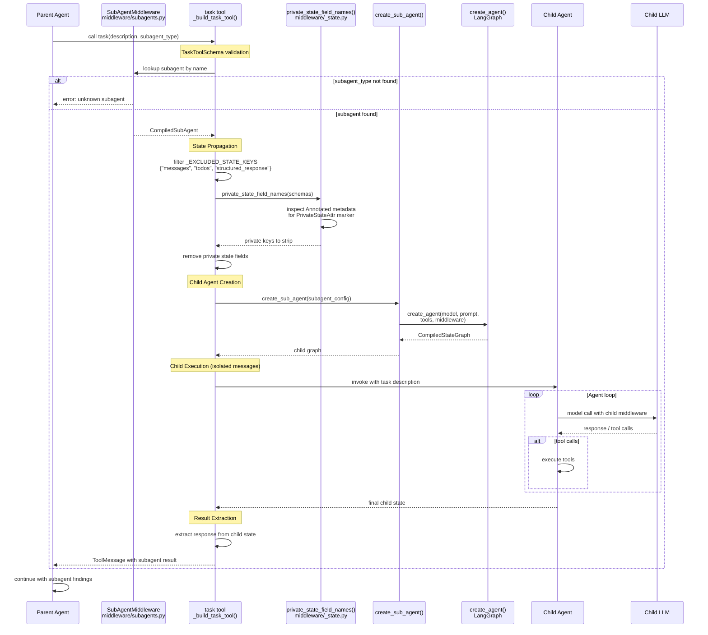
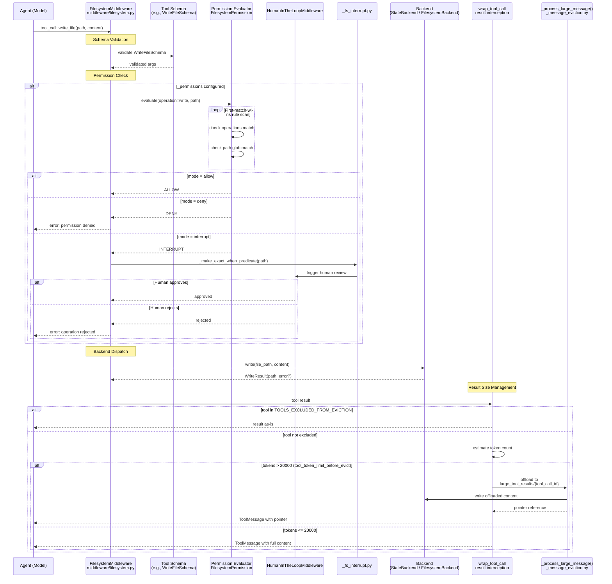
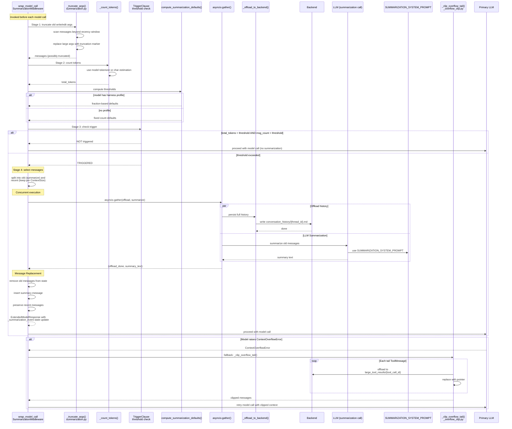
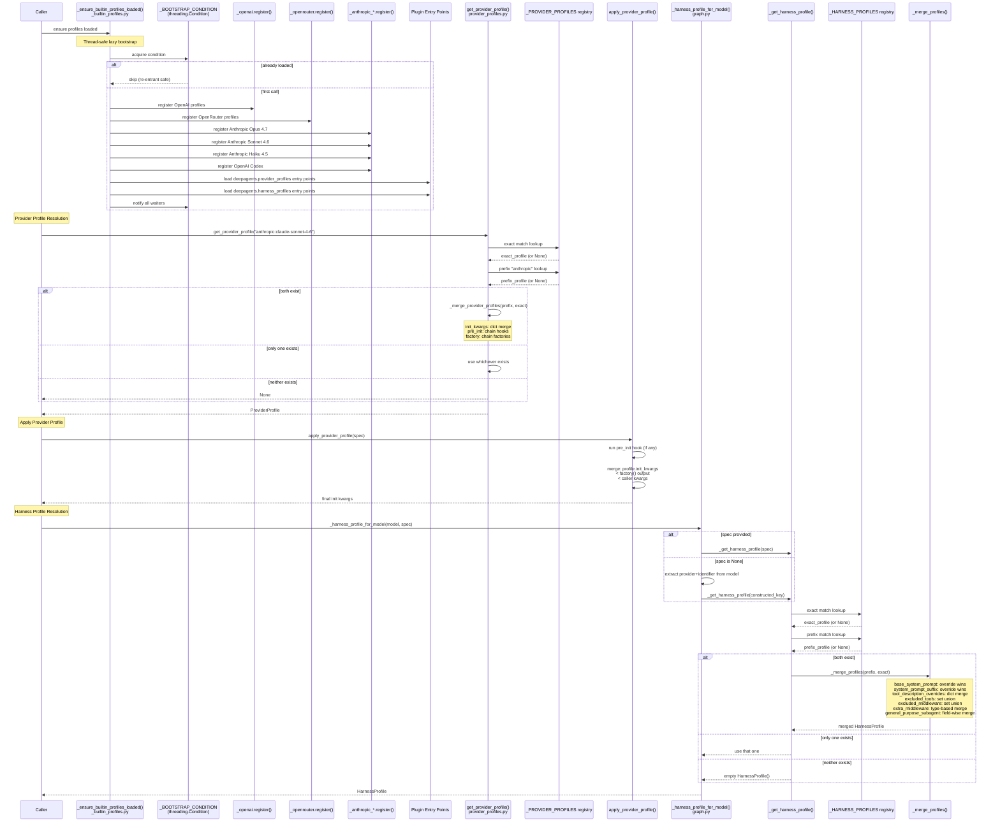
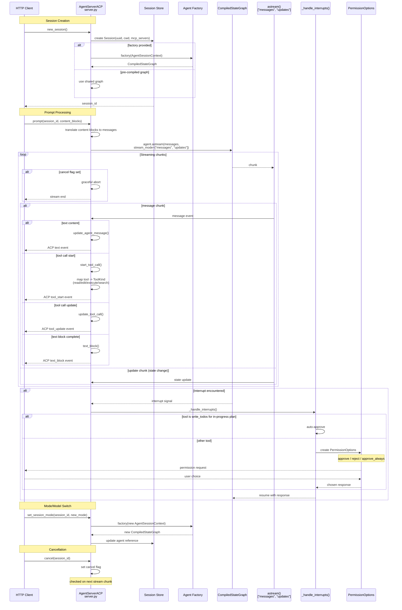

# Deep Agents: End-to-End Execution Flows

This document provides exhaustive, implementation-level tracing of every major
execution flow in the Deep Agents library. Each section walks through the code
path from entry point to final result, referencing source files and line numbers,
and includes a Mermaid sequence diagram that captures the full interaction
between components.

Source root: `libs/deepagents/deepagents/`

---

## Table of Contents

1. [Agent Creation Flow](#1-agent-creation-flow)
2. [Message Processing Flow](#2-message-processing-flow)
3. [Subagent Spawn Flow](#3-subagent-spawn-flow)
4. [File Operation Flow](#4-file-operation-flow)
5. [Summarization Flow](#5-summarization-flow)
6. [Profile Resolution Flow](#6-profile-resolution-flow)
7. [ACP Request Flow](#7-acp-request-flow)
8. [Knowledge Verification Questions](#8-knowledge-verification-questions)

---

## 1. Agent Creation Flow

The primary entry point for constructing a Deep Agent is `create_deep_agent()`
in `graph.py`. This function orchestrates model resolution, profile lookup,
middleware stacking, tool configuration, subagent compilation, system prompt
assembly, and final graph creation. The result is a LangGraph
`CompiledStateGraph` with a recursion limit of 9999.

### 1.1 Step-by-Step Walkthrough

#### Step 1 -- Model Resolution (`graph.py:548-568`)

The `model` parameter accepts `None`, a raw string, or a pre-built chat model
instance.

- **`model is None`**: A deprecation warning is emitted and the function calls
  `_build_default_model()`, which returns
  `ChatAnthropic(model_name="claude-sonnet-4-6")`. This path exists only for
  backward compatibility and will be removed in a future release.

- **`model` is a string** (e.g. `"anthropic:claude-sonnet-4-6"`): The string is
  forwarded to `resolve_model(model)` in `_models.py`. Internally this calls
  `init_chat_model(model, **apply_provider_profile(model))`. The
  `apply_provider_profile` function looks up the `ProviderProfile` from the
  global registry, runs its `pre_init` hook (if any), and merges kwargs with
  the following precedence (lowest to highest):

  ```
  profile.init_kwargs < init_kwargs_factory() output < caller kwargs
  ```

- **`model` is an object**: Used directly; assumed to satisfy the chat model
  protocol.

#### Step 2 -- Harness Profile Resolution (`graph.py:569-581`)

`_harness_profile_for_model(model, _model_spec)` resolves the `HarnessProfile`
that governs agent behavior for the chosen model.

Resolution order:

1. Exact spec match (e.g. `"anthropic:claude-sonnet-4-6"`)
2. Provider prefix match (e.g. `"anthropic"`)
3. If both exist, merge via `_merge_profiles`
4. If nothing matches, return an empty `HarnessProfile()` (null object pattern)

After resolution, `_validate_excluded_middleware_config` ensures that no
middleware in the `_REQUIRED_MIDDLEWARE` tuple has been excluded. The required
middleware set is:

```python
_REQUIRED_MIDDLEWARE = ((FilesystemMiddleware, ()), (SubAgentMiddleware, ()))
```

#### Step 3 -- Tool Description Overrides (`graph.py:586-589`)

`_apply_tool_description_overrides(tools, _profile.tool_description_overrides)`
from `_tools.py` iterates over the provided tool list. For each tool whose name
matches a key in the profile's `tool_description_overrides` dict, it creates a
shallow copy of the tool with the description replaced by the override value.
Tools without overrides pass through unchanged.

#### Step 4 -- Backend Default (`graph.py:591`)

If no `backend` was provided by the caller, a `StateBackend()` instance is
created. `StateBackend` (in `backends/state.py`) keeps files in memory as part
of the LangGraph state. The alternative is `FilesystemBackend` (in
`backends/filesystem.py`), which persists to a real filesystem.

#### Step 5 -- Subagent Processing (`graph.py:597-748`)

This is the most complex step. Subagents are classified into two categories:

- **`async_subagents`**: Detected by the presence of a `"graph_id"` key. These
  represent agents that run in a separate graph and communicate asynchronously.

- **`inline_subagents`**: Everything else. Further split into:
  - **`CompiledSubAgent`**: Detected by a `"runnable"` key. These are
    pre-compiled and used as-is.
  - **Declarative `SubAgent`**: A plain dict or `SubAgent` dataclass that must
    be compiled.

For each declarative `SubAgent`, the compilation process is:

1. **Model resolution**: Same `resolve_model` flow as the parent.
2. **Profile lookup**: `_harness_profile_for_model` for the subagent's model.
3. **Permission resolution**: Uses the subagent's own `permissions` if
   specified; otherwise inherits the parent's permissions.
4. **Middleware stack construction** (order matters):
   - `TodoListMiddleware`
   - `FilesystemMiddleware`
   - `SummarizationMiddleware`
   - `PatchToolCallsMiddleware`
   - `SkillsMiddleware` (only if skills are provided)
   - User-supplied middleware
   - Profile `extra_middleware`
   - `_ToolExclusionMiddleware` (if `excluded_tools` is non-empty)
   - `AnthropicPromptCachingMiddleware`
5. **Excluded middleware filtering**: `_apply_excluded_middleware` removes any
   middleware types listed in the profile's `excluded_middleware` set.
6. **Interrupt configuration**: `_build_interrupt_on_from_permissions` resolves
   permission-based interrupt triggers.
7. **Tool resolution**: Uses the subagent's own tools if specified; otherwise
   inherits the parent's tools. Profile `tool_description_overrides` are
   applied.
8. **System prompt**: `_apply_profile_prompt` replaces or appends the profile
   suffix to the base prompt.

**Auto-added general-purpose subagent**: If not explicitly disabled and no
existing subagent has the name `"general-purpose"`, a default
`GENERAL_PURPOSE_SUBAGENT` spec is inserted at position 0 of the inline
subagent list. The `GeneralPurposeSubagentProfile` in
`profiles/harness/harness_profiles.py` governs its configuration.

#### Step 6 -- Main Middleware Stack (`graph.py:751-833`)

The parent agent's middleware stack is assembled in a specific order. Each
middleware is appended to a list, and the final list is filtered through
`_apply_excluded_middleware`.

**Middleware order (top = first to wrap, last to execute on inbound)**:

| Position | Middleware                       | Condition               |
|----------|----------------------------------|-------------------------|
| 1        | `TodoListMiddleware`             | Always                  |
| 2        | `SkillsMiddleware`               | If `skills` provided    |
| 3        | `FilesystemMiddleware`           | Always (required)       |
| 4        | `SubAgentMiddleware`             | If subagents exist      |
| 5        | `SummarizationMiddleware`        | Always                  |
| 6        | `PatchToolCallsMiddleware`       | Always                  |
| 7        | `AsyncSubAgentMiddleware`        | If async subagents      |
| 8        | User-supplied middleware          | If provided             |
| 9        | Profile `extra_middleware`        | If profile specifies    |
| 10       | `_ToolExclusionMiddleware`        | If `excluded_tools`     |
| 11       | `AnthropicPromptCachingMiddleware`| Always                  |
| 12       | `MemoryMiddleware`                | If `memory` provided    |
| 13       | `HumanInTheLoopMiddleware`        | If `interrupt_on`       |

After assembly:

- `_apply_excluded_middleware` removes excluded types.
- `private_state_field_names` extracts keys from middleware state schemas that
  carry the `PrivateStateAttr` annotation marker.
- A coverage verification ensures all required middleware is present.

#### Step 7 -- System Prompt Assembly (`graph.py:836-842`)

The system prompt is built from three potential inputs:

- **`BASE_AGENT_PROMPT`**: The built-in prompt with sections for Core Behavior,
  Professional Objectivity, Doing Tasks, Clarifying Requests, and Progress
  Updates.
- **Profile prompt**: `_apply_profile_prompt(_profile, BASE_AGENT_PROMPT)` can
  either replace the base prompt entirely (if `base_system_prompt` is set) or
  append a suffix (via `system_prompt_suffix`).
- **Caller's `system_prompt`**: Three cases:
  - `None`: Use the profile-modified base prompt as-is.
  - `SystemMessage` instance: Append the base prompt as a new content block to
    the caller's message.
  - `str`: Concatenate `system_prompt + "\n\n" + base_prompt`.

#### Step 8 -- Graph Creation (`graph.py:844-866`)

The assembled components are passed to `create_agent()` (from LangGraph's
agent framework):

```python
create_agent(
    model,
    system_prompt,
    tools,
    middleware,
    response_format,
    state_schema=DeepAgentState,
    ...
)
```

The returned graph is wrapped with `.with_config()`:

- `recursion_limit=9999` -- effectively unlimited recursion for complex agent
  loops.
- `metadata` -- includes the `deepagents` library version and an integration
  tag for observability.

### 1.2 Sequence Diagram



---

## 2. Message Processing Flow

Once the agent graph is running, every user message and model response passes
through the message processing pipeline. This pipeline involves the
`_messages_delta_reducer`, the middleware `wrap_model_call` chain, tool call
interception via `wrap_tool_call`, and lifecycle hooks (`before_agent`,
`after_agent`).

### 2.1 Delta Channel and Message Reduction

Messages arrive through a `DeltaChannel` configured with
`snapshot_frequency=50`. The `_messages_delta_reducer()` function in
`_messages_reducer.py` processes each batch:

1. **Flatten write batches**: Incoming writes are flattened into a single list.

2. **Coerce to BaseMessage**: Raw dicts and strings are converted via
   `convert_to_messages()` from LangChain.

3. **Handle `REMOVE_ALL_MESSAGES` sentinel**: If this sentinel value appears in
   the batch, all existing state messages and all preceding writes in the same
   batch are discarded. Only writes after the sentinel survive.

4. **Deduplication by ID**: Each message has an ID. If a new message shares an
   ID with an existing message:
   - `RemoveMessage` instances tombstone the original (set to `None`).
   - Other messages replace the original in-place.
   - Messages with new IDs are appended.

5. **Filter tombstones**: `None` entries left by `RemoveMessage` are stripped
   from the final list.

### 2.2 Middleware `wrap_model_call` Chain

Each middleware implements a `wrap_model_call` method that wraps the next
handler in the chain. The outermost middleware wraps the innermost (the actual
model call). When a model call is made, execution flows outward-in through the
chain:

| Middleware                          | Pre-call behavior                                                                                       | Post-call behavior                   |
|-------------------------------------|---------------------------------------------------------------------------------------------------------|--------------------------------------|
| `FilesystemMiddleware`              | Injects filesystem system prompt; filters unsupported tools; evicts oversized `HumanMessage` content    | --                                   |
| `SummarizationMiddleware`           | Truncates large `write_file`/`edit_file` args in old messages; checks token threshold; triggers summary | Returns `ExtendedModelResponse` with `_summarization_event` |
| `MemoryMiddleware`                  | Injects `AGENTS.md` content into the system message                                                     | --                                   |
| `SkillsMiddleware`                  | Injects skill metadata into the system message                                                          | --                                   |
| `SubAgentMiddleware`                | Appends task tool usage instructions to the system message                                              | --                                   |
| `_ToolExclusionMiddleware`          | Filters tools listed in `excluded_tools` from `request.tools`                                           | --                                   |
| `AnthropicPromptCachingMiddleware`  | Adds `cache_control` markers to eligible message blocks                                                 | --                                   |

### 2.3 Tool Call Interception (`wrap_tool_call`)

After the model returns tool calls, each call passes through the middleware
chain's `wrap_tool_call` method:

- **`FilesystemMiddleware.wrap_tool_call`**: Intercepts tool results and checks
  if the content is too large. Tools in `TOOLS_EXCLUDED_FROM_EVICTION` bypass
  this check:

  ```python
  TOOLS_EXCLUDED_FROM_EVICTION = (
      "ls", "glob", "grep", "read_file", "edit_file", "write_file"
  )
  ```

  For other tools, `_intercept_large_tool_result` estimates token count.
  If the result exceeds `tool_token_limit_before_evict` (default: 20000
  tokens), `_process_large_message` offloads the content:

  - Content is written to `{large_tool_results_prefix}/{tool_call_id}` on
    the backend.
  - The `ToolMessage` content is replaced with a reference pointer.

### 2.4 Lifecycle Hooks

#### `before_agent` hooks (run before each agent turn)

| Middleware                  | Action                                                        |
|-----------------------------|---------------------------------------------------------------|
| `PatchToolCallsMiddleware`  | Scans for orphaned tool calls (AIMessage with tool_call but no corresponding ToolMessage). Adds a synthetic `ToolMessage` with error content to prevent the model from hanging. |
| `MemoryMiddleware`          | Loads `AGENTS.md` files from the configured backend.          |
| `SkillsMiddleware`          | Loads skill metadata from all registered skill sources.       |
| `RubricMiddleware`          | Resets iteration bookkeeping counters for the current turn.   |

#### `after_agent` hooks (run after each agent turn)

| Middleware                  | Action                                                        |
|-----------------------------|---------------------------------------------------------------|
| `RubricMiddleware`          | Grades the agent's transcript against the rubric. If the score is below threshold, the middleware returns `jump_to="model"` to loop the agent back for another attempt. |

### 2.5 Sequence Diagram



---

## 3. Subagent Spawn Flow

When the parent agent decides to delegate work, it invokes the `task` tool
created by `SubAgentMiddleware._build_task_tool()`. This triggers subagent
selection, state propagation, isolated execution, and result extraction.

### 3.1 Task Tool Invocation

The `task` tool is defined with `TaskToolSchema`:

```python
class TaskToolSchema:
    description: str   # What the subagent should do
    subagent_type: str # Name of the subagent to invoke
```

The parent agent calls this tool when it determines that a subtask is better
handled by a specialized subagent (or the general-purpose subagent).

### 3.2 Subagent Lookup

`SubAgentMiddleware` maintains a list of compiled subagents. When the `task`
tool is invoked:

1. The `subagent_type` string is matched against compiled subagent names.
2. If no match is found, an error is returned to the parent agent.
3. If matched, the corresponding `CompiledSubAgent` is retrieved.

### 3.3 State Propagation

Before the child agent runs, state is propagated from parent to child with
careful isolation:

**Excluded keys** -- the following keys are never propagated:

```python
_EXCLUDED_STATE_KEYS = {"messages", "todos", "structured_response"}
```

**Private state isolation** -- `private_state_field_names(*state_schemas)` in
`middleware/_state.py` inspects `Annotated` type metadata for the
`PrivateStateAttr` marker. Fields carrying this marker are stripped from the
state before propagation. This prevents cross-contamination of
middleware-internal state between parent and child (e.g., summarization
counters, filesystem caches).

The remaining state fields are copied to the child's initial state. This
typically includes user-defined state extensions and shared configuration.

### 3.4 Child Agent Execution

A new agent is created via `create_sub_agent()`, which internally calls
`create_agent()` with the subagent's own:

- Model (resolved during `create_deep_agent`)
- Tools (own or inherited from parent)
- Middleware stack (built during subagent processing)
- System prompt (profile-modified)

The child runs with **isolated messages** -- it starts with a clean message
history containing only the task description. It has no visibility into the
parent's conversation history.

### 3.5 Result Extraction

When the child agent completes:

1. The final state is inspected for the child's response.
2. The response is extracted and formatted as a tool result.
3. The tool result is returned to the parent agent as a `ToolMessage`.
4. The parent continues its execution with the subagent's findings incorporated.

### 3.6 Sequence Diagram



---

## 4. File Operation Flow

File operations (`read_file`, `write_file`, `edit_file`, `ls`, `glob`, `grep`)
are handled by `FilesystemMiddleware` in `middleware/filesystem.py`. The flow
involves schema validation, permission checking, backend dispatch, and result
size management.

### 4.1 Tool Schema Validation

Each file tool has a corresponding schema (e.g., `WriteFileSchema` with
`file_path` and `content` fields). When the model emits a tool call, the
arguments are validated against the schema before any filesystem operation
occurs.

### 4.2 Permission Evaluation

If `_permissions` is configured on the `FilesystemMiddleware`, a first-match-wins
evaluation of `FilesystemPermission` rules is performed.

Each `FilesystemPermission` has three attributes:

| Attribute    | Type                          | Description                                    |
|--------------|-------------------------------|------------------------------------------------|
| `operations` | `set[str]`                    | Applicable operations: `read`, `write`, `execute` |
| `paths`      | `list[str]`                   | Glob patterns to match against the file path    |
| `mode`       | `allow | deny | interrupt`    | What to do when the rule matches                |

Evaluation:

1. For the requested operation and file path, iterate through rules in order.
2. The first rule whose `operations` includes the current operation AND whose
   `paths` glob matches the file path determines the outcome.
3. Outcomes:
   - **`allow`**: Proceed with the operation.
   - **`deny`**: Return an error to the model.
   - **`interrupt`**: Trigger a Human-in-the-Loop (HITL) review.

### 4.3 HITL Interrupt Bridge (`middleware/_fs_interrupt.py`)

When `mode=interrupt`, the filesystem interrupt bridge connects permissions to
`HumanInTheLoopMiddleware`:

- **`_FS_TOOL_PATH_ARGS`**: A mapping from tool name to the argument that
  contains the file path, plus the operation type.
- **`_make_exact_when_predicate`**: Creates a predicate for single-file tools
  (`read_file`, `write_file`, `edit_file`) that checks the exact path argument.
- **`_make_bulk_when_predicate`**: Creates a predicate for multi-result tools
  (`ls`, `glob`, `grep`) that checks paths in bulk.

The interrupt is surfaced through `_build_interrupt_on_from_permissions`, which
is called during agent creation (Step 5 of the creation flow). The resulting
interrupt configuration is passed to `HumanInTheLoopMiddleware`.

### 4.4 Backend Dispatch

Once permission is granted:

```python
backend.write(file_path, content)    # for write_file
backend.read(file_path)              # for read_file
backend.edit(file_path, edits)       # for edit_file
backend.list(directory_path)         # for ls
backend.glob(pattern)               # for glob
backend.grep(pattern, path)         # for grep
```

The backend is either `StateBackend` (in-memory, stored in LangGraph state) or
`FilesystemBackend` (real filesystem I/O).

### 4.5 Result Size Management

After the backend returns, the result flows through `wrap_tool_call`:

1. `FilesystemMiddleware.wrap_tool_call` intercepts the result.
2. If the tool is in `TOOLS_EXCLUDED_FROM_EVICTION`, the result is returned
   as-is regardless of size:

   ```python
   TOOLS_EXCLUDED_FROM_EVICTION = (
       "ls", "glob", "grep", "read_file", "edit_file", "write_file"
   )
   ```

3. For other tools, `_intercept_large_tool_result` estimates token count.
4. If the count exceeds `tool_token_limit_before_evict` (default: 20000
   tokens), `_process_large_message` offloads the content:

   - Content is written to `{large_tool_results_prefix}/{tool_call_id}` on
     the backend.
   - The `ToolMessage` content is replaced with a reference pointer.

5. The final `ToolMessage` (or pointer) is returned to the agent.

### 4.6 Sequence Diagram



---

## 5. Summarization Flow

The `_DeepAgentsSummarizationMiddleware` in `middleware/summarization.py`
manages context window pressure. When the conversation grows too large, it
triggers a multi-step summarization process that truncates arguments, counts
tokens, offloads history, and replaces old messages with a summary.

### 5.1 Trigger Detection

The summarization check happens inside `wrap_model_call`, before the actual
model call is made. The process has multiple stages:

#### Stage 1 -- Argument Truncation

`_truncate_args()` scans old messages for `write_file` and `edit_file` tool
calls. These tools often carry large `content` arguments that bloat the context.
The truncation is controlled by `TruncateArgsSettings`:

- Only messages beyond a recency window are eligible.
- Large argument values are replaced with a truncation marker.
- This is a lossy but cheap operation that can defer full summarization.

#### Stage 2 -- Token Counting

`_count_tokens(model, messages, tools?)` computes the total token count of the
current context. This uses the model's tokenizer when available, falling back
to character-based estimation.

#### Stage 3 -- Threshold Check

The token count is compared against a `TriggerClause`, which supports two
trigger types:

- **Token-based**: Trigger when total tokens exceed a threshold.
- **Message-count-based**: Trigger when the number of messages exceeds a
  threshold.

The thresholds are computed by `compute_summarization_defaults`:

- If the model has a harness profile with context window information:
  **fraction-based** defaults (e.g., summarize when context is 80% full, keep
  50% of context).
- If no profile exists: **fixed count** defaults.

#### Stage 4 -- Message Selection

If the threshold is exceeded, the middleware determines which messages to
summarize based on `ContextSize` (the `keep` parameter):

- Messages are divided into "old" (to be summarized) and "recent" (to be
  preserved).
- The `keep` value specifies how much recent context to preserve -- either as
  a token count or a message count.

### 5.2 Summarization Execution

Once messages are selected for summarization, two operations run concurrently
via `asyncio.gather`:

1. **`_offload_to_backend`**: The full conversation history is persisted to:
   ```
   /conversation_history/{thread_id}.md
   ```
   This ensures no information is permanently lost, even though the in-context
   messages are replaced.

2. **LLM summarization call**: A separate LLM call is made using
   `SUMMARIZATION_SYSTEM_PROMPT` to generate a concise summary of the old
   messages. This summary captures key decisions, findings, and context that
   the agent needs to continue working effectively.

### 5.3 Message Replacement

After both operations complete:

1. The old messages are removed from the state.
2. A single summary message replaces them.
3. The recent messages (governed by `keep`) remain intact.
4. An `ExtendedModelResponse` is returned with a `_summarization_event` state
   update, which records that summarization occurred (for observability and
   debugging).

### 5.4 Overflow Fallback

If summarization fails or if the model returns a `ContextOverflowError` despite
summarization:

1. The middleware catches the error.
2. Falls back to `_clip_overflow_tail` from `_overflow_clip.py`.
3. This clips messages from the tail (oldest) of the conversation.
4. Each clipped `ToolMessage` is offloaded to:
   ```
   large_tool_results/{tool_call_id}
   ```
5. The clipped messages are replaced with pointers, similar to the eviction
   mechanism in the file operation flow.

### 5.5 Sequence Diagram



---

## 6. Profile Resolution Flow

Profiles control model-specific behavior. There are two profile types:
`ProviderProfile` (governs model initialization) and `HarnessProfile` (governs
agent runtime behavior). Both use a registry pattern with lazy bootstrap.

### 6.1 Bootstrap (`profiles/_builtin_profiles.py`)

`_ensure_builtin_profiles_loaded()` performs thread-safe lazy initialization
using `_BOOTSTRAP_CONDITION` (a `threading.Condition`). It includes re-entrant
safety to handle recursive profile loading.

**Bootstrap registration order**:

1. `_openai.register()`
2. `_openrouter.register()`
3. `_anthropic_opus_4_7.register()`
4. `_anthropic_sonnet_4_6.register()`
5. `_anthropic_haiku_4_5.register()`
6. `_openai_codex.register()`
7. Plugin entry points for `deepagents.provider_profiles`
8. Plugin entry points for `deepagents.harness_profiles`

Each `register()` call populates the global `_PROVIDER_PROFILES` and/or
`_HARNESS_PROFILES` dictionaries with one or more keyed entries.

### 6.2 Provider Profile Resolution

`get_provider_profile(spec)` resolves a `ProviderProfile` for a model spec
string (e.g., `"anthropic:claude-sonnet-4-6"`):

1. **Exact match**: Check `_PROVIDER_PROFILES[spec]`.
2. **Prefix match**: Extract the provider prefix (before `:`), check
   `_PROVIDER_PROFILES[prefix]`.
3. **Merge**: If both exact and prefix profiles exist, merge them via
   `_merge_provider_profiles`:
   - `init_kwargs`: Dict merge (exact overrides prefix).
   - `pre_init`: Chains both hooks (prefix runs first).
   - `factory`: Chains both factories (prefix runs first).
4. **No match**: Return `None`.

### 6.3 Applying the Provider Profile

`apply_provider_profile(spec)` uses the resolved profile to produce the final
kwargs for `init_chat_model`:

**Precedence** (lowest to highest):

```
profile.init_kwargs  <  init_kwargs_factory() output  <  caller kwargs
```

If the profile has a `pre_init` hook, it runs before kwargs are merged. This
allows profiles to perform side effects like environment variable setup.

### 6.4 Harness Profile Resolution

`_harness_profile_for_model(model, spec)` resolves the `HarnessProfile`:

- **If `spec` is provided**: Call `_get_harness_profile(spec)` directly.
- **If `spec` is None**: Extract `provider` and `identifier` from the model
  instance, construct a lookup key, and try a fallback chain.

`_get_harness_profile(spec)` follows the same exact -> prefix -> merge pattern
as provider profiles.

### 6.5 Harness Profile Merging

`_merge_profiles(base, override)` combines two `HarnessProfile` instances:

| Field                        | Merge strategy              |
|------------------------------|-----------------------------|
| `base_system_prompt`         | Override wins               |
| `system_prompt_suffix`       | Override wins               |
| `tool_description_overrides` | Dict merge (override wins)  |
| `excluded_tools`             | Set union                   |
| `excluded_middleware`        | Set union                   |
| `extra_middleware`           | Type-based merge            |
| `general_purpose_subagent`   | Field-wise merge            |

### 6.6 Profile Key Validation

`validate_profile_key(key)` in `profiles/_keys.py` ensures profile registry
keys follow the expected format. This is called during registration to catch
malformed keys early.

### 6.7 Sequence Diagram



---

## 7. ACP Request Flow

The Agent Communication Protocol (ACP) server in
`libs/acp/deepagents_acp/server.py` exposes the Deep Agent as an HTTP service.
The `AgentServerACP` class extends `ACPAgent` and translates between the ACP
protocol and the LangGraph agent.

### 7.1 Session Management

Each client connection creates a session:

```python
new_session()  ->  Session(
    id=uuid4(),
    cwd=os.getcwd(),
    mcp_servers=[...],
    mode_state=...,
    model_state=...
)
```

Sessions are stored in memory and identified by UUID. Each session can
independently configure its mode and model.

### 7.2 Agent Factory Pattern

The `AgentServerACP` constructor accepts either:

- A pre-compiled `CompiledStateGraph` (used as-is for all sessions).
- A factory function `(AgentSessionContext) -> CompiledStateGraph` that creates
  a fresh agent per session or per mode/model change.

When a mode or model switch occurs via `set_session_mode()`, the factory is
invoked with the new context to produce a fresh agent graph. This allows
dynamic reconfiguration without restarting the server.

### 7.3 Prompt Processing

The `prompt()` method receives ACP content blocks from the client:

1. Content blocks are translated to LangGraph-compatible message format.
2. `agent.astream()` is called with `stream_mode=["messages", "updates"]` to
   get both message-level and state-update-level streaming events.
3. For each streaming chunk, the method dispatches to one of:
   - **`update_agent_message()`**: Updates the current text response block.
   - **`start_tool_call()`**: Begins a new tool invocation block.
   - **`update_tool_call()`**: Updates an in-progress tool call with partial
     results.
   - **`text_block()`**: Emits a completed text block.
4. Each of these is translated to ACP protocol events and streamed to the
   client.

### 7.4 Interrupt Handling

When the agent hits an interrupt (e.g., a permission check from
`FilesystemMiddleware`):

1. `_handle_interrupts()` is called.
2. The interrupt is translated to `PermissionOptions` with three choices:
   - **`approve`**: Allow the operation to proceed.
   - **`reject`**: Deny the operation.
   - **`approve_always`**: Allow this and all future similar operations.
3. Special case: `write_todos` tool calls for in-progress plans are
   auto-approved without user interaction.
4. The chosen response is fed back to the agent to resume execution.

### 7.5 Per-Session Command Allowlists

For the `execute` tool (shell command execution), each session maintains its
own allowlist of permitted commands. This is separate from the filesystem
permission system and provides an additional layer of control for shell
operations in the ACP context.

### 7.6 Tool-to-ACP Kind Mapping

ACP uses a `ToolKind` enum to categorize tool operations for the client UI.
The mapping is:

| Deep Agents Tool       | ACP `ToolKind`    |
|------------------------|-------------------|
| `read_file`            | `ToolKind.read`   |
| `edit_file`            | `ToolKind.edit`   |
| `write_file`           | `ToolKind.edit`   |
| `execute`              | `ToolKind.execute`|
| `glob`                 | `ToolKind.search` |
| `grep`                 | `ToolKind.search` |
| `ls`                   | `ToolKind.search` |

### 7.7 Cancellation

The `cancel()` method sets a flag that is checked during streaming. When the
flag is detected, the streaming loop breaks for graceful abort. No partial
state corruption occurs because cancellation happens between stream chunks.

### 7.8 Sequence Diagram



---

## 8. Knowledge Verification Questions

These questions test deep understanding of the execution flows documented
above. Each question targets a specific implementation detail that requires
tracing through the actual code paths.

---

### Q1: Middleware Stack Ordering

**Question**: In the main agent's middleware stack, what is the exact position
of `SummarizationMiddleware` relative to `FilesystemMiddleware` and
`PatchToolCallsMiddleware`? Why does this ordering matter?

**Answer**: `FilesystemMiddleware` is at position 3,
`SummarizationMiddleware` is at position 5, and `PatchToolCallsMiddleware` is
at position 6. Since middleware wraps from outside-in, `PatchToolCallsMiddleware`
executes before `SummarizationMiddleware` on the way to the model, and
`SummarizationMiddleware` executes before `FilesystemMiddleware`. This ordering
matters because summarization must see the filesystem-enriched context (with
filesystem system prompts injected) but needs to truncate arguments before
the model sees them. `PatchToolCallsMiddleware` must run before summarization
to ensure orphaned tool calls are patched before token counting occurs.

---

### Q2: State Propagation to Subagents

**Question**: When a subagent is spawned, which state keys are excluded from
propagation, and what additional mechanism prevents middleware-internal state
from leaking across the parent-child boundary?

**Answer**: The explicitly excluded keys are defined in `_EXCLUDED_STATE_KEYS`:
`{"messages", "todos", "structured_response"}`. Beyond this, the
`private_state_field_names()` function in `middleware/_state.py` inspects all
state schema fields for the `PrivateStateAttr` annotation marker (found in
`Annotated` type metadata). Any field carrying this marker is also stripped
from the state before propagation. This dual mechanism ensures that both
well-known agent-level state (messages, todos) and arbitrary middleware-private
state (summarization counters, caches) are isolated.

---

### Q3: Summarization Fallback

**Question**: What happens when the `SummarizationMiddleware` performs
summarization but the model still raises a `ContextOverflowError`? Trace the
fallback path.

**Answer**: The middleware catches the `ContextOverflowError` and falls back
to `_clip_overflow_tail()` from `_overflow_clip.py`. This function iterates
through messages from the tail (oldest) of the conversation. For each
`ToolMessage` in the tail, the content is offloaded to
`large_tool_results/{tool_call_id}` on the backend, and the message content is
replaced with a pointer reference. The clipped context is then retried with
the model. This is a more aggressive but lossless (content is preserved on the
backend) approach to reducing context size.

---

### Q4: Permission Evaluation Semantics

**Question**: How does the `FilesystemPermission` system differ in its
evaluation strategy for single-file tools (`read_file`, `write_file`,
`edit_file`) versus bulk tools (`ls`, `glob`, `grep`)? What functions implement
each strategy?

**Answer**: Single-file tools use `_make_exact_when_predicate` from
`_fs_interrupt.py`, which creates a predicate that checks the exact file path
from the tool's path argument against the permission rules. Bulk tools use
`_make_bulk_when_predicate`, which creates a predicate that checks paths in
aggregate. The mapping from tool name to operation type and path argument is
defined in `_FS_TOOL_PATH_ARGS`. Both produce predicates consumed by
`HumanInTheLoopMiddleware` via `_build_interrupt_on_from_permissions`.

---

### Q5: Profile Merging Specifics

**Question**: When both an exact-match and a prefix-match `HarnessProfile`
exist for a model spec, how are the `extra_middleware` and
`general_purpose_subagent` fields merged?

**Answer**: According to `_merge_profiles`, `extra_middleware` uses a
**type-based merge** strategy: if both profiles provide middleware of the same
type, the override's version takes precedence; middleware types present in only
one profile are included from whichever provides them. The
`general_purpose_subagent` field uses a **field-wise merge**: individual fields
of the subagent configuration (name, model, tools, etc.) are merged at the
attribute level, with the override profile's non-None values taking precedence
over the base profile's values.

---

### Q6: Delta Channel Behavior

**Question**: What is the role of the `REMOVE_ALL_MESSAGES` sentinel in
`_messages_delta_reducer()`, and how does it interact with other writes in the
same batch?

**Answer**: When `REMOVE_ALL_MESSAGES` appears in a write batch, it causes
all existing state messages AND all preceding writes in the same batch to be
discarded. Only writes that appear after the sentinel in the batch survive.
This enables a clean-slate reset of the conversation state within a single
atomic batch operation, which is used during summarization to replace the
entire message history with a summary message.

---

### Q7: ACP Auto-Approval

**Question**: Under what specific condition does the ACP server auto-approve a
tool call without presenting it to the user for review?

**Answer**: The `_handle_interrupts()` method in `AgentServerACP` auto-approves
`write_todos` tool calls when they are associated with an in-progress plan.
This prevents the user from being repeatedly interrupted for routine todo-list
updates during active plan execution. All other tool calls that trigger an
interrupt (including all filesystem operations with `mode=interrupt`) are
presented to the user with `PermissionOptions` (approve/reject/approve_always).

---

### Q8: Tool Result Eviction

**Question**: The constant `TOOLS_EXCLUDED_FROM_EVICTION` lists six tools.
Why are these specific tools excluded from the large-result eviction mechanism,
and what would happen if they were not excluded?

**Answer**: The excluded tools are `ls`, `glob`, `grep`, `read_file`,
`edit_file`, and `write_file`. These are excluded because their results are
essential for the agent's immediate decision-making about file operations.
Evicting a `read_file` result to a backend pointer would force the agent to
re-read the file to see its contents, creating an unnecessary round-trip. For
`edit_file` and `write_file`, the results are typically small confirmation
messages. For search tools (`ls`, `glob`, `grep`), the results are the
primary way the agent discovers and navigates the filesystem. If these were
subject to eviction, the agent would lose its working context about the
codebase structure and file contents, severely degrading its ability to
perform multi-file operations.

---

### Q9: Provider Profile Hook Chain

**Question**: When both a prefix-match and an exact-match `ProviderProfile`
exist, in what order do their `pre_init` hooks execute, and how does the
`init_kwargs` merge work?

**Answer**: According to `_merge_provider_profiles`, the `pre_init` hooks are
chained with the **prefix hook running first**, followed by the exact-match
hook. This allows the provider-wide hook to set up general configuration
before the model-specific hook refines it. For `init_kwargs`, a standard
dict merge is performed where the exact-match profile's values override the
prefix profile's values for any shared keys. Keys unique to either profile
are included from whichever provides them.

---

### Q10: Bootstrap Thread Safety

**Question**: How does `_ensure_builtin_profiles_loaded()` handle the case
where a profile's `register()` call itself triggers another call to
`_ensure_builtin_profiles_loaded()` (re-entrant invocation)? Why is this
scenario possible?

**Answer**: The function uses `_BOOTSTRAP_CONDITION` (a `threading.Condition`)
with explicit re-entrant safety. When a `register()` call within the bootstrap
sequence triggers another call to `_ensure_builtin_profiles_loaded()` (which
can happen if a plugin's entry point imports code that itself tries to resolve
a profile), the function detects that bootstrapping is already in progress on
the current thread and returns immediately without deadlocking. This
re-entrancy scenario is possible because plugin entry points (loaded in steps
7-8 of the bootstrap) can contain arbitrary code that may reference the
profile registry, and the registry lookup functions call
`_ensure_builtin_profiles_loaded()` as their first step.

---

## Appendix A: Key Constants Reference

| Constant | Value | Location |
|----------|-------|----------|
| `_REQUIRED_MIDDLEWARE` | `((FilesystemMiddleware, ()), (SubAgentMiddleware, ()))` | `graph.py` |
| `_EXCLUDED_STATE_KEYS` | `{"messages", "todos", "structured_response"}` | `graph.py` |
| `TOOLS_EXCLUDED_FROM_EVICTION` | `("ls", "glob", "grep", "read_file", "edit_file", "write_file")` | `middleware/filesystem.py` |
| `DeltaChannel snapshot_frequency` | `50` | `graph.py` |
| `tool_token_limit_before_evict` (default) | `20000` tokens | `middleware/filesystem.py` |
| `recursion_limit` | `9999` | `graph.py:844-866` |

## Appendix B: Middleware Hooks Summary

| Middleware | `wrap_model_call` | `wrap_tool_call` | `before_agent` | `after_agent` |
|------------|:-:|:-:|:-:|:-:|
| `FilesystemMiddleware` | Injects FS prompt, filters tools, evicts oversized messages | Intercepts large results | -- | -- |
| `SummarizationMiddleware` | Truncates args, checks tokens, triggers summarization | -- | -- | -- |
| `MemoryMiddleware` | Injects AGENTS.md | -- | Loads AGENTS.md | -- |
| `SkillsMiddleware` | Injects skill metadata | -- | Loads skills | -- |
| `SubAgentMiddleware` | Appends task instructions | -- | -- | -- |
| `_ToolExclusionMiddleware` | Filters excluded tools | -- | -- | -- |
| `AnthropicPromptCachingMiddleware` | Adds cache_control markers | -- | -- | -- |
| `PatchToolCallsMiddleware` | -- | -- | Fixes orphaned tool calls | -- |
| `RubricMiddleware` | -- | -- | Resets iteration counters | Grades transcript, may loop |

## Appendix C: File Layout Reference

```
libs/deepagents/deepagents/
  graph.py                          # create_deep_agent(), DeepAgentState, BASE_AGENT_PROMPT
  _messages_reducer.py              # _messages_delta_reducer()
  _models.py                        # resolve_model(), get_model_identifier(), model_matches_spec()
  _tools.py                         # _apply_tool_description_overrides()
  _excluded_middleware.py            # _apply_excluded_middleware()
  middleware/
    filesystem.py                   # FilesystemMiddleware, FilesystemPermission
    subagents.py                    # SubAgentMiddleware, SubAgent, CompiledSubAgent
    async_subagents.py              # AsyncSubAgentMiddleware, AsyncSubAgent
    summarization.py                # _DeepAgentsSummarizationMiddleware
    memory.py                       # MemoryMiddleware
    skills.py                       # SkillsMiddleware
    rubric.py                       # RubricMiddleware
    patch_tool_calls.py             # PatchToolCallsMiddleware
    _tool_exclusion.py              # _ToolExclusionMiddleware
    _state.py                       # private_state_field_names()
    _utils.py                       # append_to_system_message()
    _fs_interrupt.py                # HITL bridge for filesystem permissions
    _message_eviction.py            # Large content eviction helpers
    _overflow_clip.py               # Overflow clipping fallback
  profiles/
    harness/harness_profiles.py     # HarnessProfile, HarnessProfileConfig
    provider/provider_profiles.py   # ProviderProfile
    _builtin_profiles.py            # _ensure_builtin_profiles_loaded()
    _keys.py                        # validate_profile_key()
  backends/
    protocol.py                     # BackendProtocol, SandboxBackendProtocol
    state.py                        # StateBackend
    filesystem.py                   # FilesystemBackend
libs/acp/deepagents_acp/
    server.py                       # AgentServerACP (ACP HTTP server)
```
