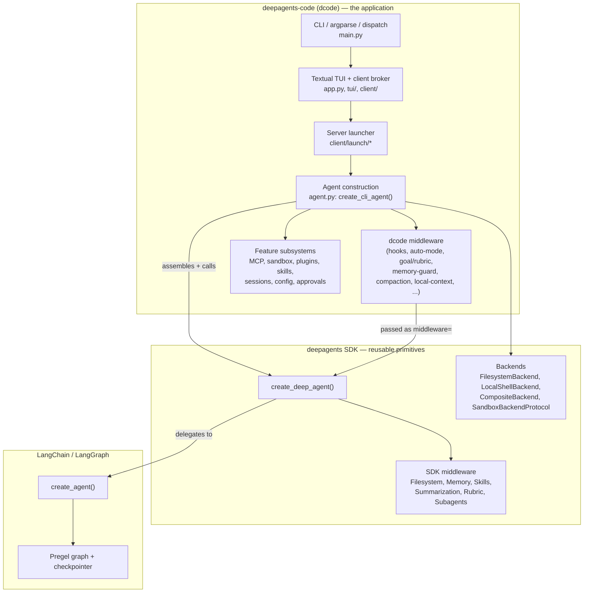

# Deep Agents Code (`dcode`) — Architecture Documentation

This is a **dedicated architecture reference for `deepagents-code`** (the `dcode`
terminal coding agent), written for someone who wants to become a core
contributor: modify the architecture, add features, or build a similar coding
agent from scratch.

It is intentionally **separate from the generic Deep Agents SDK docs**
(`docs/00_*.md`–`docs/30_*.md`). Those describe the reusable SDK primitives
(`create_deep_agent`, middleware protocol, backends, subagents). This set
describes the *application* that consumes them and everything it layers on top.

> Source of truth: everything here is traced to real source under
> [`libs/code/deepagents_code`](../../libs/code/deepagents_code). Claims are
> anchored to specific files and line numbers. When the code and this doc
> disagree, the code wins — please update the doc.

---

## The one-sentence mental model

`dcode` is a **thin-but-opinionated client/server application** that:

1. spawns a private **`langgraph dev` server subprocess**,
2. inside that subprocess builds a **17-layer middleware stack** and hands it to
   the SDK's [`create_deep_agent()`](../../libs/deepagents/deepagents/graph.py),
3. connects a **Textual TUI** to the server over HTTP (`RemoteGraph`/SSE), and
4. streams messages/interrupts back to the terminal, brokering **approvals,
   hooks, and goal/rubric evaluation** as the graph runs.

Everything distinctive about `dcode` — approvals, auto mode, hooks, plugins,
skills discovery, memory, offload/compaction, MCP, sandboxes, goals/rubrics,
session persistence — is implemented as **middleware, tools, backends, and
client-side brokers around the SDK graph**, not by forking the SDK.

---

## SDK vs. `dcode`: what belongs where



| Layer | Owned by | Key entry points |
|-------|----------|------------------|
| Terminal UI, keybindings, widgets | **dcode** | `app.py`, `tui/` |
| CLI parsing & command dispatch | **dcode** | `main.py`, `client/commands/` |
| Server subprocess lifecycle | **dcode** | `client/launch/server.py`, `server_manager.py` |
| Graph factory for `langgraph dev` | **dcode** | `server_graph.py` (`make_graph`) |
| Agent construction / middleware wiring | **dcode** | `agent.py` (`create_cli_agent`) |
| Approvals, auto-mode, hooks, goals/rubric, memory-guard, compaction, MCP, sandbox, plugins, skills discovery | **dcode** | see [03](03_subsystems.md), [04](04_hooks_and_plugins.md), [05](05_approvals_goals_rubric.md) |
| `create_deep_agent`, base middleware protocol, backends, subagent runner | **SDK** | `libs/deepagents/deepagents/` |
| `create_agent`, graph compilation, streaming, checkpointing | **LangChain/LangGraph** | external deps |

**The seam** is a single call — [`create_deep_agent(...)`](../../libs/code/deepagents_code/agent.py) at
`agent.py:3026`. Everything above the seam is dcode; everything below is SDK.
See [02_agent_construction.md](02_agent_construction.md) for the exact boundary.

---

## Package layout (current)

The package was significantly reorganized from earlier versions (see
["What changed"](#what-changed-since-the-previous-docs)). Current top-level
structure of [`libs/code/deepagents_code/`](../../libs/code/deepagents_code):

```
deepagents_code/
├── main.py                  # CLI entry (cli_main), argparse, dispatch
├── agent.py                 # create_cli_agent(): the middleware stack + create_deep_agent
├── server_graph.py          # make_graph(): server-side graph factory for `langgraph dev`
├── app.py                   # Textual Application (owns deferred server start)
├── config.py                # Settings singleton, dotenv, shell security, bootstrap
├── model_config.py          # ModelSpec, provider resolution, DEEPAGENTS_CODE_ prefix
├── configurable_model.py    # ConfigurableModelMiddleware (runtime /model switching)
│
├── client/                  # Client side of the client/server split
│   ├── launch/              #   server.py (ServerProcess), server_manager.py (orchestrator)
│   ├── commands/            #   config.py, auth.py, mcp.py, tools.py, extras.py (CLI subcommands)
│   ├── remote_client.py     #   RemoteAgent — thin wrapper over RemoteGraph
│   └── non_interactive.py   #   headless (-n) execution pipeline
│
├── tui/                     # Textual UI (moved here from top-level widgets/)
│   ├── textual_adapter.py   #   TextualUIAdapter — the streaming/interrupt broker
│   ├── widgets/             #   ~50 widgets (chat, approval, diff, selectors, ...)
│   ├── modals/              #   plugin_manager/ and other modal screens
│   └── screens/
│
├── hooks/                   # Hooks v2 lifecycle system (was a single hooks.py)
│   ├── models/              #   domain/wire/transport/config Pydantic split
│   ├── server_middleware.py #   ServerHooksMiddleware (in-graph event emitter)
│   ├── runtime.py engine.py runner.py reducer.py projection.py ...
│   └── legacy.py migration.py   # v1 dotted-event system + bridge
│
├── plugins/                 # Plugin system (NEW): skills + MCP contributions
│   ├── discovery.py store.py marketplace.py manifest.py models.py
│   └── adapters/            #   skills.py, skills_middleware.py, mcp.py
│
├── integrations/            # Sandbox providers (registry + factory + provider adapters)
│
├── mcp_tools.py mcp_config.py mcp_auth.py mcp_login_service.py mcp_oauth_ui.py mcp_disabled.py
├── mcp_providers/           # OAuth provider policies (Slack, GitHub, Generic)
│
├── goal_tools.py goal_rubric.py reliable_rubric.py goal_state_notice.py  # Goal + rubric self-eval (NEW)
├── approval_mode.py auto_mode.py                                          # HITL + classifier auto-mode (NEW)
├── memory_guard.py onboarding.py                                          # Managed-memory protection
├── offload.py offload_middleware.py                                       # Context offload/compaction
├── local_context.py                                                       # LocalContextMiddleware
├── sessions.py resume_state.py state_migration.py                         # Thread persistence + resume
├── skills/                  # CLI-facing skill discovery/invocation
├── built_in_skills/         # remember, skill-creator, deepagents-thread-inspector
├── tools.py                 # web_search, fetch_url (SSRF-guarded), get_current_thread_id
├── tool_catalog.py doctor.py extras_info.py update_check.py               # diagnostics/UX
└── _*.py                    # internal helpers (_server_config, _repository_bounds, _glm_5p2_profile, ...)
```

---

## How to read this documentation

| Doc | Read it to understand |
|-----|-----------------------|
| [01_execution_flow.md](01_execution_flow.md) | End-to-end: CLI keystroke → server → graph → response on screen. Startup sequence, client/server split, the streaming loop. Sequence diagrams. |
| [02_agent_construction.md](02_agent_construction.md) | The heart: `create_cli_agent`, the exact 17-layer middleware stack, backend composition, subagents, and the precise `create_deep_agent` boundary. |
| [03_subsystems.md](03_subsystems.md) | Component reference: tools, memory, skills, context/offload, MCP, sandbox, sessions, configuration, model switching. |
| [04_hooks_and_plugins.md](04_hooks_and_plugins.md) | The two extensibility subsystems: Hooks v2 (lifecycle events) and the plugin system (skills + MCP contributions). |
| [05_approvals_goals_rubric.md](05_approvals_goals_rubric.md) | Human-in-the-loop approvals, classifier-backed Auto mode, and the goal/rubric self-evaluation loop. |
| [06_tui_and_client.md](06_tui_and_client.md) | TUI internals, the client broker, and how approvals/hooks/interrupts are surfaced to the terminal. |
| [07_extensibility_and_design.md](07_extensibility_and_design.md) | Consolidated extension points, design decisions, and a "build-your-own coding agent" guide. |

Suggested first pass: **01 → 02 → 07**, then dip into 03/04/05/06 as needed.

---

## What changed since the previous docs

The repository moved ~300 commits since the earlier documentation. The most
consequential architectural changes for readers of the old `docs/25_code_agent.md`:

- **Package reorganization.** The flat top-level layout was split into packages:
  `server.py` → `client/launch/server.py` + `server_manager.py`; `widgets/` →
  `tui/widgets/`; `textual_adapter.py` → `tui/textual_adapter.py`;
  `auth_commands.py`/`mcp_commands.py`/`config_commands.py` → `client/commands/`;
  the single `hooks.py` became the `hooks/` package.
- **Client/server split is now explicit.** Interactive launch defers server
  start to the TUI (`app.py`), and the server is a real `langgraph dev`
  subprocess loading [`server_graph.make_graph`](../../libs/code/deepagents_code/server_graph.py).
- **New subsystems:** the **plugin system** (`plugins/`), **Hooks v2**
  (`hooks/` with server-owned lifecycle events over the interrupt channel),
  **goal + rubric self-evaluation** (`goal_tools.py`, `goal_rubric.py`,
  `reliable_rubric.py`), **classifier-backed Auto mode** (`auto_mode.py`,
  `approval_mode.py`), **context offload/compaction** (`offload.py`,
  `offload_middleware.py`), and **`doctor`/`tools` diagnostics**.
- **Removed:** `FilesystemEmptyResultMiddleware` (`filesystem_empty_result.py`
  deleted). The old fixed `SummarizationToolMiddleware` entry is replaced by the
  dcode `CLICompactionMiddleware`.
- **Approval model expanded** from a boolean `auto_approve` to a three-way
  `ApprovalMode` (`manual`/`auto`/`yolo`) with per-thread persistence.
- **Session DB is `sessions.db`** at `~/.deepagents/.state/sessions.db` (the old
  docs said `threads.db`).

A per-topic "changed since previous docs" note appears at the end of each
document.
